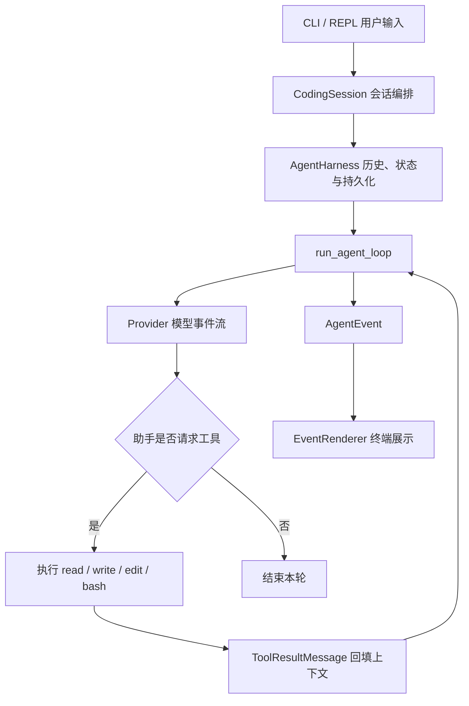

# Minitau

Minitau 是一个对照 tau 源码逐步实现的 Python 教学型 Coding Agent。项目围绕“如何从底层构建一个 Agent”展开：从消息和事件协议、模型流式响应，到工具调用、会话恢复、上下文压缩与终端交互，把每一层的职责和数据流呈现在代码中。

目前已经可以在终端连续对话，通过兼容端点调用真实模型，让模型使用 `read`、`write`、`edit`、`bash` 四个工具，并保存、恢复和分支会话。P6/P7 的主要组件与离线综合验收已经落地，后续将继续补齐文件搜索、Skill、Hook、MCP、跨会话记忆和多 Agent 协作。

## 已实现的能力

| 能力 | 当前实现 |
| --- | --- |
| Agent loop / ReAct | 模型生成工具调用 → 执行工具 → 将结果回填上下文 → 继续请求模型，直到结束或取消 |
| Provider 接入 | Provider 统一接口、离线 Fake/Demo、OpenAI 兼容 Chat Completions 流式端点、SSE 解析与请求重试 |
| 编码工具 | `read` 文件读取与分页；`write` 文件写入；`edit` 文本替换；`bash` 命令执行、超时、取消与输出截断 |
| 项目上下文 | 发现项目规则文件 `AGENTS.md`，与工具说明一起构建系统提示词 |
| 终端交互 | 顺序执行的多轮 REPL、流式文本展示、斜杠命令、单次 print 模式与管道输入 |
| 会话管理 | JSONL 追加日志、新建、列表、改名、按 ID 或唯一前缀恢复 |
| 上下文压缩 | 粗略 token 估算、自动压缩、手动压缩、摘要持久化与重放 |
| 历史分支 | 查看安全分支节点，切换到完整助手回合或压缩节点，并持久化选择 |
| 模型切换 | 同 Provider 内切换模型；保存配置；按活动分支恢复；支持显式启动参数覆盖 |
| 取消与清理 | 取消令牌、活动任务监督、Ctrl+C 状态处理、异步事件流与 Provider 资源释放 |

## 快速开始

需要 **Python 3.12 或更高版本**与 **uv**。在项目目录中执行：

```powershell
uv sync --locked --dev
uv run minitau --help
```

### 离线体验多轮交互

```powershell
uv run minitau --provider demo
```

进入 `minitau>` 提示符后，可连续输入问题：

```text
minitau> 你好
Demo response to: 你好
minitau> /status
minitau> /help
minitau> /exit
```

`demo` 每轮回显用户输入，适合体验交互、命令和会话流程；它没有真实推理能力，也不会自主调用工具。

### 单次运行

```powershell
uv run minitau -p "你好"
uv run minitau --provider demo -p "介绍一下 Agent loop"
```

新会话未指定 `--provider` 时默认使用 `fake`，返回一次固定问候。`fake` 是脚本式测试 Provider，工厂仅预置一次回复；连续离线对话请使用 `demo`。

`-p` 将最终回答写到标准输出，工具进度、会话信息与错误写到标准错误。可通过管道附加输入：

```powershell
Get-Content -Raw README.md | uv run minitau --provider demo -p "总结这段内容"
```

交互模式需要终端输入；管道输入应配合 `-p` 使用。

## 配置 API 与模型

真实 Provider 从**当前进程环境变量**读取 API key：

| `--provider` | API key 环境变量 | 项目内置默认端点 |
| --- | --- | --- |
| `deepseek` | `DEEPSEEK_API_KEY` | `https://api.deepseek.com` |
| `kimi` | `MOONSHOT_API_KEY` | `https://api.moonshot.cn/v1` |
| `openai` | `OPENAI_API_KEY` | `https://api.openai.com/v1` |

下面以 PowerShell 为例。请将密钥和模型 ID 替换为自己账号可用的值：

```powershell
$env:DEEPSEEK_API_KEY = "你的API密钥"
uv run minitau --provider deepseek --model "你的模型ID"
```

也可以单次请求：

```powershell
uv run minitau --provider deepseek --model "你的模型ID" -p "读取 README.md 并介绍项目结构"
```

使用其他兼容端点时，通过 `MINITAU_BASE_URL` 覆盖默认地址：

```powershell
$env:OPENAI_API_KEY = "你的API密钥"
$env:MINITAU_BASE_URL = "https://your-compatible-endpoint.example/v1"
uv run minitau --provider openai --model "你的模型ID"
```

`MINITAU_BASE_URL` 对所有真实 Provider 生效。切回内置端点时，可以清除当前终端中的覆盖值：

```powershell
Remove-Item Env:MINITAU_BASE_URL -ErrorAction SilentlyContinue
```

项目目前不自动加载 `.env` 文件，也不提供 API key 的交互配置界面。PowerShell 的 `$env:...` 设置只作用于当前终端及其启动的子进程；新终端需要重新设置或使用系统环境变量。Provider、端点和密钥读取逻辑见 [factory.py](src/minitau_ai/factory.py) 与 [env.py](src/minitau_ai/env.py)。

未指定 `--model` 时使用项目预设模型名；这些预设值不保证当前账号或服务端支持。`/model` 设置成功表示本地配置已保存，模型是否可用由下一次真实请求确认。

## 交互命令

普通文本作为用户消息发给模型；以 `/` 开头的输入由命令路由处理。

| 命令 | 用途 |
| --- | --- |
| `/help` | 列出可用命令 |
| `/status` | 查看会话 ID、工作目录、模型、估算上下文占用和运行状态 |
| `/sessions` | 列出当前工作目录中的会话 |
| `/new` | 创建并切换到空会话 |
| `/resume <id或唯一前缀>` | 恢复已有会话 |
| `/name <标题>` | 为当前会话改名 |
| `/compact` | 请求模型总结当前上下文，保存摘要 |
| `/model` | 查看当前模型 |
| `/model <模型名>` | 在当前 Provider 内切换下一轮使用的模型 |
| `/tree` | 查看可选择的安全分支节点 |
| `/branch <entry_id>` | 切换到指定历史节点 |
| `/exit` | 退出交互 |

要把以 `/` 开头的文本发送给模型，可使用双斜杠，例如 `//help` 会发送 `/help`。未知命令会返回提示，不会作为普通提问发送。

运行中第一次 **Ctrl+C** 请求取消，并等待工具和事件流收尾；再次中断会请求清理后退出，必要时升级为任务取消。空闲输入时第一次 Ctrl+C 取消本次输入，两秒内再次按下则退出；EOF 也会结束交互。

## 启动参数与工作目录

| 参数 | 用途 |
| --- | --- |
| `--print` / `-p` | 单次非交互运行 |
| `--provider <name>` | 选择 Provider |
| `--model <name>` / `-m` | 指定请求模型 |
| `--cwd <目录>` | 设置工具工作目录和会话存储位置 |
| `--resume <id或唯一前缀>` | 恢复指定会话 |
| `--continue` / `-c` | 恢复最近使用的会话 |
| `--context-window <tokens>` | 设置上下文窗口预算，必须大于零 |
| `--version` / `-v` | 显示版本 |
| `--help` | 显示帮助 |

例如，让 Agent 在另一项目中工作：

```powershell
uv run minitau --provider demo --cwd "D:\path\to\your-project"
```

相对文件路径以 `--cwd` 为基准。`bash` 工具通过操作系统默认 shell 执行命令，因此 Windows 和 POSIX 的命令语法可能不同。工具会实际写文件和执行命令；当前尚未实现工具调用审批或文件系统沙箱，`--cwd` 也不限制绝对路径访问。

系统提示词会读取项目根目录到当前目录沿途的 `AGENTS.md`，以及当前目录下的 `.minitau/AGENTS.md`、`.agents/AGENTS.md`。可以在这些文件中放置编码约定和项目说明。

## 会话、压缩与模型恢复

每个会话保存在工作目录下：

```text
<cwd>/.minitau/sessions/<session_id>.jsonl
```

日志只追加新条目：

- `SessionInfoEntry`：工作目录与会话标题。
- `ModelChangeEntry`：Provider 名、模型名和上下文窗口配置。
- `MessageEntry`：用户、助手和工具结果消息。
- `CompactionEntry`：摘要及其替代的历史消息 ID。
- `LeafEntry`：当前选择的分支节点。

压缩会改变下一轮模型接收的上下文，原始历史仍保留在 JSONL 文件中。分支选择也会立即落盘；即使选择后直接退出，恢复时仍沿所选路径还原消息与模型配置。

```powershell
uv run minitau --resume "会话ID或唯一前缀"
uv run minitau --continue
uv run minitau --resume "会话ID" --model "本次使用的模型ID"
```

`--resume` 与 `--continue` 不能同时使用。配置优先级为 **显式启动参数 → 活动分支最后生效的配置 → 工厂默认值**。启动时会先加载快照，再决定创建哪个 Provider；密钥和端点仍从当前环境重新读取，不写入模型配置条目。

同 Provider 内切换模型保留历史与当前窗口值。项目暂时不根据模型名查询真实窗口大小，token 占用也是粗略估算；需要时通过 `--context-window` 明确指定预算。当前默认兜底窗口为 128,000 tokens。运行中的跨 Provider 切换尚未实现。

会话文件按工作目录隔离；当前约定每个会话文件只有一个活动写入者。

## 项目结构与数据流

```text
Minitau/
├── src/
│   ├── minitau_agent/       # 消息、事件、Agent loop、Harness、压缩与会话重放
│   │   └── session/        # 条目模型、JSONL、树路径与存储
│   ├── minitau_ai/          # Provider 实现、HTTP/SSE、重试与环境配置
│   └── minitau_coding/      # CLI、REPL、命令路由、会话装配、工具与系统提示词
├── tests/                  # 单元测试、回归测试与离线综合场景
├── docs/                   # 源码走读、学习路线与阶段实现说明
├── pyproject.toml
└── uv.lock
```

三个包分别处理 Agent 核心、模型接入和编码应用层。一轮请求经过如下路径：



Provider 返回模型事件，loop 将其转换为统一的 Agent 事件；Harness 维护历史和持久化，renderer 负责展示。调用方通过 `async for` 完整消费事件流，操作完成后才进入下一次输入。

## 测试与开发

```powershell
uv run pytest -q
uv run mypy src
uv run ruff check src tests
```

测试包含消息与事件协议、模型/工具循环、请求错误、取消与清理、JSONL 恢复、压缩、分支、模型配置和 REPL 行为。单独运行完整场景验收：

```powershell
uv run pytest -q tests/test_p74_end_to_end.py
```

该场景用脚本式 FakeProvider 驱动真实会话与工具：读文件 → 写入/编辑 → 执行命令 → 压缩 → 恢复 → 分支，并验证长命令取消后可以继续提问。它不调用真实模型 API。真实端点的模型可用性以及真实 Windows 终端的 Ctrl+C 行为，需要在实际环境另行验证。

## 学习资料与后续路线

建议先沿一条输入到工具结果的调用链阅读代码，再结合测试理解失败、取消和恢复场景。

| 文档 | 内容 |
| --- | --- |
| [执行流程走读](docs/execution-flow.md) | 从 CLI 到模型流、工具与会话记录的数据流 |
| [完整 Agent 学习路线](docs/agent-roadmap.md) | 后续工具、Skill、Hook、MCP、记忆与协作能力 |
| [P6/P7 实施路线](docs/p6-p7-roadmap.md) | 会话编排与终端交互的阶段目标 |
| [P6.6 模型切换说明](docs/p6.6-model-switch-implementation.md) | 模型配置持久化、恢复优先级与分支重放 |
| [P7.4 综合验收](docs/p7.4-end-to-end-acceptance.md) | 完整离线场景与验证方式 |
| [可靠性修复记录](docs/reliability-changes.md) | 取消、工具输出、持久化与错误处理的设计原因 |
| [总体阶段计划](docs/roadmap.md) | 项目分阶段学习计划 |

接下来的能力顺序为：

```text
P8  glob / grep 与统一工具边界
 → P9  Skill 发现与按需加载
 → P10 Hook / 扩展事件
 → P11 MCP 客户端接入
 → P12 跨会话记忆
 → P13 多 Agent 协作
```

这些能力目前仍属于后续计划。现有 `session/memory.py` 负责当前会话的历史重放，长期记忆将使用独立的存储与检索机制。部分路线文档保留了早期阶段状态，当前功能以 `src/` 和 `tests/` 的实现为准。
