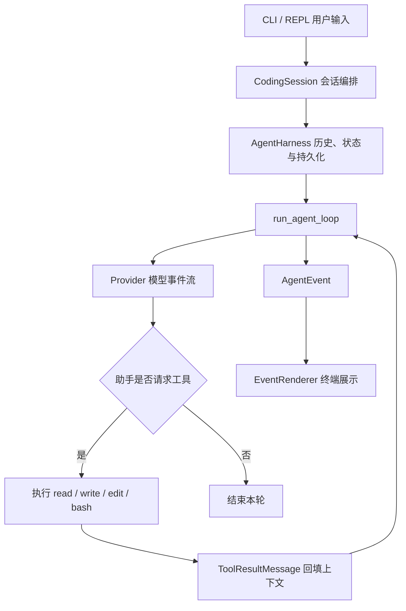

# Minitau

Minitau 是一个对照 tau 源码逐步实现的 Python 教学型 Coding Agent。项目围绕“如何从底层构建一个 Agent”展开：从消息和事件协议、模型流式响应，到工具调用、会话恢复、上下文压缩与终端交互，把每一层的职责和数据流呈现在代码中。

目前可以直接启动应用，在终端内配置 API、选择供应商和模型，并连续对话；无需提前设置 API key 环境变量。模型可以使用 `read`、`write`、`edit`、`bash` 四个工具，会话支持保存、恢复、压缩和历史分支。P6/P7 的主要组件与离线综合验收已经落地，后续将继续补齐文件搜索、Skill、Hook、MCP、跨会话记忆和多 Agent 协作。

## 已实现的能力

| 能力 | 当前实现 |
| --- | --- |
| Agent loop / ReAct | 模型生成工具调用 → 执行工具 → 将结果回填上下文 → 继续请求模型，直到结束或取消 |
| Provider 接入 | Provider 统一接口、离线 Fake/Demo、OpenAI 兼容 Chat Completions 流式端点、SSE 解析与请求重试 |
| 编码工具 | `read` 文件读取与分页；`write` 文件写入；`edit` 文本替换；`bash` 命令执行、超时、取消与输出截断 |
| 项目上下文 | 发现项目规则文件 `AGENTS.md`，与工具说明一起构建系统提示词 |
| 终端交互 | 顺序执行的多轮 REPL、流式文本展示、斜杠命令、单次 print 模式与管道输入 |
| 会话管理 | JSONL 追加日志、新建、列表、改名、按 ID 或唯一前缀恢复 |
| 上下文压缩 | 粗略 token 估算、自动压缩、手动压缩、摘要持久化与重放 |
| 历史分支 | 查看安全分支节点，切换到完整助手回合或压缩节点，并持久化选择 |
| API 配置与模型切换 | 首次启动向导、隐藏输入 key、供应商切换、端点与模型设置、本地保存、按活动分支恢复 |
| 取消与清理 | 取消令牌、活动任务监督、Ctrl+C 状态处理、异步事件流与 Provider 资源释放 |

## 快速开始

需要 **Python 3.12 或更高版本**与 **uv**。在项目目录中执行：

```powershell
uv sync --locked --dev
uv run minitau --help
```

### 启动并配置供应商

```powershell
uv run minitau
```

首次启动会显示配置向导，选择 `deepseek`、`kimi`、`openai` 或 `custom`，输入 Base URL、模型 ID 和 API key 即可开始聊天，**无需提前设置环境变量**。端点和模型可以回车采用显示的默认值；key 隐藏输入。`custom` 用于其他兼容 OpenAI Chat Completions 的服务。

配置按项目保存在 `.minitau/settings.json` 和 `.minitau/credentials.json`，下次在同一工作目录启动会自动使用已保存的默认供应商。更换 `--cwd` 后使用该目录自己的配置。向导中输入 `q` 或按 Ctrl+C 可以取消。

首次配置的操作顺序：

1. 输入供应商名称或列表编号，例如 `deepseek`。
2. 输入 API 根地址；内置供应商可以回车使用显示的默认端点。
3. 输入账号实际可用的模型 ID。
4. 在隐藏输入提示下粘贴 API key，再按回车；终端不会显示 key 字符。
5. 出现 `minitau>` 后输入消息，开始对话。

配置向导不会发送 API 请求；第一条聊天消息才会验证 key、端点和模型是否可用。以后需要更改配置，在 `minitau>` 中输入 `/config` 即可。

### 离线体验多轮交互

```powershell
uv run minitau --provider demo
```

进入 `minitau>` 提示符后，可连续输入问题：

```text
minitau> 你好
Demo response to: 你好
minitau> /status
minitau> /help
minitau> /exit
```

`demo` 每轮回显用户输入，适合体验交互、命令和会话流程；它没有真实推理能力，也不会自主调用工具。

### 单次运行

```powershell
uv run minitau -p "你好"
uv run minitau --provider demo -p "介绍一下 Agent loop"
```

新会话未指定 `--provider` 时使用项目保存的默认供应商；交互模式没有默认配置时打开向导，print 模式没有默认配置时仍使用 `fake`。`fake` 是脚本式测试 Provider，工厂仅预置一次回复；连续离线对话请使用 `demo`。

`-p` 将最终回答写到标准输出，工具进度、会话信息与错误写到标准错误。可通过管道附加输入：

```powershell
Get-Content -Raw README.md | uv run minitau --provider demo -p "总结这段内容"
```

交互模式需要终端输入；管道输入应配合 `-p` 使用。

## 配置 API 与模型

进入应用后，可以随时配置或修改 API，无需退出终端：

```text
minitau> /config
minitau> /config deepseek
minitau> /provider
minitau> /provider kimi
minitau> /model 你的模型ID
```

`/config` 显示供应商选择向导；`/config deepseek` 直接修改 DeepSeek 的 key、端点和默认模型。已有 key 时回车保留，输入新 key 则替换。保存后立即应用到当前会话，保留聊天历史。`/provider` 查看可用供应商与配置状态；`/provider kimi` 切换到已配置的 Kimi。如果目标供应商尚未配置，先执行 `/config kimi`。`/model` 修改当前会话的模型，也会更新已保存供应商的默认模型。

支持的供应商与使用方式：

| 名称 | 用途 | 配置方式 |
| --- | --- | --- |
| `deepseek` | DeepSeek 的 OpenAI 兼容接口 | `/config deepseek` |
| `kimi` | Moonshot / Kimi 的 OpenAI 兼容接口 | `/config kimi` |
| `openai` | OpenAI Chat Completions 接口 | `/config openai` |
| `custom` | 其他 OpenAI Chat Completions 兼容服务 | `/config custom`，填写端点和模型 ID |
| `demo` | 多轮离线回显，体验交互流程 | 无需 key |
| `fake` | 单次固定回复，供测试使用 | 无需 key |

`custom` 的 Base URL 应填写 API 根地址，例如 `https://example.com/v1`。Provider 会自动追加 `/chat/completions`，不要在配置中重复填写该路径。当前没有模型目录查询界面，模型 ID 由用户输入。

API key 以**本地明文**保存在 `.minitau/credentials.json`，不写入设置文件或模型切换日志，也不显示在供应商列表中；`.minitau/` 已被 `.gitignore` 排除。不要把凭据文件分享给他人。Windows 上文件权限仍取决于所在目录的访问权限。

仍兼容原来的环境变量方式。未在应用中保存配置时，真实 Provider 从当前进程环境变量读取 key：

| `--provider` | API key 环境变量 | 项目内置默认端点 |
| --- | --- | --- |
| `deepseek` | `DEEPSEEK_API_KEY` | `https://api.deepseek.com` |
| `kimi` | `MOONSHOT_API_KEY` | `https://api.moonshot.cn/v1` |
| `openai` | `OPENAI_API_KEY` | `https://api.openai.com/v1` |
| `custom` | `MINITAU_API_KEY`（备用） | 通过 `/config custom` 设置 |

下面以 PowerShell 为例。请将密钥和模型 ID 替换为自己账号可用的值：

```powershell
$env:DEEPSEEK_API_KEY = "你的API密钥"
uv run minitau --provider deepseek --model "你的模型ID"
```

也可以单次请求：

```powershell
uv run minitau --provider deepseek --model "你的模型ID" -p "读取 README.md 并介绍项目结构"
```

使用其他兼容端点时，通过 `MINITAU_BASE_URL` 覆盖默认地址：

```powershell
$env:OPENAI_API_KEY = "你的API密钥"
$env:MINITAU_BASE_URL = "https://your-compatible-endpoint.example/v1"
uv run minitau --provider openai --model "你的模型ID"
```

`MINITAU_BASE_URL` 只在未保存供应商设置、沿用旧环境变量方式时生效。应用中保存的 key 和端点优先于环境变量。切回内置端点时，可以清除当前终端中的覆盖值：

```powershell
Remove-Item Env:MINITAU_BASE_URL -ErrorAction SilentlyContinue
```

项目不自动加载 `.env` 文件。交互启动指定了 `--provider`、但该供应商缺少 key 时，也会进入配置向导。print 模式不会询问配置，缺 key 会报错并提示先使用交互配置。实现与数据流说明见 [应用内 API 配置](docs/interactive-api-configuration.md)。

新会话未指定 `--model` 时，优先使用该供应商已保存的默认模型，没有保存设置时才使用工厂预设；恢复会话时优先沿用活动分支的模型。预设模型名不保证当前账号或服务端支持。`/model` 设置成功表示本地配置已保存，模型是否可用由下一次真实请求确认。

### 配置保存与常见问题

| 位置 | 保存内容 |
| --- | --- |
| `<cwd>/.minitau/settings.json` | 默认供应商、各供应商的 Base URL 和默认模型 |
| `<cwd>/.minitau/credentials.json` | API key，不包含在模型切换日志中 |
| `<cwd>/.minitau/sessions/` | 会话消息、摘要、分支和供应商/模型选择 |

- **返回 401**：使用 `/config <供应商>` 输入新 key，并确认端点与 key 所属服务匹配；保存后直接重试消息。
- **仍使用旧 key**：本地保存的 key 优先于环境变量。修改 `$env:...` 不会覆盖已保存值，需要通过 `/config` 更新。
- **换项目后重新要求配置**：设置按工作目录隔离，`--cwd` 改变后读取目标项目自己的 `.minitau/`。
- **print 模式提示缺少 key**：先在同一工作目录用交互模式完成配置，再执行 `-p`；print 模式不会打开向导。
- **只想体验界面**：执行 `uv run minitau --provider demo`，不需要真实 API。

## 交互命令

普通文本作为用户消息发给模型；以 `/` 开头的输入由命令路由处理。

| 命令 | 用途 |
| --- | --- |
| `/config [供应商]` | 配置 API key、端点、默认模型，保存并立即应用 |
| `/provider` | 查看当前供应商和各供应商配置状态 |
| `/provider <供应商>` | 切换已配置供应商，使用其默认模型 |
| `/help` | 列出可用命令 |
| `/status` | 查看会话 ID、工作目录、供应商、模型、估算上下文占用和运行状态 |
| `/sessions` | 列出当前工作目录中的会话 |
| `/new` | 创建并切换到空会话 |
| `/resume <id或唯一前缀>` | 恢复已有会话 |
| `/name <标题>` | 为当前会话改名 |
| `/compact` | 请求模型总结当前上下文，保存摘要 |
| `/model` | 查看当前模型 |
| `/model <模型名>` | 切换当前 Provider 的模型，更新会话与已保存供应商的默认模型 |
| `/tree` | 查看可选择的安全分支节点 |
| `/branch <entry_id>` | 切换到指定历史节点 |
| `/exit` | 退出交互 |

要把以 `/` 开头的文本发送给模型，可使用双斜杠，例如 `//help` 会发送 `/help`。未知命令会返回提示，不会作为普通提问发送。

运行中第一次 **Ctrl+C** 请求取消，并等待工具和事件流收尾；再次中断会请求清理后退出，必要时升级为任务取消。空闲输入时第一次 Ctrl+C 取消本次输入，两秒内再次按下则退出；EOF 也会结束交互。

配置向导中的 Ctrl+C 会取消向导：首次启动时结束启动流程，已进入会话时返回 `minitau>` 并继续使用原供应商。

## 启动参数与工作目录

| 参数 | 用途 |
| --- | --- |
| `--print` / `-p` | 单次非交互运行 |
| `--provider <name>` | 选择 Provider |
| `--model <name>` / `-m` | 指定请求模型 |
| `--cwd <目录>` | 设置工具工作目录，以及该项目的配置、凭据和会话存储位置 |
| `--resume <id或唯一前缀>` | 恢复指定会话 |
| `--continue` / `-c` | 恢复最近使用的会话 |
| `--context-window <tokens>` | 设置上下文窗口预算，必须大于零 |
| `--version` / `-v` | 显示版本 |
| `--help` | 显示帮助 |

例如，让 Agent 在另一项目中工作：

```powershell
uv run minitau --provider demo --cwd "D:\path\to\your-project"
```

相对文件路径以 `--cwd` 为基准。`bash` 工具通过操作系统默认 shell 执行命令，因此 Windows 和 POSIX 的命令语法可能不同。工具会实际写文件和执行命令；当前尚未实现工具调用审批或文件系统沙箱，`--cwd` 也不限制绝对路径访问。

系统提示词会读取项目根目录到当前目录沿途的 `AGENTS.md`，以及当前目录下的 `.minitau/AGENTS.md`、`.agents/AGENTS.md`。可以在这些文件中放置编码约定和项目说明。

## 会话、压缩与模型恢复

每个会话保存在工作目录下：

```text
<cwd>/.minitau/sessions/<session_id>.jsonl
```

日志只追加新条目：

- `SessionInfoEntry`：工作目录与会话标题。
- `ModelChangeEntry`：Provider 名、模型名和上下文窗口配置。
- `MessageEntry`：用户、助手和工具结果消息。
- `CompactionEntry`：摘要及其替代的历史消息 ID。
- `LeafEntry`：当前选择的分支节点。

压缩会改变下一轮模型接收的上下文，原始历史仍保留在 JSONL 文件中。分支选择也会立即落盘；即使选择后直接退出，恢复时仍沿所选路径还原消息与模型配置。

```powershell
uv run minitau --resume "会话ID或唯一前缀"
uv run minitau --continue
uv run minitau --resume "会话ID" --model "本次使用的模型ID"
```

`--resume` 与 `--continue` 不能同时使用。供应商与模型的优先级为 **显式启动参数 → 活动分支配置 → 项目保存的默认配置 → 工厂默认值**。key 优先使用本地凭据，未保存时回退到环境变量；端点优先使用保存的设置，未保存时沿用环境变量和内置端点。恢复时先加载快照，再创建匹配的 Provider；历史分支只记录供应商和模型，不记录 key，始终使用当前有效的凭据。

同 Provider 内通过 `/model` 切换模型保留历史与当前窗口值；通过 `/config` 或 `/provider <名称>` 切换供应商时，保留对话历史，同时更新实际 Provider 实例和模型，窗口恢复为默认预算。跨供应商的历史分支与会话恢复也会装载匹配的 Provider，使用当前凭据。

供应商切换需要等当前请求结束或取消后执行。项目暂时不根据模型名查询真实窗口大小，token 占用也是粗略估算；需要时通过 `--context-window` 明确指定预算。当前默认兜底窗口为 128,000 tokens。

会话文件按工作目录隔离；当前约定每个会话文件只有一个活动写入者。

## 项目结构与数据流

```text
Minitau/
├── src/
│   ├── minitau_agent/       # 消息、事件、Agent loop、Harness、压缩与会话重放
│   │   └── session/        # 条目模型、JSONL、树路径与存储
│   ├── minitau_ai/          # Provider 实现、HTTP/SSE、重试与环境配置
│   └── minitau_coding/      # CLI、REPL、命令路由、会话装配、工具与系统提示词
│       ├── configuration.py     # 供应商选择与隐藏输入 key 的配置向导
│       ├── provider_settings.py # 设置、凭据校验与文件保存
│       └── provider_runtime.py  # Provider 创建、配置解析与资源释放
├── tests/                  # 单元测试、回归测试与离线综合场景
├── docs/                   # 源码走读、学习路线与阶段实现说明
├── pyproject.toml
└── uv.lock
```

三个包分别处理 Agent 核心、模型接入和编码应用层。一轮请求经过如下路径：



Provider 返回模型事件，loop 将其转换为统一的 Agent 事件；Harness 维护历史和持久化，renderer 负责展示。调用方通过 `async for` 完整消费事件流，操作完成后才进入下一次输入。

配置输入走另一条路径：`配置向导 → 设置与凭据存储 → ProviderRuntime → CodingSession → Harness 配置`。配置输入不会作为聊天消息交给模型。分层设计与 tau 的对应关系见 [应用内 API 配置说明](docs/interactive-api-configuration.md)。

## 测试与开发

```powershell
uv run pytest -q
uv run mypy src
uv run ruff check src tests
```

测试包含消息与事件协议、模型/工具循环、请求错误、取消与清理、JSONL 恢复、压缩、分支、API 配置、模型切换和 REPL 行为。单独运行配置与完整场景验收：

```powershell
uv run pytest -q tests/test_p74_end_to_end.py
uv run pytest -q tests/test_interactive_configuration.py
```

该场景用脚本式 FakeProvider 驱动真实会话与工具：读文件 → 写入/编辑 → 执行命令 → 压缩 → 恢复 → 分支，并验证长命令取消后可以继续提问。它不调用真实模型 API。真实端点的模型可用性以及真实 Windows 终端的 Ctrl+C 行为，需要在实际环境另行验证。

API 配置验收通过 `httpx.MockTransport` 驱动实际 OpenAI 兼容适配器，检查首次配置、key 更新、请求端点、模型与历史消息、重启复用、跨供应商恢复、取消和客户端清理，不调用远端服务。

## 学习资料与后续路线

建议先沿一条输入到工具结果的调用链阅读代码，再结合测试理解失败、取消和恢复场景。

| 文档 | 内容 |
| --- | --- |
| [执行流程走读](docs/execution-flow.md) | 从 CLI 到模型流、工具与会话记录的数据流 |
| [完整 Agent 学习路线](docs/agent-roadmap.md) | 后续工具、Skill、Hook、MCP、记忆与协作能力 |
| [P6/P7 实施路线](docs/p6-p7-roadmap.md) | 会话编排与终端交互的阶段目标 |
| [P6.6 模型切换说明](docs/p6.6-model-switch-implementation.md) | 模型配置持久化、恢复优先级与分支重放 |
| [应用内 API 配置](docs/interactive-api-configuration.md) | 配置向导、供应商切换、凭据保存及设计原因 |
| [P7.4 综合验收](docs/p7.4-end-to-end-acceptance.md) | 完整离线场景与验证方式 |
| [可靠性修复记录](docs/reliability-changes.md) | 取消、工具输出、持久化与错误处理的设计原因 |
| [总体阶段计划](docs/roadmap.md) | 项目分阶段学习计划 |

接下来的能力顺序为：

```text
P8  glob / grep 与统一工具边界
 → P9  Skill 发现与按需加载
 → P10 Hook / 扩展事件
 → P11 MCP 客户端接入
 → P12 跨会话记忆
 → P13 多 Agent 协作
```

这些能力目前仍属于后续计划。现有 `session/memory.py` 负责当前会话的历史重放，长期记忆将使用独立的存储与检索机制。部分路线文档保留了早期阶段状态，当前功能以 `src/` 和 `tests/` 的实现为准。
