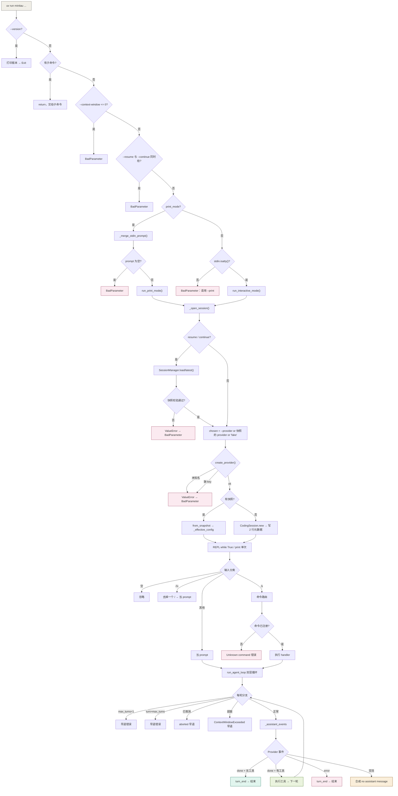

# minitau 全场景数据流手册

> 配套文档：
> - `docs/execution-flow.md` —— print 模式（`-p`）单条链路的逐层走读
> - `docs/interactive-hello-flow.md` —— 交互模式「你好」单条链路的逐层走读
>
> 本文把**所有分支情况**各自拆成一条数据流。每条都给出：触发条件 → 判定点（`文件:行号`）→ 步骤化数据流 → 产出。
> 共 **84 种情况**，分 11 组。

---

## 0. 怎么读这份文档

每条情况的格式固定：

```
### 编号 标题
- 触发：什么样的输入/状态会走到这里
- 判定点：决定走这条路的代码位置
- 数据流：逐步列出「谁调用谁、什么数据在动」
- 产出：终端显示什么 / 写什么文件 / 返回什么值
```

三个包的简称：**C** = `minitau_coding`（应用层）、**A** = `minitau_agent`（框架层）、**AI** = `minitau_ai`（适配层）。

---

## 1. 场景总览

### 1.1 全局决策树



### 1.2 场景索引

| 组 | 情况数 | 覆盖范围 |
|---|---|---|
| 2. 启动入口 | 12 | 参数校验、模式分叉、Provider 创建失败 |
| 3. 输入分类 | 5 | 空输入、普通文本、`//` 转义、已知/未知命令 |
| 4. 斜杠命令 | 11 | `/help` 到 `/branch` 全部命令 |
| 5. Agent loop | 14 | 双层循环的每条出口 |
| 6. 工具执行 | 6 | 成功、失败、找不到、取消、超时、多工具 |
| 7. 上下文压缩 | 7 | 自动、手动、跳过、失败、超窗 |
| 8. 取消与中断 | 7 | 空闲/运行中 × 第一次/第二次 Ctrl+C、EOF |
| 9. Provider 与网络 | 9 | fake/demo/真实、4xx/5xx/断流/取消、SSE 错误 |
| 10. 恢复 / 分支 / 模型 | 8 | 快照校验、配置优先级、分支安全点、模型切换 |
| 11. 持久化与重放 | 6 | 五种 Entry 的写入与重放、旧文件兼容 |

---

## 2. 启动入口（12 种）

### 2.1 `--version` / `-v`

- **触发**：`uv run minitau --version`
- **判定点**：`C/cli.py:201`
- **数据流**：
  1. 模块导入期 `C/cli.py:400` 先跑 `_force_utf8_streams()`（改 stdout/stderr 编码）；
  2. Typer 绑定 `version=True`；
  3. `if version:` → `typer.echo(f"Minitau version: {__version__}")`；
  4. `raise typer.Exit()` → Click 捕获，跳过 traceback，退出码 0。
- **产出**：stdout 一行 `Minitau version: 0.0.1`。**不建 Provider，不建会话目录。**

### 2.2 有子命令

- **触发**：`uv run minitau <subcommand>`
- **判定点**：`C/cli.py:205`
- **数据流**：`if ctx.invoked_subcommand is not None: return` → 回调函数直接结束，控制权交给 Typer 去执行对应子命令函数。
- **产出**：`app` 当前**没有注册任何子命令**（`cli.py:122-128` 之后没有 `app.command()`），所以这条分支实际不可达，属于防御性保留。

### 2.3 `--context-window` 非正数

- **触发**：`--context-window 0` 或负数
- **判定点**：`C/cli.py:213-214`
- **数据流**：`raise typer.BadParameter("--context-window must be greater than 0")` → Click 捕获 → 打印用法 + 错误 → 退出码 2。
- **产出**：stderr 报错，进程退出。**没有创建 Provider。**

### 2.4 `--resume` 与 `--continue` 同时给

- **触发**：`--resume abc --continue`
- **判定点**：`C/cli.py:216-217`（print 模式在 `C/cli.py:299-300` 再查一次）
- **数据流**：`raise typer.BadParameter("--resume and --continue cannot be combined.")`
- **产出**：stderr 报错，退出码 2。

### 2.5 print 模式 + 无 prompt

- **触发**：`uv run minitau -p`（没给文本，也没管道输入）
- **判定点**：`C/cli.py:222-226`
- **数据流**：
  1. `prompt = _merge_stdin_prompt(positional_prompt).strip()`（`C/cli.py:221`）→ `""`；
  2. `if not prompt:` → `raise typer.BadParameter('Print mode requires a prompt. Use `minitau -p "your prompt"` or pipe content through stdin.')`
- **产出**：stderr 报错 + 用法提示，退出码 2。

### 2.6 print 模式（正常）

- **触发**：`uv run minitau -p "你好"`
- **判定点**：`C/cli.py:219` → `C/cli.py:228-237`
- **数据流**：
  1. `_merge_stdin_prompt("你好")`：`stdin.isatty()` 为 True（或抛异常）→ 原样返回 `"你好"`；
  2. `run_print_mode(prompt="你好", provider_name=None, model_name=None, cwd=<Path.cwd()>, resume=None, continue_latest=False, context_window=None)`（`C/cli.py:289`）；
  3. 里面 `asyncio.run(run_and_close())` → `_open_session(...)` → `CodingSession.new`；
  4. `typer.echo(f"Session: {session.session_id}", err=True)` → **stderr**；
  5. `_run_print_session(session, prompt="你好")`；
  6. `raise typer.Exit()`（`C/cli.py:237`）—— 注意这行在 `run_print_mode` 返回之后，用来终止进程。
- **产出**：stdout 出助手正文，stderr 出 `Session: <id>`。详见 `docs/execution-flow.md`。

### 2.7 print 模式 + 管道输入

- **触发**：`Get-Content README.md | uv run minitau --provider demo -p "总结"`
- **判定点**：`C/cli.py:95-120` 的 `_merge_stdin_prompt`
- **数据流**：
  1. `stdin.isatty()` 返回 **False**（连着管道）→ 不提前返回；
  2. `piped_content = stdin.read()` 一次读完管道全部内容；
  3. `if not piped_content: return prompt`（空管道直接返回原 prompt）；
  4. `if not prompt: return piped_content`（没给命令行文本，就用管道内容）；
  5. 都有 → `return f"{piped_content}\n\n{prompt}"`，**管道内容在前、命令行文本在后**；
  6. 回到 `C/cli.py:221` 再 `.strip()`。
- **产出**：模型收到的是「文件全文 + 空行 + 指令」。
- **四个异常兜底**：`stdin is None`、`isatty()` 抛 `AttributeError/ValueError`、`read()` 抛 `OSError/ValueError` —— 每一处都**返回原 prompt 而不抛异常**。辅助功能失败不阻塞主流程。

### 2.8 交互模式（正常）

- **触发**：`uv run minitau`（无参数）
- **判定点**：`C/cli.py:241` → `C/cli.py:244`
- **数据流**：见 `docs/interactive-hello-flow.md` 第 3~9 节。
  关键点：`run_interactive_mode(initial_prompt=None, ...)` → `SessionManager(cwd)` → `asyncio.run` → `_open_session` → `CodingSession.new` → `run_repl(...)`。
- **产出**：stderr 一行 `Session: <id>`，然后 `minitau> ` 提示符阻塞等待输入。

### 2.9 交互模式 + 非 TTY

- **触发**：`echo 你好 | uv run minitau`
- **判定点**：`C/cli.py:241-242`
- **数据流**：`sys.stdin.isatty()` 为 False → `raise typer.BadParameter("Interactive mode requires a TTY; use --print for piped input.")`
- **产出**：stderr 报错，退出码 2。
- **为什么这么设计**：`C/cli.py:239-240` 注释说明——`input()` 需要真实终端，**不能**先调 `_merge_stdin_prompt()`，否则它会把交互输入当管道内容一次性读完。

### 2.10 `--resume` 恢复会话

- **触发**：`uv run minitau --resume 20261003`
- **判定点**：`C/cli.py:34-38`（`_open_session`）→ `C/session_manager.py:55-77`
- **数据流**：
  1. `snapshot = await manager.load("20261003")`；
  2. `load()` 先用 `re.fullmatch(r"[A-Za-z0-9_-]+", ref)` 校验引用格式，不合法抛 `ValueError("Invalid session reference: ...")`；
  3. 精确匹配 `<ref>.jsonl`；不存在则 `glob(f"{ref}*.jsonl")`；
     - 0 个 → `ValueError("No session matches ...")`
     - 多个 → `ValueError("Ambiguous session ...: a, b")`
     - 恰好 1 个 → 用它；
  4. `_read_snapshot(path)`（`C/session_manager.py:113-195`）做全量校验 + 状态重放（见第 11 组）；
  5. `stored_provider = snapshot.model_change.provider_name`；
  6. `chosen_provider = provider_name or stored_provider or "fake"` —— **未传 `--provider` 时自动沿用会话里记录的 Provider**；
  7. `create_provider(chosen_provider)`；
  8. `CodingSession.from_snapshot(config, snapshot)` → `_effective_config` 决定最终 model / window；
  9. `typer.echo("Resumed session: <id>", err=True)`（`C/cli.py:315-316`）。
- **产出**：加载已有 JSONL，链尾指向 `snapshot.last_entry_id`，下一条消息接到该节点之后。
- **失败路径**：`ValueError` 从 `asyncio.run` 冒到 `C/cli.py:396` → `typer.BadParameter(str(exc))`。

### 2.11 `--continue` 恢复最近会话

- **触发**：`uv run minitau --continue`（或 `-c`）
- **判定点**：`C/cli.py:35-36` → `C/session_manager.py:79-84`
- **数据流**：
  1. `snapshot = await manager.latest()`；
  2. `latest()` → `list_sessions()` 遍历 `sessions_dir.glob("*.jsonl")`，对每个文件 `_read_snapshot`，**单个文件损坏被 `except ValueError: continue` 跳过**，不连累其他会话；
  3. 排序 `key=lambda item: (-item.updated_at_ns, item.session_id)` —— 先按 mtime 降序，mtime 相同时按 ID 保证稳定；
  4. `if not summaries: raise ValueError("No sessions found yet; run a prompt first")`；
  5. 取 `summaries[0].session_id` 再走一次 `load()`；
  6. 之后与 2.10 第 5 步起完全一致。
- **产出**：恢复 mtime 最新的会话。

### 2.12 Provider 创建失败（未知名 / 缺 API key）

- **触发**：`--provider foo`，或 `--provider deepseek` 但没设 `DEEPSEEK_API_KEY`
- **判定点**：`AI/factory.py:40-53`
- **数据流**：

  **路径 A —— 未知 provider 名**
  1. `name not in PROVIDER_PRESETS` 且不是 `demo`/`fake`/`None`；
  2. `raise ValueError(f"Unknown provider {name!r}; available providers: fake, deepseek, kimi, openai")`；
  3. 注意这一步在 `_open_session` 的 `try` 块**之前**（`C/cli.py:46` vs `C/cli.py:47`），所以**没有 provider 需要 `aclose()`**；
  4. `ValueError` 冒到 `C/cli.py:396` → `typer.BadParameter(str(exc))`。

  **路径 B —— 缺 API key**
  1. `PROVIDER_PRESETS["deepseek"] = ("DEEPSEEK_API_KEY", "https://api.deepseek.com", "deepseek-flash")`；
  2. `openai_compatible_config_from_env(api_key_var="DEEPSEEK_API_KEY", default_base_url="https://api.deepseek.com")`（`AI/env.py:22-34`）；
  3. `api_key = environ.get("DEEPSEEK_API_KEY")` → `None`；
  4. `raise RuntimeError("Missing required environment variable: DEEPSEEK_API_KEY")`；
  5. `AI/factory.py:46-48` 捕获并**转换异常类型**：`raise ValueError(str(exc)) from exc`（注释写明「cli 只捕 ValueError——错误类型在工厂边界统一（契约！）」）；
  6. 冒到 `C/cli.py:396` → `BadParameter`。
- **产出**：stderr 报错，退出码 2。
- **成功路径**：`OpenAICompatibleProvider(config)` + `default_model`（`AI/factory.py:49-50`）。`MINITAU_BASE_URL` 环境变量会覆盖 `default_base_url`（`AI/env.py:34`）。

---

## 3. 输入分类（5 种）

全部入口：`C/commands.py:286-318` 的 `dispatch_input(line, context)`。

### 3.1 空输入

- **触发**：直接回车，或只输入空格
- **判定点**：`C/commands.py:291-293`
- **数据流**：`text = line.strip()` → `""` → `if not text: return CommandResult(handled=True)`。
- **产出**：`handled=True`，`prompt=None` → 回到 `C/repl.py:121` 的 `if not result.handled and result.prompt is not None` 为假 → 不 continue；`error`/`message` 都是 None → 不打印；`exit_requested` 为 False → **回到 `minitau> ` 重新读输入**。屏幕无任何输出。

### 3.2 普通文本

- **触发**：`你好`
- **判定点**：`C/commands.py:299-300`
- **数据流**：不以 `//` 开头、不以 `/` 开头 → `return CommandResult(handled=False, prompt="你好")`。
- **产出**：`C/repl.py:67-68` 检测到 `not handled and prompt is not None` → `await consume_prompt("你好")`。

### 3.3 `//` 转义

- **触发**：`//help`
- **判定点**：`C/commands.py:296-297`
- **数据流**：`text.startswith("//")` → `return CommandResult(handled=False, prompt=text[1:])` → `prompt = "/help"`。
- **产出**：把 `/help` **作为普通提问发给模型**，不执行内置命令。这是唯一能把斜杠开头的文本送进模型的通道。

### 3.4 已知斜杠命令

- **触发**：`/status`
- **判定点**：`C/commands.py:302-315`
- **数据流**：
  1. `parts = text.split(maxsplit=1)` → `["/status"]`（`maxsplit=1` 保证标题里的空格留在 `argument` 里，`/name 我的 会话` → `argument="我的 会话"`）；
  2. `name = parts[0][1:].lower()` → `"status"`；
  3. `argument = parts[1] if len(parts) == 2 else ""` → `""`；
  4. `spec = COMMANDS.get("status")` → 命中 `CommandSpec("status", "/status", "Show session status.", _status)`；
  5. `return await spec.handler(context, argument)`。
- **产出**：命令 handler 的返回值。

### 3.5 未知斜杠命令

- **触发**：`/foo`
- **判定点**：`C/commands.py:307-312`
- **数据流**：`spec is None` → `return CommandResult(handled=True, error=f"Unknown command /foo; use /help to see available commands.")`
- **产出**：`C/repl.py:124-125` → `emit(result.error, True)` → **stderr**。不会作为普通提问发给模型。

### 3.6（补充）命令 handler 抛可预期异常

- **触发**：`/resume 不存在的id`、运行中执行 `/new`
- **判定点**：`C/commands.py:314-318`
- **数据流**：`except (ValueError, RuntimeError) as exc: return CommandResult(handled=True, error=str(exc))`
- **产出**：错误信息走 stderr，REPL 继续循环。
- **注意**：只捕 `ValueError` / `RuntimeError`。`RuntimeError` 覆盖的是 `_ensure_idle` 的「Cannot ... while the agent is running」和「This session has no storage」这类会话层错误。

---

## 4. 斜杠命令（11 种）

注册表在 `C/commands.py:261-283`。所有 handler 签名统一为 `async def handler(context: CommandContext, argument: str) -> CommandResult`。

**`CommandResult` 五个字段**（`C/commands.py:39-46`）：`handled` / `message` / `exit_requested` / `error` / `prompt`。
**REPL 消费顺序**（`C/repl.py:121-130`）：先看 `handled=False and prompt` 是否要跑模型 → 再看 `error` → 再看 `message` → 最后看 `exit_requested`。

### 4.1 `/help`

- **判定点**：`C/commands.py:70-79`
- **数据流**：
  1. `_reject_extra(argument, "/help")` —— 有参数则 `CommandResult(handled=True, error="Usage: /help")`；
  2. 无参数 → 列表推导遍历 `COMMANDS.values()`，每条 `f"{spec.usage} — {spec.help}"`；
  3. `"\n".join(lines)`。
- **产出**：stdout 一段命令清单（注意顺序 = `COMMANDS` 字典的插入顺序）。

### 4.2 `/status`

- **判定点**：`C/commands.py:82-96`
- **数据流**：
  1. `_reject_extra`；
  2. `status = context.session.status` → `C/session.py:328-344`：
     - `usage = estimate_context_usage(system=harness.config.system, messages=self.messages, tools=tuple(harness.config.tools))`；
     - `window = self._config.context_window_tokens or DEFAULT_CONTEXT_WINDOW_TOKENS`（128000）；
     - 组装 `CodingSessionStatus`；
  3. 拼 5 行文本。
- **产出**：

  ```
  Session: 20261003-152920-1a58ae
  Working directory: D:\Learn\deeplearn\Minitau
  Model: fake
  Context: approximately 1234/128000 tokens
  Running: False
  ```

  注意 `estimated_tokens` 是**字符数 ÷ 4** 的经验估算（`A/context_window.py:19-23`），不是真实 tokenizer。

### 4.3 `/sessions`

- **判定点**：`C/commands.py:99-120`
- **数据流**：
  1. `summaries = await context.manager.list_sessions(current_session_id=context.session.session_id)`；
  2. 空 → `CommandResult(message="No sessions found.")`；
  3. 遍历：`marker = "*" if item.is_current else " "`；`updated = datetime.fromtimestamp(item.updated_at_ns / 1_000_000_000).strftime("%Y-%m-%d %H:%M:%S")`；
  4. 每条 `f"{marker} {item.session_id}  {updated}  {item.title}"`。
- **产出**：

  ```
  * 20261003-152920-1a58ae  2026-10-03 15:29:20  你好
    20261003-152100-7bfaa3  2026-10-03 15:21:00
  ```

  `updated_at_ns` 来自 `path.stat().st_mtime_ns`（纳秒），除以 `1e9` 转秒。

### 4.4 `/new`

- **判定点**：`C/commands.py:123-132`
- **数据流**：
  1. `_reject_extra`；
  2. `await context.session.start_new(context.manager, title="")` → `C/session.py:406-421`：
     - `self._ensure_idle("create")` → 运行中抛 `RuntimeError`；
     - `self._ensure_cwd(manager)` → `manager.cwd != self._config.cwd.resolve()` 抛 `ValueError("Session manager belongs to a different cwd")`；
     - `candidate = await CodingSession.new(self._config, session_id=manager.create(), title="")` —— **注意用的是 `self._config`（当前配置，可能已被 `/model` 改过）**；
     - `self._harness = candidate._harness`；`self._session_id = candidate._session_id`；`self._config = candidate._config`。
  3. 返回 `Created session: <新id>`。
- **产出**：新 JSONL 只有 2 行（`session_info` + `model_change`），**旧会话文件保留不动**。

### 4.5 `/resume <id或前缀>`

- **判定点**：`C/commands.py:135-146`
- **数据流**：
  1. `if not argument:` → `error="Usage: /resume <session ID or unique prefix>"`；
  2. `await context.session.switch_to(context.manager, argument)` → `C/session.py:386-402`：
     - `_ensure_idle("switch")` + `_ensure_cwd(manager)`；
     - `snapshot = await manager.load(ref)` —— **先完整装载**，失败就抛，当前状态不动；
     - `candidate = type(self).from_snapshot(self._launch_config, snapshot)` —— **注意用的是 `_launch_config`（本次进程启动时的配置），不是 `_config`**。这与 `/new` 相反；
     - 再次 `_ensure_idle()` 后原子替换三个字段。
  3. 返回 `Resumed session: <id>`。
- **产出**：当前会话被整体替换。`_launch_config` 的作用是让 `/resume` 回到「本次启动的 Provider/模型」，而不是带着上一次 `/model` 改过的值去装载另一个会话。

### 4.6 `/name <标题>`

- **判定点**：`C/commands.py:149-160` → `C/session.py:423-432`
- **数据流**：
  1. 空参数 → `error="Usage: /name <title>"`；
  2. `await context.session.rename(argument)`：
     - `_ensure_idle("rename")`；
     - `title = title.strip()`，空则 `ValueError("Session title cannot be empty")`；
     - `await self._harness.append_session_info(cwd=str(self._config.cwd), title=title)`；
  3. `A/harness.py:448-477` `append_session_info`：
     - `_ensure_not_running()`；
     - `self._running = True`（**在 await 之前设标志**，防止其他会话操作插进来）；
     - `await self._persist_unrecorded_messages()`；
     - `info = SessionInfoEntry(cwd=..., title=..., parent_id=self._last_entry_id)`；
     - `await self._storage.append(info)` → JSONL 追加一行；
     - `self._last_entry_id = info.id`（链尾前移）；
     - `finally: self._running = False`。
  4. 返回 `Renamed session to: <title>`。
- **产出**：JSONL 多一行 `session_info`。**重放时靠「取最后一条 `session_info`」生效**（`A/session/memory.py:72-73` + `C/session_manager.py:176-181`），所以改名记录即使不在所选分支路径上也会继续生效。
- **为什么必须走 Harness**：`A/harness.py:454-459` 的注释——假设旧链尾是 A，改名追加 B(parent=A) 后，下一条用户消息必须是 C(parent=B)。绕过 Harness 直接写 B，Harness 仍以为链尾是 A，就会错误写出 C(parent=A)。

### 4.7 `/compact`

- **判定点**：`C/commands.py:163-194`
- **数据流**：
  1. `_reject_extra`；
  2. `stream = context.session.compact()` → `C/session.py:434-439` → `harness.compact(keep_recent_tokens=0)` → `_run_manual_compaction`；
  3. `async with closing_async_iterator(stream): async for event in stream: await context.on_event(event)`，同时记下最后一个 `CompactionEndEvent`；
  4. 按 `final_event` 分支：`None` → error；`skipped` → `"There is no history to compact."`；`aborted` → `error_message or "Compaction failed."`；否则 → `"Context compacted."`。
- **产出**：`keep_recent_tokens=0` 表示**全部压掉，只留一条摘要**（语义翻转见 7.4）。详见 7.2。

### 4.8 `/model`（无参数，查询）

- **判定点**：`C/commands.py:205-211`
- **数据流**：`if not argument:` → `CommandResult(message=f"Current model: {context.session.status.model}")`。
- **产出**：`Current model: fake`。只读，不写盘。

### 4.9 `/model <模型名>`（切换）

- **判定点**：`C/commands.py:213-217` → `C/session.py:352-370`
- **数据流**：
  1. `await context.session.set_model("beta")`：
     - `_ensure_idle("change model")`；
     - `selected = "beta".strip()`；
     - 空 → `ValueError("Model name cannot be empty")`；
     - 含空白 → `ValueError("Model name cannot contain whitespace")`；
     - `if selected == self._config.model: return`（**相同则早退，不写盘**）；
     - `await self._harness.append_model_change(provider_name=self._config.provider_name, model="beta", context_window_tokens=self._config.context_window_tokens)` → `A/harness.py:479-506` 追加 `ModelChangeEntry` 并推进链尾；
     - **写入成功之后**才 `self._apply_model_config(replace(self._config, model="beta"))`。
  2. 返回 `Current model: beta`。
- **产出**：JSONL 多一行 `model_change`。会话文件形状：

  ```
  session_info → model_change(alpha) → user → assistant → model_change(beta) → user
  ```

- **三个设计点**：
  - `_apply_model_config`（`C/session.py:372-375`）同时改 `self._harness.config.model` 和 `self._config.model`，保证「显示状态、下一轮请求、磁盘历史」三者一致；
  - `append_model_change` 里的 `_ensure_not_running` + `has_queued_messages` 双重守卫（`A/harness.py:487-491`）；
  - `context_window_tokens` 沿用旧值 —— 项目没有「模型名 → 窗口」元数据，不猜。
- **失败回滚**：`storage.append` 抛异常 → `_apply_model_config` 不执行 → 内存仍是旧模型。

### 4.10 `/tree`

- **判定点**：`C/commands.py:219-243` → `C/session.py:244-290`
- **数据流**：
  1. `choices = await context.session.tree_choices()`：
     - `_ensure_idle("show tree")`；
     - `snapshot = await manager.load(self._session_id)`（**先整体校验一遍**）；
     - `entries = await JsonlSessionStorage(snapshot.path).read_all()`；
     - `safe_ids = {entry.id for entry in entries if _branch_state_if_safe(entries, entry) is not None}` —— 见第 10 组的安全点判定；
     - 定义内层函数 `closest_safe_parent(parent_id)`：沿 `parent_id` 向上走，返回最近的 safe 节点；
     - 遍历 entries，只对 `safe_ids` 里的节点生成 `TreeChoice`，标签：`CompactionEntry` → `f"compaction: {preview}"`，`AssistantMessage` → `f"assistant: {preview}"`；
     - `_tree_preview`（`C/session.py:115-121`）：不可打印字符换空格、多行压成一行、截 80 字符加 `…`，空则 `"(empty)"`；
  2. 空 → `message="No safe branch points yet."`；
  3. 每行 `f"{marker} {choice.entry_id}  <- {parent}  {choice.label}"`，`parent` 取前 8 字符或 `"root"`。
- **产出**：

  ```
  * 8de5937d13384cd08b89f6254ac6df02  <- root  assistant: Hello from the minitau fake provider!
    468c55aecd2940819514f158219962d7  <- 8de5937d  assistant: read complete
  ```

### 4.11 `/branch <entry_id>`

- **判定点**：`C/commands.py:246-259` → `C/session.py:216-242`
- **数据流**：
  1. `parts = argument.split()`，`len(parts) != 1` → `error="Usage: /branch <entry_id>"`；
  2. `await context.session.branch_to(entry_id)`：
     - `_ensure_idle("branch")`；
     - 空 → `ValueError("Branch entry ID cannot be empty")`；
     - `await manager.load(self._session_id)` —— **先复用加载器检查整份文件**，避免在损坏的会话上追加标记；
     - `entries = await JsonlSessionStorage(path).read_all()`；
     - `selected = entries_by_id(entries).get(target_id)`，`None` → `ValueError(f"Unknown session entry: {target_id}")`；
     - `state = _branch_state_if_safe(entries, selected)`，`None` → `ValueError("Branch point must be a safe complete assistant turn or compaction")`；
     - `await self._harness.select_branch(target_id=target_id, messages=state.messages, entry_ids=state.context_entry_ids)` → `A/harness.py:164-195`；
     - `self._apply_model_config(_effective_config(self._launch_config, state.model_change))` —— **模型配置也跟着分支走**。
  3. 返回 `Active branch: <entry_id>`。
- **产出**：JSONL 多一行 `LeafEntry(parent_id=target_id, entry_id=target_id)`。
- **`select_branch` 的四道守卫**（`A/harness.py:172-183`）：无 storage → RuntimeError；有排队消息 → RuntimeError；有未持久化消息（`entry_ids` 含 None）→ RuntimeError；长度不匹配 → ValueError。然后**先写 LeafEntry，成功后才改内存**（`:185-195`）。

### 4.12 `/exit`

- **判定点**：`C/commands.py:197-203`
- **数据流**：`_reject_extra` → `return CommandResult(handled=True, exit_requested=True)`。注释写明：「这里只返回退出意图。关闭 Provider 是应用入口或 REPL 的职责。」
- **产出**：`C/repl.py:129-130` → `if result.exit_requested: return` → `run_repl` 返回 → `C/cli.py:391-392` 的 `finally: await provider.aclose()` 关闭 HTTP 客户端。

---

## 5. Agent loop（14 种）

全部在 `A/loop.py:38-222`。双层循环骨架：

```python
while True:                                   # 外层：处理 follow_up
    has_more_tools = True
    while has_more_tools or pending:           # 内层：推理 → 工具 → 再推理
        ...
    follow_ups = tuple(get_follow_up_messages() if get_follow_up_messages else ())
    if follow_ups:
        pending = follow_ups
        continue
    break
```

### 5.1 入口段：prompt 转消息事件

- **判定点**：`A/loop.py:57-67`
- **数据流**：
  1. `new_messages = list(prompts)` —— 本轮新增的快照；
  2. `if prompts: messages.extend(prompts)` —— 追加进**全局历史**（这个 `messages` 是 Harness 的活列表，同一对象）；
  3. `yield AgentStartEvent()`；
  4. `yield TurnStartEvent()`；
  5. `for prompt in prompts: yield MessageStartEvent(message=prompt); yield MessageEndEvent(message=prompt)`。
- **产出**：`agent_start`、`turn_start`、每条 prompt 一对 `message_start`/`message_end`。
- **注意**：`MessageEndEvent(user)` 会被 Harness 拦截落盘（`A/harness.py:411-412`）。

### 5.2 `max_turns < 1`

- **触发**：`AgentHarnessConfig.max_turns = 0`
- **判定点**：`A/loop.py:70-78`
- **数据流**：
  1. `error = _error_message(model, "max_turns must be at least 1")` → `AssistantMessage(model=model, content=[], stop_reason="error", error_message=...)`；
  2. `messages.append(error)`；`new_messages.append(error)`；
  3. `yield MessageStartEvent` / `MessageEndEvent`；
  4. `yield TurnEndEvent(message=error)`；
  5. `yield AgentEndEvent(messages=new_messages)`；
  6. `return`。
- **产出**：事件序列 `agent_start, turn_start, message_start(user), message_end(user), message_start(error), message_end(error), turn_end, agent_end`。renderer 会把 error 打到 stderr，print 模式退出码 1。
- **可达性**：REPL / print 都不传 `max_turns`，所以这条只在直接调用 `run_agent_loop` 或测试中触发。

### 5.3 正常单轮（无工具调用）

- **触发**：模型回 `stop_reason="stop"` 且 `tool_calls` 为空
- **判定点**：`A/loop.py:187-190`（`stop_reason` 检查）、`A/loop.py:195`（`has_more_tools`）
- **数据流**：
  1. `_assistant_events(...)` 产出 `MessageStartEvent(assistant)` + `MessageEndEvent(assistant)`；
  2. loop 在 `:170-173` 记下 `assistant = event.message`；
  3. `messages.append(assistant)`；`new_messages.append(assistant)`；
  4. `assistant.stop_reason == "stop"` → 不 return；
  5. `calls = list(assistant.tool_calls)` → `[]`；`has_more_tools = False`；
  6. `for call in calls:` 空转；
  7. `yield TurnEndEvent(message=assistant, tool_results=[])`；
  8. `turn += 1`；`pending = get_steering_messages()` → `()`；
  9. 内层条件 `False or ()` → **退出内层**；
  10. `follow_ups = ()` → `break`；
  11. `yield AgentEndEvent(messages=new_messages)`。
- **产出**：8 个事件。这是「你好」走的那条路。

### 5.4 单轮工具调用

- **触发**：模型回 `stop_reason="toolUse"` 且 `tool_calls` 非空
- **判定点**：`A/loop.py:193-206`
- **数据流**：
  1. `tool_results: list[ToolResultMessage] = []`；
  2. `calls = list(assistant.tool_calls)`；`has_more_tools = bool(calls)` → `True`；
  3. 对每个 `call`：`async for event in _execute_tool_call(call, tool_by_name, signal)`：
     - 转发 `ToolExecutionStartEvent`；
     - 收到 `MessageEndEvent(ToolResultMessage)` 时 `tool_results.append`、`messages.append`、`new_messages.append`；
  4. `yield TurnEndEvent(message=assistant, tool_results=tool_results)`；
  5. `turn += 1`；`pending = ()`；
  6. 内层条件 `True or ()` → **继续内层**；
  7. 下一轮：`if not first_turn: yield TurnStartEvent()` —— 现在 `first_turn=False`，**发一个**；
  8. `_before_model_request()` 再跑一次预算检查；
  9. 再调 Provider，此时 `_provider_context(messages)` 已包含 assistant 的 tool_calls 和 ToolResultMessage。
- **产出**：`turn_end` 之后紧跟新的 `turn_start`，形成多轮。

### 5.5 多轮工具链

- **触发**：连续多轮模型都要调工具
- **判定点**：`A/loop.py:96-211` 的内层 `while`
- **数据流**：第 5.4 步的第 6 步每次 `has_more_tools=True` 就回到 `:99`，形成 `turn=1,2,3,...`。
  `messages` 每轮增长 `1(assistant) + N(toolResult)`。
- **产出**：`turn_start`/`turn_end` 成对出现，`agent_end` 只在最后发一次。
- **参考**：`tests/test_p74_end_to_end.py:51-74` 预置了 8 组事件（read→write→edit→bash 各两轮），验证这条链路。

### 5.6 `turn > max_turns`

- **触发**：`max_turns=1` 但模型第一轮就调了工具
- **判定点**：`A/loop.py:114-122`
- **数据流**：
  1. 第一轮：`turn=1`，`1 > 1` 为假 → 正常执行；
  2. 有工具调用 → `turn` 变 2；
  3. 第二轮进入内层，注入 pending 后 `turn > max_turns` → `2 > 1` 为真；
  4. `error = _error_message(model, f"Agent stopped after max_turns ={max_turns}")`；
  5. append + `yield MessageStartEvent/MessageEndEvent` + `yield TurnEndEvent` + `yield AgentEndEvent` + `return`。
- **产出**：在工具执行完之后、下一次模型请求之前截断。
- **注意**：检查位置在 `pending` 注入之后、`before_model_request` 之前。

### 5.7 运行中取消

- **触发**：`signal.is_cancelled()` 为真
- **判定点**：`A/loop.py:124-131`、`A/loop.py:145-152`、`A/loop.py:207-209`
- **数据流**：三处检查，都在 `return` 前合成 `_aborted_message`：

  ```python
  aborted = _aborted_message(model)   # AssistantMessage(stop_reason="aborted", error_message="Operation aborted")
  messages.append(aborted); new_messages.append(aborted)
  yield MessageStartEvent(message=aborted); yield MessageEndEvent(message=aborted)
  yield AgentEndEvent(messages=new_messages)
  return
  ```

  - `:124` 内层循环开头（模型请求前）；
  - `:145` `before_model_request` 之后、Provider 调用之前；
  - `:207` 工具执行完之后（`turn_end` 之后）。
- **产出**：`stop_reason="aborted"` → renderer 打错误到 stderr 并设 `exit_code = 130`（`C/rendering.py:119`）。
- **区别**：`:145` 和 `:124` 这两处**不发 `TurnEndEvent`**，`:207` 那处已经发过了。

### 5.8 `ContextWindowExceeded`

- **触发**：估算 token ≥ 窗口
- **判定点**：`A/loop.py:136-144`
- **数据流**：
  1. `before_model_request()` 内部 `A/harness.py:346-350` 抛 `ContextWindowExceeded(f"Context requires approximately {usage.total_tokens} tokens; configured window is {window}")`；
  2. loop 捕获 → `error = _error_message(model, str(exc))`；
  3. append + 发 `MessageStartEvent`/`MessageEndEvent`/`TurnEndEvent`/`AgentEndEvent`；
  4. `return`。
- **产出**：可见错误，**不发模型请求**。这是「避免反复发送明显过大的上下文」的守卫（`docs/reliability-changes.md` 第 5 节）。
- **注意**：只捕 `ContextWindowExceeded`，其他异常照常向上传播。

### 5.9 Provider 返回空流

- **触发**：`FakeProvider` 预置事件耗尽
- **判定点**：`A/loop.py:175-181`
- **数据流**：
  1. `_assistant_events` 一个事件都没产出 → `started` 保持 False、`assistant` 保持 `None`；
  2. `if assistant is None:` → 判断 `signal is not None and signal.is_cancelled()`：
     - 已取消 → `_aborted_message(model)`
     - 否则 → `_error_message(model, "Provider produced no assistant message")`
  3. `yield MessageStartEvent(message=assistant)`；`yield MessageEndEvent(message=assistant)`；
  4. 后续 `:184-185` 照常 append；
  5. `:187` `stop_reason="error"` → `yield TurnEndEvent` + `yield AgentEndEvent` + `return`。
- **产出**：stderr 一行 `Provider produced no assistant message`，print 模式退出码 1。
- **这是 `fake` 第二次提问的必然结果**（`AI/factory.py:36-39` 只预置一组）。

### 5.10 Provider 返回 error 消息

- **触发**：真实 Provider 的 HTTP 错误、SSE 解析错误
- **判定点**：`A/loop.py:187-190`
- **数据流**：
  1. `_assistant_events` 把 `AssistantErrorEvent` 翻译成 `MessageEndEvent(error)`；
  2. loop 在 `:170-173` 记下 `assistant = error`；
  3. append 到 `messages` / `new_messages`；
  4. `stop_reason in {"error", "aborted"}` → `yield TurnEndEvent(message=assistant)` + `yield AgentEndEvent(messages=new_messages)` + `return`。
- **产出**：renderer 的 `_finish_assistant_message` 走 `:113-119` 分支，`emit_line(error_message, True)` 到 stderr，`exit_code = 1`（error）或 `130`（aborted）。
- **注意**：错误消息**仍然会被 `_record_message` 落盘**（Harness 只判断事件类型），但它 `content=[]`，会被 `_provider_context` 过滤，不进下一次请求。

### 5.11 steering 注入

- **触发**：`harness.steer("...")` / `steer_message(...)`
- **判定点**：`A/loop.py:86`（首次拉取）、`A/loop.py:211`（每轮末拉取）、`A/loop.py:106-111`（注入）
- **数据流**：
  1. `harness.steer("等等")` → `_steering_queue.append(UserMessage(content="等等"))`（`A/harness.py:208-210`）；
  2. loop 在**工具执行完、下一轮 Provider 调用之前**调 `get_steering_messages()` → `_drain_queue` 取走并清空；
  3. `for message in pending: messages.append(message); new_messages.append(message); yield MessageStartEvent; yield MessageEndEvent`；
  4. `pending = ()` 防止重复注入；
  5. 继续下一轮 Provider 调用，模型能看到这条插话。
- **语义**：**改变当前任务的方向**。典型场景「等等，先不要改那个文件」。
- **可达性**：REPL **没有** `/steer` 命令，所以目前只能通过 API 或测试触发。

### 5.12 follow_up 注入

- **触发**：`harness.follow_up("...")`
- **判定点**：`A/loop.py:216-220`
- **数据流**：
  1. `_follow_up_queue.append(...)`；
  2. 内层循环退出后（模型不再调工具）`follow_ups = get_follow_up_messages()`；
  3. 非空 → `pending = follow_ups`；`continue` → **回到外层 `while True`**；
  4. 内层重新开始，`has_more_tools = True`，注入 `pending`。
- **语义**：**在当前任务完成后追加新任务**。典型场景「顺便再帮我写个测试」。
- **与 steering 的区别**：steering 在内层循环消费，follow_up 在外层循环消费。

### 5.13 队列排空语义

- **判定点**：`A/harness.py:436-446`
- **数据流**：

  ```python
  def _drain_queue(self, queue: deque[AgentMessage]) -> tuple[AgentMessage, ...]:
      if not queue:
          return ()
      messages = tuple(queue)
      queue.clear()          # 取走并清空，原子
      return messages
  ```

- **产出**：同一条消息绝不会被注入两次。
- **关键**：`get_steering_messages` / `get_follow_up_messages` 是**回调**，循环主动来取（拉取式），不是外部线程往队列里推。这从根本上避免了并发竞争。

### 5.14 事件转发与落盘交织

- **判定点**：`A/harness.py:409-413`
- **数据流**：

  ```python
  async with closing_async_iterator(loop_events):
      async for event in loop_events:
          if isinstance(event, MessageEndEvent):
              await self._record_message(event.message)   # 先落盘
          yield event                                     # 再往上传
  ```

- **产出**：每条消息**一旦生成就立刻持久化**，不是等整轮结束再批量写。
- **`closing_async_iterator` 的作用**：调用方可能在任意事件处提前关闭（比如 Ctrl+C），`finally` 里对子流调 `aclose()`，让 `run_agent_loop` 的 `finally` 有机会执行。

---

## 6. 工具执行（6 种）

入口：`A/loop.py:297-329` 的 `_execute_tool_call`。

### 6.1 工具执行成功

- **判定点**：`A/loop.py:314`（`_run_tool` 返回 `is_error=False`）
- **数据流**：
  1. `yield ToolExecutionStartEvent(tool_call_id, tool_name, args)`；
  2. `tool = tools.get(call.name)` 命中；
  3. `result, is_error = await _run_tool(tool, call, signal)`；
  4. `yield ToolExecutionEndEvent(tool_call_id, tool_name, result, is_error=False)`；
  5. 组装 `ToolResultMessage(tool_call_id, tool_name, content=result.content, is_error=False)`；
  6. `yield MessageStartEvent(message)`；`yield MessageEndEvent(message)`。
- **产出**：renderer 在 `ToolExecutionStartEvent` 时打 `Tool: read started`（stderr），`ToolExecutionEndEvent` 时打 `Tool: read finished`（stderr）。

### 6.2 工具抛异常

- **判定点**：`A/loop.py:371-372`
- **数据流**：
  1. `_run_tool` 里 `except Exception as exc: return AgentToolResult(content=str(exc)), True`；
  2. `is_error=True` → `ToolExecutionEndEvent(is_error=True)` → renderer 打 `Tool: read failed`；
  3. `ToolResultMessage(is_error=True)` 照样进 `messages`。
- **产出**：**工具失败不中断整轮**。模型下一轮会看到 `is_error=True` 的结果，有机会自行修复（`docs/reliability-changes.md` 第 1 节明确了这个设计）。
- **注意**：只捕 `Exception`。`CancelledError`（继承自 `BaseException`）不在这里吞掉，继续向上传播。

### 6.3 工具不存在

- **判定点**：`A/loop.py:310-312`
- **数据流**：`tool = tools.get(call.name)` → `None` → `result, is_error = AgentToolResult(content=f"Tool {call.name} not found"), True`
- **产出**：模型看到 `Tool foo not found`，可以换个工具重试。
- **触发场景**：模型幻觉出一个没注册的工具名。

### 6.4 工具执行前已取消

- **判定点**：`A/loop.py:307-308`
- **数据流**：`if signal is not None and signal.is_cancelled(): result, is_error = AgentToolResult(content="Operation aborted"), True`
- **产出**：**不真正执行工具**，直接产出 aborted 结果。这保证「用户按了 Ctrl+C 之后不会再有副作用」。

### 6.5 工具执行中取消（bash 长命令）

- **判定点**：`A/loop.py:336-372`
- **数据流**：
  1. `execute = asyncio.create_task(tool.execute(call.arguments, signal=signal))`；
  2. `watch = asyncio.create_task(_wait_for_cancel(signal))`（50ms 轮询）；
  3. `done, _ = await asyncio.wait({execute, watch}, return_when=asyncio.FIRST_COMPLETED)`；
  4. 若 `watch in done or signal.is_cancelled()`：
     - `result = await asyncio.wait_for(asyncio.shield(execute), timeout=5)` —— **给工具 5 秒自己收尾**；
     - 超时 → `AgentToolResult(content="Operation aborted"), True`；
  5. `finally`：`watch.cancel()`；`if not execute.done(): execute.cancel()`；`await asyncio.gather(execute, watch, return_exceptions=True)` —— 等工具自己的 `finally` 真正跑完。
- **bash 内部的配套**：`_communicate_with_cancellation`（`C/tools.py:810-860`）在取消时 `_kill_process_tree(process)`，POSIX 走 `os.killpg(pid, SIGKILL)`，Windows 走 `taskkill /PID x /T /F`，再 `await asyncio.wait_for(communicate, timeout=5)` 收尾。
- **产出**：bash 输出末尾追加状态块 `Command cancelled`（`C/tools.py:920-921`）。
- **为什么要 `shield`**：`asyncio.shield` 防止 `wait_for` 的 timeout 把 `execute` 一起取消掉，这样工具还能拿到它自己清理后的结果。

### 6.6 一次 assistant 多个工具调用

- **判定点**：`A/loop.py:196-204`
- **数据流**：

  ```python
  for call in calls:
      async for event in _execute_tool_call(call, tool_by_name, signal):
          yield event
          if isinstance(event, MessageEndEvent) and isinstance(event.message, ToolResultMessage):
              tool_results.append(event.message)
              messages.append(event.message)
              new_messages.append(event.message)
  ```

- **产出**：**串行执行**（`for` 循环，不是 `gather`），每个 call 依次产出一对 `ToolExecutionStart/End` + `MessageStart/End`。
- **顺序保证**：`tool_results` 的顺序与 `assistant.tool_calls` 一致，这样回填给模型时 tool_call 和 toolResult 能一一对应。
- **注意**：工具名 → 工具的映射表 `tool_by_name = {tool.name: tool for tool in tools}` 在 `A/loop.py:81` 一次性建好。

### 6.7（补充）bash 的三种非零结局

- **判定点**：`C/tools.py:912-925`
- **数据流**：
  - `timed_out=True` → `status = f"Command timed out after {timeout:g} seconds"`；
  - `cancelled=True` → `status = "Command cancelled"`；
  - `exit_code not in (0, None)` → `status = f"Command exited with code {exit_code}"`；
  - 有 status → `output_text = append_status_block(output_text, status)`（`f"{text}\n\n{status}"`，空输出时状态块独占）。
- **产出**：状态块附在输出**末尾**（不是开头），因为报错信息通常在末尾。
- **截断策略**：`truncate_tail`（`C/tools.py:129-164`）保留**最后** 2000 行 / 50KB，被截断的全文写到系统临时文件（`_write_temp_output`，`delete=False`），并把路径附在提示里。截断是降级不是销毁。

---

## 7. 上下文压缩（7 种）

### 7.1 自动压缩：条件不满足（最常见）

- **触发**：每轮模型请求前
- **判定点**：`A/harness.py:296-313` 的 `_compaction_plan`
- **数据流**：四道守卫任一命中就返回 `None`：
  1. `threshold = self.auto_compact_token_threshold` → `None` 或 `<= 0`；
  2. `len(self._messages) < 2`；
  3. `usage.total_tokens <= threshold`；
  4. `select_compaction_rows(...)` 返回 `None`。
- **产出**：`_try_auto_compact` 直接 `return`，**不产生任何事件**。
- **阈值推导**（`A/harness.py:125-131` + `A/context_window.py:76-81`）：

  ```
  window = context_window_tokens or 128_000
  reserve = min(16_384, max(1, window // 4))
  threshold = window - reserve
  → 128000 窗口时 threshold = 111616
  ```

### 7.2 自动压缩：触发

- **判定点**：`A/harness.py:315-335`
- **数据流**：
  1. `if self._compaction_failed_this_run: return`（本轮失败过就不再试）；
  2. `plan = self._compaction_plan()`；
  3. `_execute_compaction(plan, reason="auto", signal=self._current_signal)`：
     - `yield CompactionStartEvent(reason="auto")`；
     - 检查 `signal.is_cancelled()` → 取消则 `RuntimeError("Context compaction cancelled")`；
     - `_check_compaction_request_size(plan)` → 估算摘要请求体积，超窗抛 `ContextWindowExceeded`；
     - `summary = await run_compaction(provider, model, messages=plan.messages_to_summarize, signal=signal)`；
     - 再查取消；
     - `await self._apply_compaction_in_place(plan.replace_entry_ids, summary)`；
     - `yield CompactionEndEvent(reason="auto")`；
  4. 若 `CompactionEndEvent.aborted` → `self._compaction_failed_this_run = True`。
- **`run_compaction`**（`A/compaction.py:228-281`）：
  - `build_compaction_prompt(messages)` 把消息序列化成 `<message index=N role=...>` 文本，包进 `<conversation>` 标签，再拼上 `COMPACTION_USER_PROMPT`；
  - `provider.stream_response(model, system=COMPACTION_SYSTEM_PROMPT, messages=[UserMessage(prompt)], tools=[], signal=signal)` —— **不带工具**；
  - 收集 `TextDeltaEvent.delta` 作为备选，优先用 `AssistantDoneEvent.message.text`；
  - 空摘要 → `RuntimeError("Compaction summarization returned an empty summary")`（**不能静默**，否则会拿空摘要替换真实历史）。
- **`_apply_compaction_in_place`**（`A/harness.py:352-375`）：
  - `known_ids = [eid for eid in replace_entry_ids if eid is not None]`；长度不符 → `ValueError("Cannot persist compaction of messages without session entry IDs")`；
  - 写 `CompactionEntry(parent_id=self._last_entry_id, summary=summary, replaces_entry_ids=known_ids)` → 落盘 → 链尾前移；
  - 内存替换：`self._messages[:] = [summary_message] + self._messages[replaced_count:]` —— **用切片赋值保持列表对象身份不变**，这样运行中的 loop 持有的引用仍然有效（`docs/reliability-changes.md` 第 2 节）。
- **产出**：JSONL 多一行 `compaction`；终端 stderr 先 `Compacting context...`。

### 7.3 手动压缩

- **触发**：`/compact`
- **判定点**：`A/harness.py:510-566`
- **数据流**：
  1. `keep_recent_tokens < 0` → `ValueError`；
  2. `_ensure_not_running()`（创建流时）；
  3. `_run_manual_compaction` 第一次 `__anext__` 时**再检查一次**（防两条空闲时创建的流交叉运行）；
  4. `_append_interrupted_tool_results()` 先补齐历史；
  5. `signal = SimpleCancellationToken()`；`_running = True`；
  6. `await self._persist_unrecorded_messages()`；
  7. `rows = list(zip(self._entry_ids, self._messages, strict=True))` —— `strict=True` 能及时发现长度不同步；
  8. `plan = select_compaction_rows(rows, keep_recent_tokens=0)`；
  9. `_execute_compaction(plan, reason="manual", signal=signal)`；
  10. `finally` 复位 `_current_signal` 和 `_running`。
- **产出**：与自动压缩共用执行器，只是 `reason="manual"`。

### 7.4 手动压缩：无可压缩前缀（skipped）

- **触发**：`/compact` 但历史为空
- **判定点**：`A/harness.py:550-553`
- **数据流**：`if plan is None: yield CompactionEndEvent(reason="manual", skipped=True); return`
- **产出**：`/compact` 的 handler 检测到 `final_event.skipped` → `message="There is no history to compact."`。

### 7.5 压缩范围选择：`_first_recent_index` 的四种走向

- **判定点**：`A/compaction.py:148-201`
- **数据流**：

  | `keep_recent_tokens` | 行为 |
  |---|---|
  | `<= 0` | **直接 `return len(rows)`** —— 全部压掉，只留一条摘要 |
  | `> 0`，从尾部累加达到预算 | `candidate` = 该下标；再**向后对齐到第一条 `role == "user"`** |
  | 尾部找不到 user | 从 `candidate` 向前找该回合的 user 起点；`index > 0` 才返回，否则 `None` |
  | 全部累加仍不足预算 | `candidate is None` → `return None`（不压） |

- **`0` 的语义翻转**（`A/compaction.py:163-178` 的注释）：
  自动压缩传 `keep_recent = min(20_000, max(1, window // 4))`（保守，保留近期上下文）；
  手动 `/compact` 传 `0`（激进，全部压掉）。
  **删掉那个 `if keep_recent_tokens <= 0` 守卫，`0` 会走主逻辑，第一条就满足「累计 >= 0」，然后对齐到 user 在尾部找不到 → 返回 `None`（不压）。正好相反。**
- **为什么要对齐到 user**：如果保留区从 assistant 或 toolResult 开始，模型会看到「没有提问的回答」「没有调用的工具结果」，上下文就断了。
- **粒度副作用**：预算 30 和 60 可能得到**相同**的 split，因为对齐步骤把它们吸附到同一个 user 边界。

### 7.6 压缩失败

- **判定点**：`A/harness.py:619-627`
- **数据流**：

  ```python
  except Exception as exc:
      yield CompactionEndEvent(reason=reason, aborted=True, error_message=str(exc))
      return
  ```

- **触发源**：
  - `signal.is_cancelled()` → `RuntimeError("Context compaction cancelled")`；
  - `_check_compaction_request_size` → `ContextWindowExceeded`；
  - `run_compaction` 的 Provider error → `RuntimeError(f"Context compaction failed: {event.reason}")`；
  - 空摘要 → `RuntimeError(...)`。
- **产出**：**不把失败摘要写进有效上下文**。自动压缩的失败会设 `_compaction_failed_this_run = True`，同一轮不再重试。
- **注意**：`CancelledError`（继承 `BaseException`）**不在这里吞掉**，交给上层 `finally` 清理。
- **renderer**：只对 `reason == "auto" and aborted` 打 `Compaction failed: ...`（`C/rendering.py:79-84`）；手动压缩的失败由 `/compact` 的 handler 转成 `CommandResult.error`。

### 7.7 压缩请求本身超窗

- **判定点**：`A/harness.py:568-585`
- **数据流**：
  1. `prompt = build_compaction_prompt(plan.messages_to_summarize)`；
  2. `estimate = estimate_context_usage(system=COMPACTION_SYSTEM_PROMPT, messages=(UserMessage(content=prompt),), tools=())` —— **请求只含摘要 system 和一条 user，不含编码工具定义**；
  3. `if estimate.total_tokens >= window: raise ContextWindowExceeded(...)`。
- **产出**：转成 `CompactionEndEvent(aborted=True)`。这是「近似估算，作用是提前挡住确定过大的请求；不能保证端点一定接收」（源码注释）。

---

## 8. 取消与中断（7 种）

`C/interrupts.py` 提供两套上下文管理器，`C/repl.py` 决定何时用哪套。

### 8.1 空闲时第一次 Ctrl+C

- **触发**：停在 `minitau> ` 时按 Ctrl+C
- **判定点**：`C/repl.py:91-102`
- **数据流**：
  1. `catch_idle_interrupts()`（`C/interrupts.py:54-61`）把 SIGINT 设成 `signal.default_int_handler`；
  2. `input()` 被打断 → 抛 `KeyboardInterrupt`；
  3. `except KeyboardInterrupt:` → `now = monotonic()`；`last_idle_interrupt` 为 None → 不退出；
  4. `last_idle_interrupt = now`；
  5. `emit("再按一次 Ctrl+C 退出；也可以输入 /exit。", True)` → stderr；
  6. `continue` → 重新 `input()`。
- **产出**：提示 + 回到提示符。

### 8.2 空闲时两秒内第二次 Ctrl+C

- **判定点**：`C/repl.py:96-98`
- **数据流**：`if last_idle_interrupt is not None and now - last_idle_interrupt <= 2.0: return`
- **产出**：`run_repl` 返回 → `C/cli.py:391-392` 的 `finally` 关闭 Provider → 进程退出。

### 8.3 空闲时第二次 Ctrl+C 超过两秒

- **判定点**：`C/repl.py:97`
- **数据流**：`now - last_idle_interrupt > 2.0` → 不满足退出条件 → 走到 `:100-102`，**重置** `last_idle_interrupt = now` 并再提示一次。
- **产出**：计时重新开始。所以「两次 Ctrl+C 必须间隔 2 秒内」。

### 8.4 EOF（Ctrl+Z / Ctrl+D）

- **判定点**：`C/repl.py:93-94`
- **数据流**：`read_line()` 抛 `EOFError` → `return`。
- **产出**：`run_repl` 返回，Provider 被关闭，进程退出。

### 8.5 运行中第一次 Ctrl+C（协作取消）

- **触发**：模型正在流式输出，或工具正在执行
- **判定点**：`C/repl.py:105-116` + `C/interrupts.py:40-51`
- **数据流**：
  1. `state = ActiveInterrupt(session.cancel)`；
  2. `catch_active_interrupts(state)` 把 SIGINT 换成 `state.request()`；
  3. 按 Ctrl+C → `state.request()`：
     - `if not self.requested:` → `requested = True`；`self.cancel()` → `CodingSession.cancel()` → `harness.cancel()` → `if self._current_signal is not None: self._current_signal.cancel()`；
  4. `supervise_active` 的轮询循环（50ms）看到 `state.requested` → **再调一次** `state.cancel()`（幂等，覆盖「按下时任务还没起来」的窗口）；
  5. 令牌置位后，各处协作检查开始生效：
     - loop 的 `signal.is_cancelled()` 检查（`A/loop.py:124/145/207`）；
     - `_run_tool` 的 `watch` 任务竞速（`A/loop.py:344`）；
     - bash 的 `_wait_for_cancel`（`C/tools.py:766-769`）；
     - Provider 的 `_cancelled_stream`（`AI/openai_compatible.py:34-69`）；
     - SSE 循环里的 `if signal.is_cancelled(): return`（`AI/openai_compatible.py:294-295`）。
- **产出**：走 5.7 的 aborted 路径，renderer 打 `Operation aborted` 到 stderr，`exit_code = 130`。
- **竞态补偿**：`C/repl.py:44-51` 的 `on_event` 里，收到首个事件时若 `active_state.requested` 再补一次 `session.cancel()`。原因是「Ctrl+C 可能恰好发生在流开始消费之前」——那时 `_run` 还没执行到 `signal = SimpleCancellationToken()`，第一次 `cancel()` 会因为 `_current_signal is None` 而静默失效。

### 8.6 运行中第二次 Ctrl+C（升级取消）

- **判定点**：`C/interrupts.py:88-112`
- **数据流**：
  1. 第二次 `state.request()` → `exit_after_cleanup = True`；
  2. `supervise_active` 看到该标志 → `if deadline is None: deadline = loop.time() + grace_seconds`（**5 秒宽限**）；
  3. 宽限期内若任务自己收尾完成 → 正常返回；
  4. 超过 deadline → `task.cancel()`（asyncio 任务级取消）；
  5. `done, _pending = await asyncio.wait({task}, timeout=cleanup_seconds)`（**再等 5 秒**）；
  6. 还没结束 → `raise CleanupTimeoutError("Active operation did not finish cleanup after task cancellation.")`；
  7. 结束了 → `return await task`，捕 `asyncio.CancelledError` → `raise ActiveOperationCancelled from exc`。
- **REPL 侧**：`C/repl.py:113-114` 捕 `ActiveOperationCancelled` → `return`（退出）。
- **为什么分三级**：给协作取消留时间（第一次），给工具清理留时间（宽限 5s），最后才动用强制取消（`task.cancel()`）。见 `C/interrupts.py:13-14` 的注释「signal.signal(signal.SIGINT, handler) 捕获 Ctrl+C；signal.signal(signal.SIGTERM, handler) 捕获 kill/关窗」。

### 8.7 取消后的历史补齐

- **判定点**：`A/harness.py:424-434`（`_run` 的 finally）+ `A/harness.py:244-271`
- **数据流**：
  1. `if signal.is_cancelled(): self._append_interrupted_tool_results(); await self._persist_unrecorded_messages()`；
  2. `_append_interrupted_tool_results`：
     - `returned_ids = {msg.tool_call_id for msg in self._messages if isinstance(msg, ToolResultMessage)}`；
     - 遍历 `tuple(self._messages)`（**防御性拷贝**，因为循环里会 append）；
     - 对每个 `AssistantMessage` 的 `tool_calls`，若 `call.id not in returned_ids` → 追加 `ToolResultMessage(content="Tool call interrupted by user", is_error=True)`，并把 `call.id` 加进 `returned_ids` 去重；
  3. `_persist_unrecorded_messages`（`A/harness.py:284-294`）把所有 `entry_id is None` 的消息补写进 JSONL，并回填 ID；
  4. `finally` 内层：`if self._current_signal is signal: self._current_signal = None`（**身份比较**，只清本轮令牌，不误删之后设置的令牌）；`self._running = False`。
- **为什么必须补**：模型 API 通常要求「每个 `tool_call` 必须有对应的 `toolResult`」。用户中断可能导致 `tool_call` 已产出但结果没写回，下次请求上下文就不完整。
- **参考测试**：`tests/test_p74_end_to_end.py:107-138` 验证「长 bash 被取消后，同一会话还能继续提问」，并断言 `session.is_running is False`、`len(provider.calls) == 1`。

---

## 9. Provider 与网络（9 种）

### 9.1 `fake`

- **判定点**：`AI/factory.py:32-39`
- **数据流**：`FakeProvider([[AssistantStartEvent(partial), AssistantDoneEvent(reason="stop", message=greeting)]])`。
  `stream_response` 每次 `self._streams.pop(0)` 取一组；同时 `self.calls.append((model, system, list(messages), list(tools)))` 记录快照供测试断言。
- **产出**：**只够一轮**。第二次提问走 5.9 的空流路径。
- **细节**：`greeting` 在 `create_provider` 时就构造好，所以它的 `timestamp` 早于用户消息。

### 9.2 `demo`

- **判定点**：`AI/factory.py:30-31` → `AI/demo.py:22-54`
- **数据流**：
  1. 检查 `signal.is_cancelled()`；
  2. `last_user = next((m.text for m in reversed(messages) if isinstance(m, UserMessage)), "")` —— 倒序找**最后一条**用户消息；
  3. `answer = AssistantMessage(model=model, content=[TextContent(text=f"Demo response to: {last_user}")])`；
  4. `yield AssistantStartEvent(partial=AssistantMessage(model=model))`；
  5. 再检查取消；
  6. `yield AssistantDoneEvent(reason="stop", message=answer)`。
- **产出**：可以**无限轮**回显，但「没有真实推理能力，也不会自主调用工具」（README）。
- **不发 `TextDeltaEvent`** → 走 `EventRenderer` 的非流式分支（`C/rendering.py:93-97`）。

### 9.3 `openai-compatible`：纯文本流式

- **触发**：`--provider deepseek|kimi|openai`
- **判定点**：`AI/openai_compatible.py:188-221`
- **数据流**：
  1. `raw_source = self._stream_chat_completions(...)`；
  2. `raw = _cancelled_stream(raw_source, signal) if signal is not None else raw_source`；
  3. `canonical = canonicalize_provider_stream(raw, provider="openai-compatible", model=model)`；
  4. `iterator()` 里 `async with closing_async_iterator(raw), closing_async_iterator(canonical)` —— **多个 async with 按相反顺序退出**：先关 canonical，再关 raw；raw 若是 `_cancelled_stream`，它自己的 `finally` 还会关 `raw_source`，最底层 `_stream` 的 HTTP `async with` 因而能退出。
  5. HTTP 层：`client.stream("POST", url, json=payload, headers={"Authorization": f"Bearer {api_key}"})`；
  6. 逐行 `response.aiter_lines()` → `parse_sse_line(line)` → `parser.feed(event)` → yield parsed；
  7. `stop=True` 或流结束 → `parser.finalize()`。
- **canonicalize 层的块状态机**（`AI/stream.py:59-165`）：
  - 维护 `partial: AssistantMessage`、`active_index`、`active_kind`、`started`、`terminal`；
  - `RawTextDelta` 且 `active_kind != "text"` → 先 `_end_active_block` 发 `TextEndEvent`，再 `partial.content.append(TextContent(text=""))`，发 `TextStartEvent`，然后累加 `block.text += delta` 并发 `TextDeltaEvent`；
  - `RawThinkingDelta` → **丢弃**（`AI/stream.py:109-112`，注释标明「扩展点：message.py 加 ThinkingContent 后，这里照 text 分支开块」）；
  - `RawToolCall` → 先结束活跃块，再 `partial.content.append(tool_call)`，`ToolCallStartEvent` 和 `ToolCallEndEvent` **背靠背发出**（OpenAI 系 toolcall 在解析层已拼装完整，canonical 层无 JSON 分片）；
  - `RawStreamEnd` → 校验 `finish_reason` 白名单 → 结束活跃块 → `final = partial.model_copy(deep=True)` → `final.stop_reason = _finish_reason(event.finish_reason, has_tools=bool(final.tool_calls))` → `AssistantDoneEvent`；
  - 流结束但 `not terminal` → `AssistantErrorEvent(error_message="Provider stream ended without a terminal event")`。
- **`_snapshot` 深拷贝**（`AI/stream.py:31-34`）：`message.model_copy(deep=True)` —— 「每个事件深拷贝一次 partial：消费者手里的快照不能被后续 delta 改写」。
- **`_finish_reason`**（`AI/stream.py:51-57`）：`has_tools` **优先于**厂商声明，`tool_calls`/`tool_use`/`toolUse` → `"toolUse"`；`length`/`max_tokens`/`MAX_TOKENS`/`incomplete` → `"length"`；其他 → `"stop"`。
- **产出**：`MessageUpdateEvent`（内嵌 `TextDeltaEvent`）出现 → `EventRenderer` 的流式分支生效 → 逐字打印。

### 9.4 `openai-compatible`：工具调用

- **判定点**：`AI/_sse.py:228-236`（收集）、`AI/_sse.py:247-251`（`finalize` 时组装）
- **数据流**：
  1. `_tool_call_deltas(delta)` 取 `delta["tool_calls"]` 列表；
  2. 每个分片按 `index` 取 `_ToolCallBuilder`（`setdefault` 惰性创建）；
  3. `builder.add_delta(tool_call_delta)`：累积 `id` / `function.name` / `function.arguments`（**字符串分片追加**到 `arguments_parts`）；
  4. `finalize()` 里 `builder.build(index)`：
     - `arguments_text = "".join(self.arguments_parts)`；
     - `arguments = _loads_object(arguments_text) if arguments_text else {}`；
     - `arguments is None` → `ValueError(f"Tool call {self.name or index} has invalid JSON arguments")`；
     - `not self.name` → `ValueError(f"Tool call {index} has no function name")`；
     - `id` 为空则用 `f"tool-call-{index}"` 兜底。
- **产出**：`RawToolCall` → canonicalize → `ToolCallStartEvent` + `ToolCallEndEvent` → `partial.content` 里多一个 `ToolCall` 块 → loop 执行工具。
- **关键设计**：`arguments` 是**分片 JSON 字符串**，只能拼接，不能逐片解析。`_ToolCallBuilder` 用 `field(default_factory=list)` 而不是 `= []`（`AI/_sse.py:98-107` 的注释解释了共享可变默认值的坑）。

### 9.5 HTTP 4xx（不可重试）

- **判定点**：`AI/openai_compatible.py:268-291`
- **数据流**：
  1. `response.status_code >= 400` → `body_text = (await response.aread()).decode(errors="replace")`；
  2. `if attempt < max_retries and is_transient_status(status_code)` —— `is_transient_status`（`AI/retry.py:20-22`）为 `status in {408,409,425,429} or status >= 500`；
  3. 4xx（除 408/409/425/429）不满足 → `yield RawStreamError(message=provider_http_error_message(provider_name="openai-compatible", status_code=..., body=body_text, model=model))`；
  4. `return`。
- **错误消息组装**（`AI/http_errors.py:12-62`）：
  - 前缀 `f"openai-compatible request failed with status {status_code} for model {model}"`；
  - `provider_http_error_detail(body)` 先尝试 JSON 解析，`provider_error_detail_from_mapping` 按 `error.message` → `error.code` → `message`/`detail`/`error`（递归）的顺序捞；
  - 捞不到就截断原始 body 前 1000 字符；
  - 最终 `f"{prefix}: {detail}"`。
- **实测样例**（来自项目里的历史会话文件）：

  ```
  openai-compatible request failed with status 401 for model deepseek-flash: Authentication Fails, Your api key: ****7909 is invalid (request_id: b8ca8a39-...)
  ```

- **产出**：`RawStreamError` → canonicalize → `AssistantErrorEvent(reason="error")` → loop 走 5.10 → renderer 打 stderr，`exit_code = 1`。

### 9.6 HTTP 5xx / 429（可重试 + 指数退避）

- **判定点**：`AI/openai_compatible.py:270-281`
- **数据流**：
  1. `is_transient_status(status_code)` 为真且 `attempt < max_retries`（默认 3）；
  2. `delay = retry_delay_seconds(attempt, max_delay_seconds=self._config.max_retry_delay_seconds)`：
     - `AI/retry.py:25-33`：`base_delay = min(0.25, max_delay)`；`min(max_delay, base_delay * 2**attempt)` → 0.25s、0.5s、1.0s…
  3. `attempt += 1`；
  4. `if not await wait_for_retry(delay, signal=signal): return` —— **退避期间可被取消打断**（`AI/retry.py:36-60`，50ms 步进轮询 `signal.is_cancelled()`）；
  5. `continue` → **重新进入 while 循环，重建一个全新的 `ChatStreamParser()`**。
- **为什么重建 parser**（`AI/openai_compatible.py:258-262` 的注释）：上一次尝试若在读流中途中断，旧 parser 内部已经残留半截碎片（拼了一半的 JSON、已经收到的几个字）。必须彻底扔掉被污染的旧 parser。
- **产出**：最多 `max_retries + 1` 次尝试。次数耗尽后仍失败 → `yield RawStreamError(...)`。

### 9.7 传输层异常（断流）

- **判定点**：`AI/openai_compatible.py:310-322`
- **数据流**：

  ```python
  except httpx.HTTPError as exc:
      # 已吐内容不可重试（5.1 的核心守卫）：吐过的字收不回
      if not parser.emitted_content and attempt < self._config.max_retries:
          delay = retry_delay_seconds(attempt, max_delay_seconds=...)
          attempt += 1
          if not await wait_for_retry(delay, signal=signal):
              return
          continue
      yield RawStreamError(message=str(exc))
      return
  ```

- **`parser.emitted_content`** 在 `AI/_sse.py:157` 定义，只要收到过 `content` / `thinking` / `tool_calls` 就置 True。
- **产出**：**已经吐过字就不重试** —— 否则会出现「前半句打了两遍」。这是幂等性守卫。
- **对比**：HTTP 状态码层面的重试（9.6）不受 `emitted_content` 限制，因为那时流还没开始读。

### 9.8 用户取消正在等待网络

- **判定点**：`AI/openai_compatible.py:34-69` 的 `_cancelled_stream`
- **数据流**：
  1. `watch = asyncio.create_task(_wait_for_cancel(signal))`（50ms 轮询）；
  2. 每轮：先查 `signal.is_cancelled()` → 真则 `yield RawStreamError(message="Request cancelled", aborted=True); return`；
  3. 否则 `next_event = asyncio.create_task(anext(source))`；
  4. `done, _ = await asyncio.wait({next_event, watch}, return_when=asyncio.FIRST_COMPLETED)`；
  5. `if watch in done or signal.is_cancelled():` → `next_event.cancel()`；`await asyncio.gather(next_event, return_exceptions=True)`；`yield RawStreamError(message="Request cancelled", aborted=True)`；`return`；
  6. 否则 `yield next_event.result()`；捕 `StopAsyncIteration` → `return`；
  7. `finally`：取消未完成的 `next_event`；取消 `watch`；`close = getattr(source, "aclose", None)` → 有就 `await close()`。
- **产出**：`RawStreamError(aborted=True)` → canonicalize → `AssistantErrorEvent(reason="aborted")` → `stop_reason="aborted"` → renderer `exit_code = 130`。
- **为什么需要它**：普通 `async for` 在「HTTP 连接正等待下一字节」时会一直挂着，循环内的 `signal` 检查根本没机会跑。这个包装层让取消也能在**等待网络**期间生效。

### 9.9 SSE 解析层错误

- **判定点**：`AI/_sse.py:169-253`
- **数据流**：五类错误，都产出 `RawStreamError`：

  | 触发 | 位置 | 消息 |
  |---|---|---|
  | 非法 JSON chunk | `:176-178` | `"Provider returned invalid JSON chunk"`（并设 `fatal=True`，`return True` 停止读流） |
  | 顶层 `error` 字段 | `:180-184` | `str(detail or provider_error)` |
  | 非法 tool call index | `:231-234` | `"Provider returned an invalid tool call index"` |
  | 没收到任何 choice | `:242-243` | `"Provider stream contained no response choice"` |
  | 没有 DONE 也没有 finish_reason | `:244-245` | `"Provider stream ended before completion"` |
  | 工具调用 JSON 参数非法 / 缺函数名 | `:250-251` | 来自 `_ToolCallBuilder.build` 的 `ValueError` |

- **合法结束的判定**：`if not (self._received_done or self._finish_reason): return [RawStreamError(...)]` —— **必须有完成证据**。
  反过来，有 `finish_reason` 时允许省略 `[DONE]`；有有效 choice 加 DONE 时允许没有 `finish_reason`（`docs/reliability-changes.md` 第 4 节）。
- **产出**：不执行残缺的工具调用。
- **usage 双兼容**：`AI/_sse.py:191-203` 先看顶层 `usage`（`stream_options: {"include_usage": True}` 会带来），再看 `choices[0].usage`（Moonshot 等国产端点的习惯）。
- **思考字段归一**：`THINKING_FIELD_NAMES = ("reasoning_content", "reasoning", "thinking")`（`AI/_sse.py:23`），依次探测，命中就产出 `RawThinkingDelta(field=..., delta=...)`。

---

## 10. 恢复 / 分支 / 模型（8 种）

### 10.1 快照校验失败

- **判定点**：`C/session_manager.py:113-195` 的 `_read_snapshot`
- **数据流**：七类失败，全部抛 `ValueError`（外层转成 `BadParameter`）：

  | 检查 | 位置 | 消息 |
  |---|---|---|
  | 读文件失败 | `:121-122` | `f"Cannot read session {stem}: {exc}"` |
  | 空文件 | `:124-125` | `f"Session {stem} is empty"` |
  | 重复 entry id | `:131-132` | `f"Duplicate entry ID in session {stem}"` |
  | `parent_id` 指向未出现的 id | `:134-135` | `f"Broken parent_id in session {stem}"` |
  | LeafEntry 目标不存在或指向另一个 LeafEntry | `:139-141` | `f"Invalid leaf target in session {stem}"` |
  | 没有 session_info | `:180-181` | `f"Session {stem} has no session info"` |
  | cwd 不匹配 | `:183-184` | `f"Session {stem} belongs to a different cwd: {info.cwd}"` |

- **注意**：`entries_by_id` 在遍历时**增量构建**（`:130-143`），所以「`parent_id` 必须指向**此前已经写入**的条目」这条约束天然成立 —— 不允许前向引用。
- **LeafEntry 的特殊校验**：`target = entries_by_id.get(entry.entry_id)`，`target is None or isinstance(target, LeafEntry)` 都算非法（标记不能指向另一个标记）。

### 10.2 有 LeafEntry 的分支重放

- **判定点**：`C/session_manager.py:145-172`
- **数据流**：
  1. `latest_leaf_index = next((i for i in range(len(entries)-1, -1, -1) if isinstance(entries[i], LeafEntry)), None)` —— 找**最后一个** LeafEntry；
  2. `latest_leaf_index is None` → 旧文件兼容，走线性重放：`state = SessionState.from_entries(entries)`；`last_entry_id = entries[-1].id`；
  3. 有标记 → `active_id = marker.entry_id`；
  4. `for entry in entries[latest_leaf_index + 1:]: if entry.parent_id == active_id: active_id = entry.id` —— **标记之后只有接在当前活动节点上的条目才能推动链尾**；
  5. `state = SessionState.from_entries(entries, leaf_id=active_id)`；`last_entry_id = active_id`。
- **产出**：`SessionSnapshot` 里的 `messages` / `entry_ids` 只包含**根到 `active_id` 的路径**（`A/session/tree.py:21-39` 的 `path_to_entry` 沿 `parent_id` 回溯后 `reverse()`）。
- **为什么这样设计**：分支选择「即使选择后直接退出，恢复时仍沿所选路径还原」（README）。

### 10.3 无 LeafEntry 的旧文件

- **判定点**：`C/session_manager.py:154-157`
- **数据流**：`state = SessionState.from_entries(entries)`（不传 `leaf_id` → `_UNSET_LEAF_ID` → 全量重放）；`last_entry_id = entries[-1].id`。
- **产出**：线性恢复，与有标记但标记在末尾时等价。

### 10.4 分支安全点判定

- **判定点**：`C/session.py:87-112` 的 `_branch_state_if_safe`
- **数据流**：

  ```python
  if isinstance(entry, CompactionEntry):
      pass                                    # 压缩节点总是安全
  elif isinstance(entry, MessageEntry) and isinstance(entry.message, AssistantMessage):
      assistant = entry.message
      if assistant.stop_reason != "stop" or assistant.tool_calls:
          return None                         # 非完整回合 / 有工具调用 → 不安全
  else:
      return None                             # 其他类型都不安全

  state = SessionState.from_entries(entries, leaf_id=entry.id)

  pending_calls: set[str] = set()
  for message in state.messages:
      if isinstance(message, AssistantMessage):
          pending_calls.update(call.id for call in message.tool_calls)
      elif isinstance(message, ToolResultMessage):
          pending_calls.discard(message.tool_call_id)

  return None if pending_calls else state      # 还有未回填的工具调用 → 不安全
  ```

- **两道判定**：类型/状态判定 + 悬挂工具调用判定。
- **为什么**：如果分支点有 `tool_call` 没有对应的 `toolResult`，从那里继续会让模型看到残缺的工具协议。
- **产出**：返回 `SessionState`（安全）或 `None`（不安全）。`/tree` 用它筛可选节点，`/branch` 用它拒绝非法目标。

### 10.5 有效配置的四种组合

- **判定点**：`C/session.py:45-68` 的 `_effective_config` + `C/cli.py:40-45`
- **数据流**：

  | 情况 | 条件 | 结果 |
  |---|---|---|
  | 无快照 | `stored is None` | 用启动配置 `launch` |
  | Provider 不同 + 未显式指定 | `stored.provider_name != launch.provider_name` 且 `not launch.provider_explicit` | **抛 `ValueError(f"Session uses provider {stored!r}; current provider is {launch!r}")`** |
  | Provider 不同 + 显式指定 | 同上但 `provider_explicit=True` | 用 `launch`（**不沿用旧 Provider 的模型和窗口**） |
  | Provider 相同 | — | `replace(launch, model=launch.model if model_explicit else stored.model, context_window_tokens=launch.ctx if ctx_explicit else stored.ctx)` |

- **优先级**：**显式启动参数 > 活动分支最后一条配置 > Provider 工厂默认值**（`docs/p6.6-model-switch-implementation.md`）。
- **产出**：决定本次进程用哪个 model 和 window。
- **细节**：密钥和端点**始终从当前环境重新读取**，不写入会话文件（`ModelChangeEntry` 只存 `provider_name` / `model` / `context_window_tokens`）。

### 10.6 `/branch` 后模型配置跟着回退

- **判定点**：`C/session.py:242`
- **数据流**：`branch_to` 最后一步 `self._apply_model_config(_effective_config(self._launch_config, state.model_change))`。
  `state.model_change` 是**所选路径上最后一条 `ModelChangeEntry`**（`A/session/memory.py:74-76`，注释「仅重放所选路径，最后一条配置覆盖此前配置」）。
- **产出**：如果目标路径上只有初始 `alpha`，即使别的分支后来写了 `beta`，当前分支仍恢复为 `alpha`。
- **旧文件兼容**：没有 `model_change` 条目时，`state.model_change` 为 `None` → `_effective_config` 返回 `launch`（沿用启动配置）。

### 10.7 `/model` 落盘失败回滚

- **判定点**：`C/session.py:364-370`
- **数据流**：

  ```python
  await self._harness.append_model_change(...)     # 先落盘
  # 写入成功后才切换；持久化失败不会出现界面与日志分歧。
  self._apply_model_config(replace(self._config, model=selected))
  ```

- **产出**：`storage.append` 抛异常 → `_apply_model_config` 不执行 → 内存仍用旧模型，`/status` 和下一轮请求都不会撒谎。
- **对称设计**：`append_session_info`（`:466-477`）、`select_branch`（`A/harness.py:186-193`）也都是「先写盘、成功后才改内存」。

### 10.8 `/new` 与 `/resume` 的配置来源差异

- **判定点**：`C/session.py:397`（`switch_to`）vs `C/session.py:414-418`（`start_new`）
- **数据流**：

  | 操作 | 用的配置 | 含义 |
  |---|---|---|
  | `/resume` → `switch_to` | `self._launch_config` | 回到**本次进程启动时**的配置 |
  | `/new` → `start_new` | `self._config` | 沿用**当前**配置（可能已被 `/model` 改过） |

- **产出**：`/resume` 不会被前一个会话的 `/model` 结果污染；`/new` 则保留你刚切换过的模型。
- **两者共同点**：都先构造候选（`from_snapshot` / `new`），成功后才原子替换 `_harness` / `_session_id` / `_config`（`:399-402`、`:419-421`），中途失败不破坏当前状态。

---

## 11. 持久化与重放（6 种）

### 11.1 五种 Entry 的写入

- **判定点**：`A/session/entries.py:28-80`

  | Entry | 谁写 | 何时 | 关键字段 |
  |---|---|---|---|
  | `SessionInfoEntry` | `CodingSession.new` / `rename` | 建会话、`/name` | `cwd`, `title` |
  | `ModelChangeEntry` | `CodingSession.new` / `set_model` | 建会话、`/model` | `provider_name`, `model`, `context_window_tokens` |
  | `MessageEntry` | `Harness._record_message` | 每条 `MessageEndEvent` | `message` |
  | `CompactionEntry` | `_apply_compaction_in_place` | 压缩成功 | `summary`, `replaces_entry_ids` |
  | `LeafEntry` | `Harness.select_branch` | `/branch` | `entry_id` |

- **公共字段**（`BaseSessionEntry`）：`id`（`uuid4().hex`）、`parent_id`、`timestamp`（`time()` 浮点秒）。用 `default_factory` 保证每次实例化都重新生成。
- **序列化**（`A/session/jsonl.py:17-19`）：

  ```python
  _SESSION_ENTRY_ADAPTER.dump_json(entry, exclude_none=True).decode() + "\n"
  ```

  用 `TypeAdapter` 而不是 `model_validate`，因为 `SessionEntry` 是**联合类型别名**，不是 `BaseModel` 子类。
- **别名差异**：`BaseSessionEntry` 继承 `BaseModel`（保留蛇形 `parent_id` / `provider_name`），而内层 `AgentMessage` 继承 `WireModel`（驼峰 `stopReason` / `toolCallId`）。两套规则并存。
- **`exclude_none=True` 的效果**：`parent_id=None`、`context_window_tokens=None` 被省略。

### 11.2 追加写与链尾推进

- **判定点**：`A/session/storage.py:30-35`
- **数据流**：

  ```python
  self.path.parent.mkdir(parents=True, exist_ok=True)
  with self.path.open("a", encoding="utf-8") as file:
      file.write(entry_to_json_line(entry))
  ```

- **产出**：只追加，**永不修改已写内容**。这是 append-only 约束的实现（`A/session/entries.py:1-4` 的模块注释：「条目一旦写入就不可修改，所以需要唯一 id；因为不可修改，想『改』就得追加新条目并用 parent_id 指向前驱」）。
- **链尾语义**：`Harness._last_entry_id` 是内存里的链尾指针，每条新 Entry 的 `parent_id` 从它取值，写成功后前移。
- **为什么必须由 Harness 推进**：假设旧链尾是 A，别的模块绕过 Harness 写了 B(parent=A)，Harness 仍以为链尾是 A，就会错误写出 C(parent=A) —— 链断裂。见 `A/harness.py:454-459`。

### 11.3 消息重放（`SessionState.from_entries`）

- **判定点**：`A/session/memory.py:38-88`
- **数据流**：
  1. 决定 `replay_entries`：
     - `leaf_id is _UNSET_LEAF_ID`（未传）→ 全量 `entries`；
     - `leaf_id is None` → `[]`（根节点之前的空路径）；
     - `leaf_id` 是 str → `path_to_entry(entries, leaf_id)`（只取祖先链 + 目标本身）；
  2. 遍历，用 `match` 分发：
     - `MessageEntry(message=msg)` → `message_rows.append((entry.id, msg))`；
     - `SessionInfoEntry()` → 覆盖 `session_info`（last-write-wins）；
     - `ModelChangeEntry()` → 覆盖 `model_change`（last-write-wins）；
     - `CompactionEntry()` → `message_rows = _apply_compaction(message_rows, entry)`；
     - `LeafEntry()` → `continue`（不是对话消息）；
  3. 返回 `SessionState(messages=[...], context_entry_ids=(...), session_info=..., model_change=...)`。
- **投影而非复制**：`SessionState` 只保留模型真正需要的东西（消息列表 + 当前生效元数据），丢掉 `id`/`parent_id`/`timestamp`/`type` 这些信封字段。
- **`context_entry_ids` 的作用**：让压缩能精确记录「我替换了哪几条」（`docs/reliability-changes.md` 第 2 节）。

### 11.4 压缩重放

- **判定点**：`A/session/memory.py:92-114` 的 `_apply_compaction`
- **数据流**：
  1. `replaced_ids = set(entry.replaces_entry_ids)` —— **list 转 set**，把 O(n) 查找降成 O(1)；
  2. 遍历 `message_rows`：
     - `entry_id not in replaced_ids` → `retained.append((entry_id, message))` 原样保留；
     - 命中且 `not inserted_summary` → `retained.append((entry.id, UserMessage(content=summary)))`，`inserted_summary = True`（**摘要占住第一条被替换行的位置**）；
     - 命中且已插入 → 跳过（丢弃）；
  3. 兜底：`if not inserted_summary: retained.append((entry.id, summary_message))`（一条都没匹配上就追加到末尾）。
- **产出**：磁盘上历史完整保留，喂给模型的却是压缩后的版本。
- **端到端效果**：6 条消息 + 一个替换全部的 `CompactionEntry` → 重放后 `messages` 只剩 1 条 `"Previous conversation summary:\n..."`。
- **注意**：摘要前缀 `"Previous conversation summary:\n"` 这个字面量实际散落在**三处**，没有抽成常量：

  | 位置 | 形式 | 用途 |
  |---|---|---|
  | `A/session/memory.py:116-117` | `_format_compaction_summary(summary)`（带下划线） | 重放时给摘要行加前缀 |
  | `A/compaction.py:283-284` | `format_compaction_summary(summary)`（无下划线） | 内存替换时给摘要行加前缀 |
  | `A/compaction.py:118-121` | 硬编码 `startswith("Previous conversation summary:\n")` | 判断「唯一一条已经是摘要」时跳过压缩 |

  前两个是**两个独立定义的同实现函数**，第三个是**裸字面量**。三处必须保持字面一致，否则会出现「重放后的摘要行不再被识别为摘要，导致反复压缩」或「摘要行前缀对不上」的隐蔽 bug。这是当前代码里一处值得留意的重复。

### 11.5 分支路径回溯

- **判定点**：`A/session/tree.py:21-39`
- **数据流**：

  ```python
  by_id = entries_by_id(entries)          # 重复 id 抛 SessionTreeError
  path = []; seen = set(); current_id = leaf_id
  while current_id is not None:
      if current_id in seen:
          raise SessionTreeError(f"Cycle detected at session entry: {current_id}")
      seen.add(current_id)
      entry = by_id.get(current_id)
      if entry is None:
          raise SessionTreeError(f"Missssing session entry: {current_id}")
      path.append(entry)
      current_id = entry.parent_id
  path.reverse()
  return path
  ```

- **两道守卫**：`seen` 集合防环，`by_id.get` 返回 None 报缺失。
- **产出**：`root → ... → leaf` 顺序的列表。
- **`entries_by_id`**（`:12-19`）单独抽出来，因为 `C/session.py` 的 `/tree`、`/branch` 都要用。

### 11.6 未持久化消息的补写

- **判定点**：`A/harness.py:284-294`
- **数据流**：

  ```python
  for index, entry_id in enumerate(self._entry_ids):
      if entry_id is not None:
          continue
      entry = MessageEntry(message=self._messages[index], parent_id=self._last_entry_id)
      await self._storage.append(entry)
      self._entry_ids[index] = entry.id
      self._last_entry_id = entry.id
  ```

- **触发时机**：
  - `_run` 开头（`:391`）；
  - `_run` 的 finally（`:428`，取消时）；
  - `append_session_info`（`:467`）；
  - `append_model_change`（`:495`）；
  - `_run_manual_compaction`（`:541`）。
- **产出**：**顺序补齐** —— `enumerate` 按索引顺序走，所以补写的 Entry 之间 `parent_id` 关系正确。
- **哪些消息会 `entry_id is None`**：
  - `append_message` / `replace_messages` 手工插入的消息；
  - `_append_interrupted_tool_results` 补的中断结果；
  - 从旧会话恢复、`entry_ids` 不足的历史消息。
- **不变量**：`_entry_ids` 与 `_messages` 长度始终相同（构造函数 `A/harness.py:103-104` 校验，`replace_messages` `:159-160` 再校验）。

---

## 12. 场景 → 代码位置总索引

### 启动（组 2）

| 情况 | 位置 |
|---|---|
| `--version` | `C/cli.py:201-203` |
| 子命令让路 | `C/cli.py:205-208` |
| `--context-window` 非正 | `C/cli.py:213-214` |
| `--resume` + `--continue` | `C/cli.py:216-217`、`C/cli.py:299-300` |
| print 无 prompt | `C/cli.py:222-226` |
| print 正常 | `C/cli.py:228-237`、`C/cli.py:289-352` |
| 管道合并 | `C/cli.py:95-120` |
| 交互正常 | `C/cli.py:244-252`、`C/cli.py:353-397` |
| 非 TTY | `C/cli.py:241-242` |
| `--resume` | `C/cli.py:34-38`、`C/session_manager.py:55-77` |
| `--continue` | `C/session_manager.py:79-84` |
| Provider 创建失败 | `AI/factory.py:40-53`、`AI/env.py:22-34` |

### 输入与命令（组 3、4）

| 情况 | 位置 |
|---|---|
| 空输入 | `C/commands.py:291-293` |
| 普通文本 | `C/commands.py:299-300` |
| `//` 转义 | `C/commands.py:296-297` |
| 已知命令 | `C/commands.py:302-315` |
| 未知命令 | `C/commands.py:307-312` |
| handler 异常 | `C/commands.py:314-318` |
| `/help` | `C/commands.py:70-79` |
| `/status` | `C/commands.py:82-96`、`C/session.py:328-344` |
| `/sessions` | `C/commands.py:99-120` |
| `/new` | `C/commands.py:123-132`、`C/session.py:406-421` |
| `/resume` | `C/commands.py:135-146`、`C/session.py:386-402` |
| `/name` | `C/commands.py:149-160`、`C/session.py:423-432`、`A/harness.py:448-477` |
| `/compact` | `C/commands.py:163-194` |
| `/model` 查询 | `C/commands.py:205-211` |
| `/model` 切换 | `C/commands.py:213-217`、`C/session.py:352-375`、`A/harness.py:479-506` |
| `/tree` | `C/commands.py:219-243`、`C/session.py:244-290` |
| `/branch` | `C/commands.py:246-259`、`C/session.py:216-242`、`A/harness.py:164-195` |
| `/exit` | `C/commands.py:197-203` |

### Loop 与工具（组 5、6）

| 情况 | 位置 |
|---|---|
| 入口段 | `A/loop.py:57-67` |
| `max_turns < 1` | `A/loop.py:70-78` |
| 正常单轮 | `A/loop.py:187-222` |
| 工具调用 | `A/loop.py:193-206` |
| 多轮工具链 | `A/loop.py:96-211` |
| `turn > max_turns` | `A/loop.py:114-122` |
| 取消 | `A/loop.py:124-131`、`:145-152`、`:207-209` |
| 超窗 | `A/loop.py:136-144` |
| 空流兜底 | `A/loop.py:175-181` |
| error 收尾 | `A/loop.py:187-190` |
| steering | `A/loop.py:86`、`:106-111`、`:211` |
| follow_up | `A/loop.py:216-220` |
| 队列排空 | `A/harness.py:436-446` |
| 转发 + 落盘 | `A/harness.py:409-413` |
| 工具成功 | `A/loop.py:314`、`:316-329` |
| 工具异常 | `A/loop.py:371-372` |
| 工具不存在 | `A/loop.py:310-312` |
| 执行前取消 | `A/loop.py:307-308` |
| 执行中取消 | `A/loop.py:336-372`、`C/tools.py:810-860` |
| 多工具串行 | `A/loop.py:196-204` |
| bash 非零结局 | `C/tools.py:912-925` |

### 压缩（组 7）

| 情况 | 位置 |
|---|---|
| 条件不满足 | `A/harness.py:296-313`、`:125-131`、`A/context_window.py:76-81` |
| 自动触发 | `A/harness.py:315-335`、`:587-630`、`A/compaction.py:228-281` |
| 手动触发 | `A/harness.py:510-566` |
| skipped | `A/harness.py:550-553` |
| 范围选择 | `A/compaction.py:98-201` |
| 压缩失败 | `A/harness.py:619-627` |
| 摘要请求超窗 | `A/harness.py:568-585` |

### 取消（组 8）

| 情况 | 位置 |
|---|---|
| 空闲第一次 | `C/repl.py:95-102` |
| 空闲第二次（≤2s） | `C/repl.py:96-98` |
| 空闲第二次（>2s） | `C/repl.py:97`、`:100-102` |
| EOF | `C/repl.py:93-94` |
| 运行中第一次 | `C/repl.py:105-116`、`C/interrupts.py:16-30`、`:40-51` |
| 运行中第二次 | `C/interrupts.py:88-112` |
| 取消后补齐 | `A/harness.py:424-434`、`:244-271`、`:284-294` |
| 竞态补偿 | `C/repl.py:44-51` |

### Provider 与网络（组 9）

| 情况 | 位置 |
|---|---|
| fake | `AI/factory.py:32-39`、`AI/fake.py:25-43` |
| demo | `AI/factory.py:30-31`、`AI/demo.py:22-54` |
| 文本流式 | `AI/openai_compatible.py:188-221`、`AI/stream.py:59-165` |
| 工具调用拼装 | `AI/_sse.py:91-137`、`:228-236`、`:247-251` |
| HTTP 4xx | `AI/openai_compatible.py:268-291`、`AI/http_errors.py:12-62` |
| HTTP 5xx/429 | `AI/openai_compatible.py:270-281`、`AI/retry.py:20-60` |
| 断流重试守卫 | `AI/openai_compatible.py:310-322`、`AI/_sse.py:157` |
| 等待网络时取消 | `AI/openai_compatible.py:34-69` |
| SSE 解析错误 | `AI/_sse.py:169-253` |

### 恢复 / 分支 / 模型（组 10）

| 情况 | 位置 |
|---|---|
| 快照校验失败 | `C/session_manager.py:113-195` |
| 有 LeafEntry 重放 | `C/session_manager.py:145-172`、`A/session/tree.py:21-39` |
| 无 LeafEntry（旧文件） | `C/session_manager.py:154-157` |
| 分支安全点 | `C/session.py:87-112` |
| 有效配置组合 | `C/session.py:45-68`、`C/cli.py:40-45` |
| 分支模型回退 | `C/session.py:242`、`A/session/memory.py:74-76` |
| `/model` 回滚 | `C/session.py:364-370` |
| `/new` vs `/resume` 配置源 | `C/session.py:397`、`:414-418` |

### 持久化与重放（组 11）

| 情况 | 位置 |
|---|---|
| 五种 Entry | `A/session/entries.py:28-80` |
| JSONL 编解码 | `A/session/jsonl.py:17-41` |
| 追加写 | `A/session/storage.py:30-43` |
| 消息重放 | `A/session/memory.py:38-88` |
| 压缩重放 | `A/session/memory.py:92-114` |
| 分支回溯 | `A/session/tree.py:12-39` |
| 未持久化补写 | `A/harness.py:284-294` |
| 链尾推进 | `A/harness.py:273-282`、`:448-506` |

---

## 附录：几条贯穿全局的不变量

读完 84 种情况，能提炼出五条反复出现的设计约束。理解它们比记分支更重要。

**① 先落盘，后改内存。**
`append_session_info`、`append_model_change`、`select_branch`、`_apply_compaction_in_place`、`set_model` 全都遵守。
好处：落盘失败时内存和磁盘不会分歧，用户看到的 `/status` 不会撒谎。

**② 事件流永不因局部失败而中断。**
三层兜底：工具异常 → `(result, is_error=True)`（`A/loop.py:371`）；provider 没发 start → 补一个（`A/loop.py:266-268`）；assistant 为 None → 合成错误消息（`A/loop.py:175-181`）。
唯一主动中断流的是「已取消」「超窗」「max_turns」这三种**预期内**的终止。

**③ 只有一处修改内存消息列表，且用切片赋值。**
`_apply_compaction_in_place` 用 `self._messages[:] = [...]` 而不是 `self._messages = [...]`。
原因：`run_agent_loop` 持有的是**同一个列表对象**的引用，重新绑定会让运行中的 loop 看到旧列表。

**④ 取消是协作式的，分三级升级。**
令牌置位（第一次 Ctrl+C）→ 宽限 5s → `task.cancel()` → 再等 5s 清理。
每一层都有明确的等待上限，任何一层超时都产出可见诊断（`CleanupTimeoutError`）而不是静默挂死。

**⑤ 持久化格式是 append-only + 单链表。**
五种 Entry 共享 `id` / `parent_id` / `timestamp`；「修改」= 追加新条目 + 用 `parent_id` 表达关系；
「压缩」= 追加 `CompactionEntry` 声明替换了哪些 id，重放时才生效。
所以磁盘上的原始历史**永不丢失**，`/branch` 才能切回任何安全节点。

---

*本文基于当前 `src/` 实现撰写，行号与 `docs/interactive-hello-flow.md`、`docs/execution-flow.md` 保持同一版本。*
