# minitau 执行流程详解

> 目标：把 `uv run minitau -p "你好"` 这一条命令，从敲下回车到屏幕出字，完整拆开讲一遍。
> 每个环节都标注了真实代码位置，可以直接对着源码读。

---

## 目录

- [0. 一分钟速览](#0-一分钟速览)
- [1. 全局调用链路图](#1-全局调用链路图)
- [2. 分层架构：三个包各管什么](#2-分层架构三个包各管什么)
- [3. 阶段一：uv 如何找到 minitau 命令](#3-阶段一uv-如何找到-minitau-命令)
- [4. 阶段二：模块导入时的 UTF-8 修正](#4-阶段二模块导入时的-utf-8-修正)
- [5. 阶段三：Typer 解析命令行参数](#5-阶段三typer-解析命令行参数)
- [6. 阶段四：run_print_mode 的三次装配](#6-阶段四run_print_mode-的三次装配)
- [7. 阶段五：AgentHarness 有状态的会话外壳](#7-阶段五agentharness-有状态的会话外壳)
- [8. 阶段六：asyncio 驱动与惰性生成器](#8-阶段六asyncio-驱动与惰性生成器)
- [9. 阶段七：run_agent_loop 双层循环核心](#9-阶段七run_agent_loop-双层循环核心)
- [10. 阶段八：双层事件词汇表与翻译层](#10-阶段八双层事件词汇表与翻译层)
- [11. 阶段九：FakeProvider 被调用的那一刻](#11-阶段九fakeprovider-被调用的那一刻)
- [12. 阶段十：输出与收尾](#12-阶段十输出与收尾)
- [13. 实测事件序列](#13-实测事件序列)
- [14. 关键设计模式总结](#14-关键设计模式总结)
- [15. 待改进点](#15-待改进点)

---

## 0. 一分钟速览

一句话概括：

> **`uv` 找到入口脚本 → Typer 把字符串变成参数 → 三次装配（上下文 / 提示词 / Provider）→ 装进 Harness → `asyncio.run` 用 `async for` 拉动惰性生成器 → 双层循环调模型、转译事件 → 命中 `MessageEndEvent` 就打印。**

如果只记一件事，记这个：**整个系统是"拉取式"的**。没有任何地方主动推送事件，是 `async for` 在最上层一路往下"要"值，底下才一层层往前跑。

---

## 1. 全局调用链路图

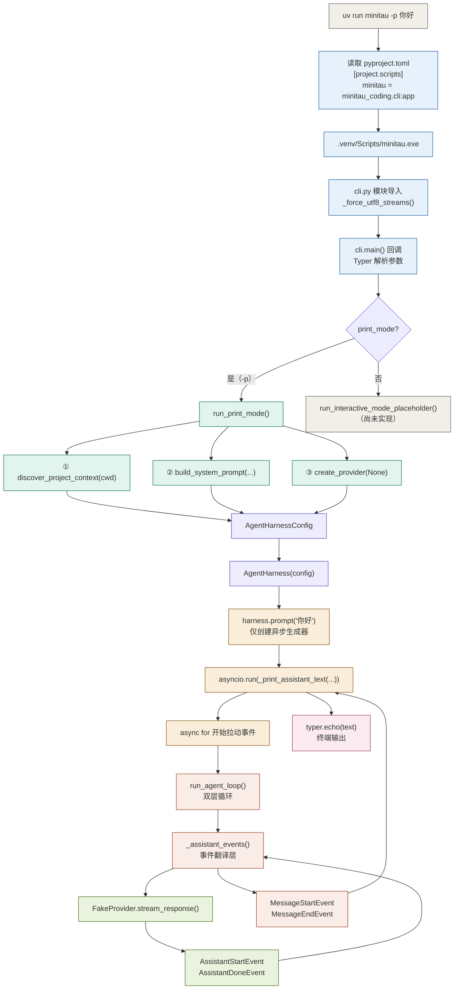

---

## 2. 分层架构：三个包各管什么

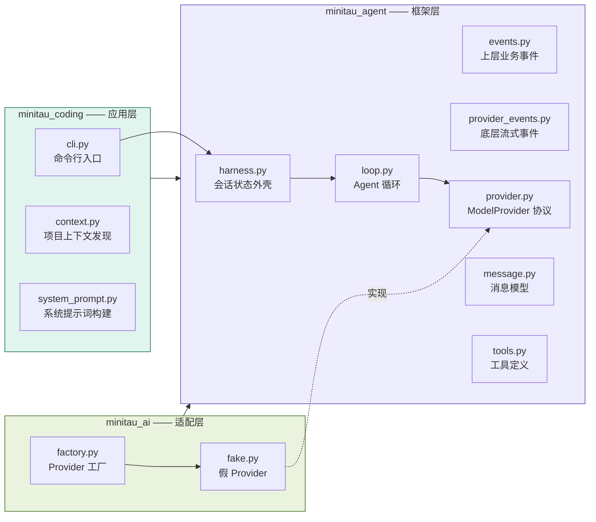

**依赖方向很干净**：`minitau_coding` 依赖 `minitau_agent` 和 `minitau_ai`；`minitau_ai` 依赖 `minitau_agent`；`minitau_agent` 谁也不依赖。

这个方向是刻意的 —— 框架层（`minitau_agent`）不知道任何具体厂商，只认 `ModelProvider` 协议。想接真实 API，写一个新的 Provider 放进 `minitau_ai` 即可，框架层和 CLI 层零改动。

---

## 3. 阶段一：uv 如何找到 minitau 命令

这一步和 Python 代码无关，但它是理解"为什么 `src/` 下的包能被导入"的关键。

`pyproject.toml:40-41`：

```toml
[project.scripts]
minitau = "minitau_coding.cli:app"
```

`uv run minitau` 依次做三件事：

| 步骤 | 动作 |
|---|---|
| 1 | 检查 `.venv` 是否存在、`uv.lock` 与 `pyproject.toml` 是否一致，必要时同步依赖 |
| 2 | 在 `.venv/Scripts/` 下找到 `minitau.exe`（由 `[project.scripts]` 生成） |
| 3 | 该 exe 的内容等价于 `from minitau_coding.cli import app; app()` |

同时 `pyproject.toml:51-56`：

```toml
[tool.hatch.build.targets.wheel]
packages = [
    "src/minitau_ai",
    "src/minitau_agent",
    "src/minitau_coding",
]
```

这三个包以可编辑模式安装进环境，因此 `src/` 被加进 `sys.path`。

> **关键点**：`cli.py` 里的 `from minitau_agent.events import ...` 不是相对导入，而是**包已装在环境里**。删掉 `[tool.hatch.build.targets.wheel]` 这一节，所有导入都会失败。

---

## 4. 阶段二：模块导入时的 UTF-8 修正

`cli.py` 被导入的瞬间，模块顶层代码立刻执行。这里有个容易被忽略、但对 Windows 中文用户至关重要的细节 —— `cli.py:236`：

```python
_force_utf8_streams()
```

注意它在**函数外**，导入时就跑，不是等 `main()` 才跑。

调用链（`cli.py:26-48`）：

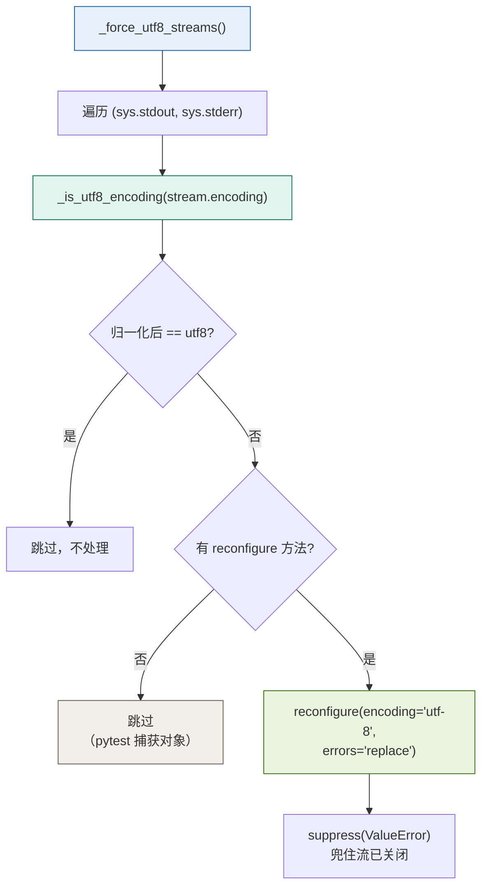

```python
def _is_utf8_encoding(encoding: str | None) -> bool:
    if encoding is None:
        return False
    normalized = encoding.lower().replace('-', '').replace('_', '')
    return normalized == 'utf8'
```

四个值得学的设计点：

1. **归一化判断** —— 不同 Python / 平台会报告 `UTF-8`、`utf_8`、`utf8` 三种写法，先统一成小写无分隔符再比较；
2. **双层检查 `reconfigure`** —— `getattr(stream, "reconfigure", None)` + `callable(...)`。因为 pytest 的捕获对象没有这个方法，直接调用会 `AttributeError`；
3. **`contextlib.suppress(ValueError)`** —— 兜住"流已关闭"之类的非法参数场景，不让它中断导入；
4. **`errors="replace"`** —— 遇到无法编码的字符输出成 `?`，而不是抛 `UnicodeEncodeError` 让整个程序崩掉。

> 这个设计思路可以复用：**在任何"必须成功"的初始化步骤上，用 `getattr` 探测能力 + `suppress` 兜异常 + 降级策略。**

---

## 5. 阶段三：Typer 解析命令行参数

### 5.1 创建 Typer 应用

`cli.py:77-83`：

```python
app = typer.Typer(
    name="minitau",
    help="A minimal Python implementation of a Pi-style coding-agent harness.",
    add_completion=False,
    invoke_without_command=True,
    context_settings={"allow_interspersed_args": True},
)
```

| 配置 | 作用 |
|---|---|
| `add_completion=False` | 不注入 shell 补全逻辑，减少启动开销 |
| `invoke_without_command=True` | 允许 `minitau -p "你好"` 不带子命令直接跑 |
| `allow_interspersed_args=True` | 选项和位置参数可混写，`-p` 放前面或后面都行 |

### 5.2 参数如何映射

`cli.py:85-135` 的 `main()` 用 `@app.callback(invoke_without_command=True)` 装饰。Typer 基于 Click 把你的输入解析成 Python 参数：

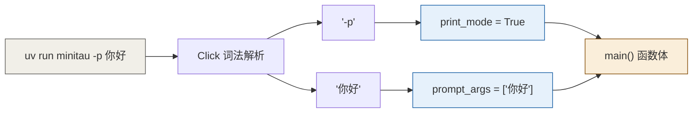

实际绑定结果：

```
-p            → print_mode = True
"你好"        → prompt_args = ["你好"]
--provider    → provider = None
--model / -m  → model = None
--cwd         → cwd = None
--version / -v→ version = False
```

### 5.3 main() 内部的四道关卡

`cli.py:137-170` 依次判断：

```python
# ① 版本号
if version:
    typer.echo(f"Minitau version: {__version__}")
    raise typer.Exit()

# ② 子命令让路
if ctx.invoked_subcommand is not None:
    return

# ③ 组装 prompt
working_directory = cwd or Path.cwd()
positional_prompt = " ".join(prompt_args or ())
prompt = _merge_stdin_prompt(positional_prompt).strip()

# ④ 分叉
if print_mode:
    if not prompt:
        raise typer.BadParameter('Print mode requires a prompt. ...')
    run_print_mode(prompt=prompt, provider_name=provider,
                   model_name=model, cwd=working_directory)
    raise typer.Exit()

run_interactive_mode_placeholder(...)
```

> **`raise typer.Exit()` 是"用异常做控制流"**。Click 会捕获它，跳过 traceback，直接以退出码 0 结束。这是 Click 生态的标准做法，第一次见会觉得奇怪，但它比层层 `return` + 标志位清晰得多。

### 5.4 管道输入合并

`_merge_stdin_prompt`（`cli.py:50-75`）处理 `cat file | minitau -p "解释它"` 这种用法，是很好的防御式编程范例：

```python
def _merge_stdin_prompt(prompt: str) -> str:
    stdin = sys.stdin
    if stdin is None:
        return prompt                        # 打包成 GUI 时可能为 None

    try:
        if stdin.isatty():                   # 连着键盘 → 没有管道内容
            return prompt
    except (AttributeError, ValueError):
        return prompt                        # 流已关闭

    try:
        piped_content = stdin.read()
    except (OSError, ValueError):
        return prompt

    if not piped_content:
        return prompt                        # 空管道

    if not prompt:
        return piped_content

    return f"{piped_content}\n\n{prompt}"    # 管道在前，参数在后
```

设计要点：

- `isatty()` 判断"输入流是否连着真实键盘"。连着键盘说明没有管道，直接返回原 prompt；
- **四处异常捕获**，每一处都返回原 prompt 而非抛出。核心原则：**辅助功能失败不应该阻塞主流程**；
- 拼接顺序是 **管道内容在前、命令行参数在后**。这样 `cat a.py | minitau -p "解释它"` 得到的是"文件内容 + 指令"，符合模型的阅读习惯。

---

## 6. 阶段四：run_print_mode 的三次装配

`cli.py:172-200` 的 `run_print_mode()` 是**装配车间** —— 它自己不干活，只把三样原料准备好。

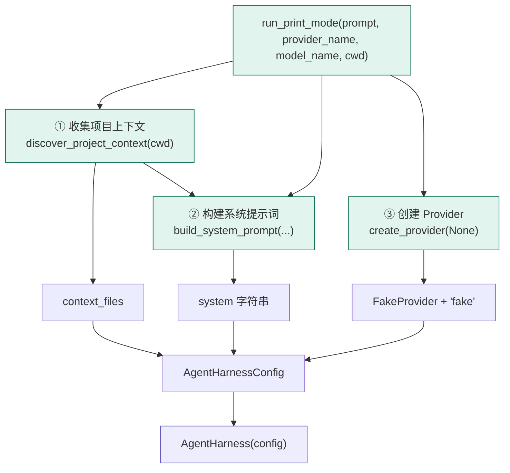

### 6.1 原料一：项目上下文发现

`context.py:37-81` 的 `discover_project_context()`：

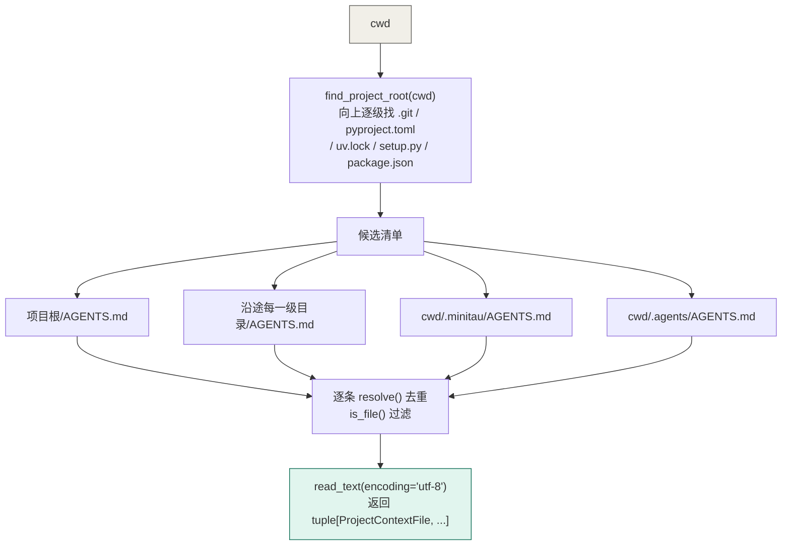

`find_project_root`（`context.py:25-34`）的核心：

```python
current = cwd.expanduser().resolve()
for candidate in (current, *current.parents):   # 从当前目录一路向上到根
    if any((candidate / marker).exists() for marker in PROJECT_ROOT_MARKERS):
        return candidate
return current
```

`(current, *current.parents)` 这个写法把"自己 + 所有祖先目录"展开成一个元组，配合 `for` 就是天然的向上遍历。

**本次运行结果：返回空元组 `()`** —— 因为项目里没有 `AGENTS.md` 文件。`find_project_root` 找到了 `pyproject.toml`，但该目录下没有 `AGENTS.md`。

### 6.2 原料二：系统提示词构建

`system_prompt.py:100-128` 的 `build_system_prompt()` 拼接顺序：

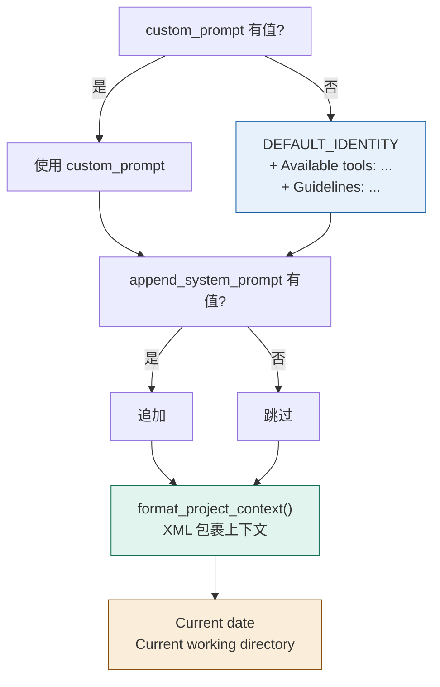

**本次运行实际生成的内容**（实测输出）：

```
You are minitau, an expert coding assistant operating inside the user's project.

Available tools:
(none)

Guidelines:
- Inspect relevant files before making changes.
- Prefer small and focused changes.
- Do not claim that commands succeeded unless their results were observed.
- Keep explanations concise and reference file paths clearly.

Current date: 2026-09-15
Current working directory: D:\Learn\deeplearn\Minitau
```

两个细节值得注意：

- `format_available_tools`（`system_prompt.py:32-37`）在无工具时返回 `"(none)"` 而非空字符串 —— 避免提示词里出现"Available tools:"后面什么都没有的断头标题；
- `collect_guidelines`（`system_prompt.py:39-62`）用 `seen` 集合对工具自带指南和默认指南去重：

```python
for guideline in candidates:
    normalized = guideline.strip()
    if not normalized or normalized in seen:
        continue
    seen.add(normalized)
    result.append(normalized)
```

`format_project_context`（`system_prompt.py:72-97`）用 XML 标签包裹上下文文件，并且**用 `xml.sax.saxutils.escape` 转义路径** —— 防止路径里有特殊字符破坏 XML 结构。

### 6.3 原料三：Provider 工厂

`factory.py:15-31` 的 `create_provider(None)`：

```python
def create_provider(name: str | None) -> tuple[ModelProvider, str]:
    if name is None or name == "fake":
        partial = AssistantMessage(model=DEFAULT_FAKE_MODEL)
        final = AssistantMessage(model=DEFAULT_FAKE_MODEL, content=FAKE_GREETING)
        provider = FakeProvider([[
            AssistantStartEvent(partial=partial),
            AssistantDoneEvent(reason="stop", message=final),
        ]])
        return provider, DEFAULT_FAKE_MODEL
    raise ValueError(f"Unknown provider {name!r};available providers: fake")
```

**注意这里是双层嵌套 `[[...]]`**：

```
外层 list  ── 每一次模型调用对应一组
   └─ 内层 list  ── 该次调用内部的流式事件序列
```

所以 `FakeProvider` 每次被调会 `pop(0)` 取一组（`fake.py:32`）。这个设计让它天然适合测试**多轮 agent 循环** —— 你预置几组事件，Agent 就会循环几轮。

由于 `name=None`，当前只支持 fake 一种。传 `--provider openai` 会抛 `ValueError`，被 `run_print_mode`（`cli.py:189-190`）捕获后转成 `typer.BadParameter`。

---

## 7. 阶段五：AgentHarness 有状态的会话外壳

`cli.py:192-198` 把三样原料装进配置再包成 harness：

```python
harness = AgentHarness(
    AgentHarnessConfig(
        provider=provider,
        model=model_name or default_model,    # 未传 -m → "fake"
        system=system,
    )
)
```

### 7.1 定位：它是"会话"，不是"执行器"

`harness.py:49-204` 的 `AgentHarness` 持有的状态：

| 属性 | 用途 |
|---|---|
| `_config` | provider / model / system / tools / max_turns |
| `_messages: list` | **跨多次 prompt 累积的完整对话历史** |
| `_steering_queue` | 中途插话队列（改变当前任务方向） |
| `_follow_up_queue` | 追问队列（当前任务完成后追加新任务） |
| `_current_signal` | 本次运行的取消令牌 |
| `_running` | 重入保护标志 |

**为什么状态放在 harness 而不是 loop？** 因为 `run_agent_loop` 要做成"易测试的纯流程"，所有跨轮持久状态都上提到会话对象。这样 loop 可以反复调用、随时中断、独立测试。

### 7.2 关键：prompt() 不执行任何东西

`cli.py:200` 那行调用有个反直觉的点：

```python
def prompt(self, content: str) -> AsyncIterator[AgentEvent]:
    return self.prompt_message(UserMessage(content=content))

def prompt_message(self, message: AgentMessage) -> AsyncIterator[AgentEvent]:
    self._ensure_not_running()           # 已有运行时立即拒绝
    return self._run(prompts=(message,)) # 只创建异步生成器
```

`_run` 是 `async def` **异步生成器函数** —— 调用它只返回生成器对象，函数体一行都不执行。所以 CLI 拿到的是一条"待启动的流水线"。第一次读取事件时，`_run` 再次检查重入、补齐中断的工具结果，并设置 `_running=True`。这些操作之间没有 `await`，两条预先创建的流也无法同时占用 Harness。若流始终没有被读取，它既不占用运行状态，也不改写历史。

### 7.3 两个防御细节

**① 重入保护**

```python
def _ensure_not_running(self):
    if self._running:
        raise RuntimeError(
            "AgentHarness is already running; use steer() or follow_up() to queue messages."
        )
```

`prompt_message()` 和 `continue_()` 创建流时检查一次，使运行期间的调用立即报错；`_run()` 首次读取事件时再检查一次，防止两条空闲时预先创建的流交叉运行。想中途干预，应该用 `steer()` / `follow_up()`。

**② 中断结果补齐**

```python
def _append_interrupted_tool_results(self) -> None:
    returned_ids = {
        message.tool_call_id
        for message in self._messages
        if isinstance(message, ToolResultMessage)
    }
    for message in tuple(self._messages):        # ← 防御性拷贝
        if not isinstance(message, AssistantMessage):
            continue
        for call in message.tool_calls:
            if call.id in returned_ids:
                continue
            returned_ids.add(call.id)
            self._messages.append(
                ToolResultMessage(
                    tool_call_id=call.id,
                    tool_name=call.name,
                    content="Tool call interrupted by user",
                    is_error=True,
                )
            )
```

两个精妙点：

- **`tuple(self._messages)` 防御性拷贝** —— 循环体内会 `self._messages.append(...)`，直接遍历列表会抛 `RuntimeError: list changed size during iteration`。转成 tuple 后可以安全遍历；
- **`returned_ids` 集合去重** —— 避免重复补写已中断的结果。

**为什么需要这个？** 模型 API 通常要求"每个 `tool_call` 必须有对应的 `toolResult`"。用户中断可能导致 `tool_call` 已经产出但结果没写回，下次调用模型时上下文就不完整了。

---

## 8. 阶段六：asyncio 驱动与惰性生成器

`cli.py:200`：

```python
asyncio.run(_print_assistant_text(harness.prompt(prompt)))
```

`cli.py:202-207`：

```python
async def _print_assistant_text(events: AsyncIterator[AgentEvent]) -> None:
    async for event in events:
        if isinstance(event, MessageEndEvent) and isinstance(event.message, AssistantMessage):
            text = event.message.text
            if text:
                typer.echo(text)
```

**这一句 `async for` 才是整条流水线的动力源。**

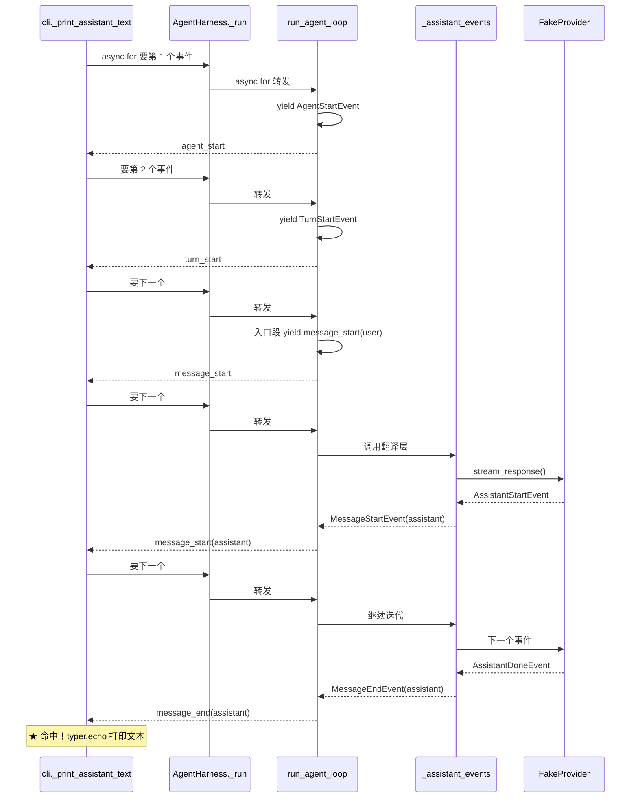

异步生成器的特性是**惰性 + 拉取式**：`async for` 每要一个值，就唤醒生成器跑到下一个 `yield`，然后挂起。

好处是**天然的背压（backpressure）**：消费者处理慢，生产者就停在那里等，不会堆积内存。这对流式输出场景（模型吐 token）尤其重要。

---

## 9. 阶段七：run_agent_loop 双层循环核心

`loop.py:35-177` 是整个项目的核心，共 143 行。

### 9.1 整体结构

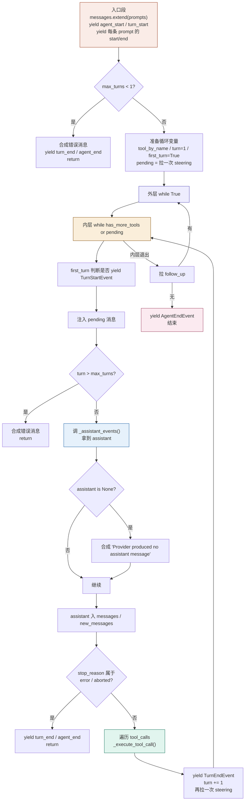

### 9.2 入口段：两种列表的分工

`loop.py:51-63`：

```python
new_messages = list(prompts)          # 局部快照：本次新增，用于事件通知/持久化
if prompts:
    messages.extend(prompts)          # 全局历史：喂给模型的完整上下文

yield AgentStartEvent()
yield TurnStartEvent()
for prompt in prompts:
    yield MessageStartEvent(message=prompt)
    yield MessageEndEvent(message=prompt)
```

| 变量 | 含义 | 用途 |
|---|---|---|
| `messages` | 传入的可变列表，**跨轮累积** | 每次调模型时 `_provider_context(messages)` 传给它 |
| `new_messages` | `list(prompts)` 快照，**只装本轮新增** | 最终放进 `AgentEndEvent(messages=...)` |

同一个对象（prompt）同时进两个列表 —— 这就是为什么 `AgentEndEvent` 只带新增消息，而模型能看到全部历史。

### 9.3 双层循环：两个变量控制

`loop.py:92-177`：

```python
while True:                                 # 外层：处理 follow_up
    has_more_tools = True
    while has_more_tools or pending:        # 内层：推理 → 执行工具 → 再推理
        ...
        calls = list(assistant.tool_calls)
        has_more_tools = bool(calls)        # 有工具调用 → 继续内层
        ...
    follow_ups = tuple(get_follow_up_messages() if get_follow_up_messages else ())
    if follow_ups:
        pending = follow_ups
        continue                            # 有追问 → 回到外层再跑
    break
```

| 循环 | 条件 | 职责 | 退出后 |
|---|---|---|---|
| 内层 | `has_more_tools or pending` | 单轮"推理 → 执行工具 → 再推理" | 查 follow_up |
| 外层 | `while True` + `break` | 处理多轮追问 | `yield AgentEndEvent` |

**`first_turn` 标志的作用**（`loop.py:79-100`）：

```python
first_turn = True
...
while has_more_tools or pending:
    if not first_turn:
        yield TurnStartEvent()
    first_turn = False
```

入口段已经 `yield TurnStartEvent()` 过一次了。如果第一轮循环再 yield 一次，事件序列就会多出一个 `turn_start`，破坏上层对"每轮一个 start/end"的假设。所以第一轮要跳过。

### 9.4 逐步走一遍本次运行

| 步骤 | 代码位置 | 实际发生 |
|---|---|---|
| 1 | `:53` | `new_messages = [UserMessage("你好")]` |
| 2 | `:55` | `messages` 扩展为 1 条 |
| 3 | `:57-58` | yield `agent_start`、`turn_start` |
| 4 | `:61-63` | yield `message_start(user)`、`message_end(user)` |
| 5 | `:82` | `pending = ()`（steering 队列空） |
| 6 | `:95` | 进入内层：`True or ()` → True |
| 7 | `:98-100` | `first_turn=True` → **跳过** `TurnStartEvent` |
| 8 | `:102-107` | `pending` 空，无注入 |
| 9 | `:110` | `max_turns is None` → 跳过检查 |
| 10 | `:122-134` | 调 `_assistant_events()`，拿到 assistant 消息 |
| 11 | `:142-143` | `messages` 与 `new_messages` 各 append 一条 |
| 12 | `:145` | `stop_reason="stop"` → 不 return |
| 13 | `:152-153` | `calls = []` → `has_more_tools = False` |
| 14 | `:164-166` | yield `turn_end`，`turn=2`，再拉 steering（空） |
| 15 | `:95` | 内层条件 `False or ()` → **退出内层** |
| 16 | `:171-175` | follow_up 为空 → `break` |
| 17 | `:177` | yield `agent_end(messages=new_messages)` |

### 9.5 steering 与 follow_up 的语义差异

代码注释（`loop.py:85-89`）讲得很清楚：

| | Steering（引导） | Follow-up（后续追问） |
|---|---|---|
| **语义** | 改变当前任务的方向 | 在当前任务完成后追加新任务 |
| **注入时机** | 当前轮工具执行完后、下次 LLM 调用前 | 整个 Agent 循环完全停下后 |
| **典型场景** | "等等，先不要改那个文件" | "顺便再帮我写个测试" |
| **处理队列** | 内层循环消费 | 外层循环消费 |

**两者都是拉取式的** —— `get_steering_messages` / `get_follow_up_messages` 是回调，循环主动来取，而不是外部线程往队列里推。这从根本上避免了并发竞争。

对应 harness 侧的实现（`harness.py:194-204`）：

```python
def _drain_queue(self, queue: deque[AgentMessage]) -> tuple[AgentMessage, ...]:
    if not queue:
        return ()
    messages = tuple(queue)
    queue.clear()
    return messages
```

"取走并清空"的原子操作 —— 取的时候顺便清，保证同一条消息不会被注入两次。

---

## 10. 阶段八：双层事件词汇表与翻译层

这是整个项目**最值得学的架构设计**。

### 10.1 两层事件的分工

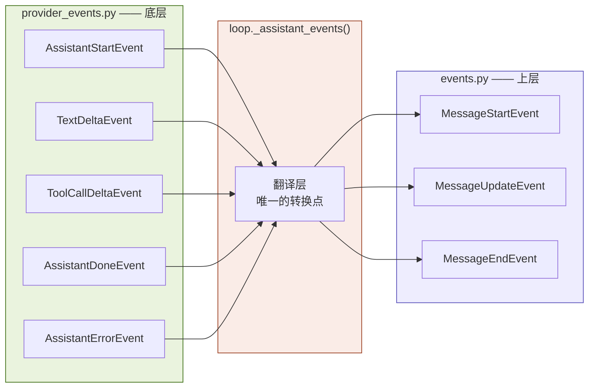

| | 底层 `provider_events` | 上层 `events` |
|---|---|---|
| **粒度** | Token 级（文本增量、工具调用 JSON 增量） | 业务级（会话、回合、消息、工具执行） |
| **是否厂商相关** | 相关（对应厂商原始流） | 无关 |
| **谁产生** | Provider 实现 | Agent 循环 |
| **谁消费** | 翻译层 | UI / 日志 / 测试 |

### 10.2 上层事件全清单

`events.py` 定义的 10 种事件：

| 事件 | 含义 |
|---|---|
`AgentStartEvent` | Agent 任务会话正式启动 |
`AgentEndEvent` | 会话结束，带本轮新增的所有消息 |
`TurnStartEvent` | 一个推理回合开始 |
`TurnEndEvent` | 回合结束，带 assistant 消息和工具结果 |
`MessageStartEvent` | 一条消息开始生成 |
`MessageUpdateEvent` | 消息增量更新（内嵌底层事件） |
`MessageEndEvent` | 一条消息生成完毕 |
`ToolExecutionStartEvent` | 工具真正开始执行 |
`ToolExecutionUpdateEvent` | 工具执行中（部分结果） |
`ToolExecutionEndEvent` | 工具执行完毕 |

> **注意区分两个"工具调用"概念**（`events.py:52-56` 注释）：
> - **ToolCall（模型侧）**：模型输出 JSON 想调工具，属于 `provider_events` 的 `toolcall_start/delta/end`，只是"打算调用"；
> - **ToolExecution（执行侧）**：后端真收到请求、真开始运行函数，属于上面那组 `ToolExecution*Event`。

### 10.3 翻译层实现

`loop.py:191-225`：

```python
async def _assistant_events(*, provider, model, system, messages, tools, signal):
    source = provider.stream_response(
        model=model, system=system, messages=messages, tools=tools, signal=signal,
    )
    started = False
    async for event in source:
        if isinstance(event, AssistantStartEvent):
            started = True
            yield MessageStartEvent(message=event.partial)
        elif isinstance(event, AssistantDoneEvent):
            if not started:                                   # 容错：provider 没发 start
                yield MessageStartEvent(message=event.message)
            yield MessageEndEvent(message=event.message)
        elif isinstance(event, AssistantErrorEvent):
            if not started:
                yield MessageStartEvent(message=event.error)
            yield MessageEndEvent(message=event.error)
        else:
            yield MessageUpdateEvent(
                message=event.partial,
                assistant_message_event=event,                # ← 原始事件被嵌进来
            )
```

**`started` 标志解决的是不变量维护**：上层约定"必须先 start 再 end"，但 provider 协议允许省略 start。翻译层负责补齐，让上层永远不用操心。

**`else` 分支的设计很聪明**：把原始 `AssistantMessageEvent` 作为字段嵌进上层事件（`events.py:44`）。这样 UI 既能用上层抽象做统一渲染，又能下探到底层拿到 `delta` 字符串做打字机效果。

### 10.4 Pydantic 判别器联合类型

`events.py:77-88` 和 `provider_events.py:92-103` 都用这种模式：

```python
type AgentEvent = Annotated[
    AgentStartEvent | AgentEndEvent | TurnStartEvent | ...,
    Field(discriminator="type"),
]
```

`discriminator="type"` 是 Pydantic 的多态解析开关。当你从 JSON 反序列化时：

```json
{"type": "text_delta", "content_index": 0, "delta": "你好", "partial": {...}}
```

Pydantic 自动读 `type` 字段，路由到 `TextDeltaEvent`。不用手写 if-else 分发，也不用担心类型混淆。

配合 `message.py:22-28` 的 `WireModel` 基类配置：

```python
model_config = ConfigDict(
    extra="forbid",              # 拒绝外来字段
    validate_by_name=True,       # 允许按变量名校验
    validate_by_alias=True,      # 允许按别名校验
    serialize_by_alias=True,     # 序列化强制用别名
    alias_generator=_to_camel,   # 自动生成驼峰别名
)
```

`_to_camel`（`message.py:11-13`）把 `tool_call_id` 转成 `toolCallId`。所以 Python 侧写蛇形（符合 PEP 8），JSON 线协议上是驼峰（符合 TS 生态习惯），**双向都合法**。

---

## 11. 阶段九：FakeProvider 被调用的那一刻

`fake.py:22-40`：

```python
def stream_response(self, *, model, system, messages, tools, signal=None):
    self.calls.append((model, system, list(messages), list(tools)))   # 记录快照
    stream = self._streams.pop(0) if self._streams else []

    async def iterator() -> AsyncIterator[AssistantMessageEvent]:
        for event in stream:
            if signal is not None and signal.is_cancelled():
                return
            yield event

    return iterator()
```

### 实测调用记录

我实际插桩抓到的记录：

```
call#0: model='fake' tools=[] n_msgs=1
    - user: '你好'
```

**模型看到的就是 `[UserMessage("你好")]`**，`system` 和 `tools` 也一起传了，但 FakeProvider 不解析它们。

### 四个设计点

1. **`list(messages)` 防御性拷贝** —— 循环后续会往 `messages` 里 append，不拷贝的话测试断言看到的是"后来被改过的"列表，断言会失准；
2. **`_streams.pop(0)`** —— 每次调用消耗一组预置事件，模拟多轮对话。列表耗尽后返回空 `[]`；
3. **`iterator()` 是闭包** —— 捕获了 `stream` 和 `signal`。返回的是生成器对象，符合 `ModelProvider` 协议的签名；
4. **取消检查在 yield 之前** —— 这是取消机制的挂载点。

### 关于取消令牌

`provider.py:11-18` 定义的是 **Protocol**：

```python
class CancellationToken(Protocol):
    def is_cancelled(self) -> bool:
        ...
```

`harness.py:39-47` 给的是最简实现：

```python
class SimpleCancellationToken:
    def __init__(self) -> None:
        self._cancelled = False
    def cancel(self) -> None:
        self._cancelled = True
    def is_cancelled(self) -> bool:
        return self._cancelled
```

用 Protocol 而不是 ABC 的好处：**结构化子类型**。任何有 `is_cancelled()` 方法的对象都能当令牌用，不需要显式继承。

### 列表耗尽时会怎样

如果预置事件用完了，`stream` 是空列表 → `_assistant_events` 一个事件都收不到 → `assistant` 仍为 `None` → 触发 `loop.py:136-139` 的防御分支：

```python
if assistant is None:
    assistant = _error_message(model, "Provider produced no assistant message")
    yield MessageStartEvent(message=assistant)
    yield MessageEndEvent(message=assistant)
```

合成一条 `stop_reason="error"` 的占位消息，然后 `:145-148` 检测到 error 就正常收尾。**事件流不会断，只是带上错误信息。**

---

## 12. 阶段十：输出与收尾

回到 `cli.py:203-207`：

```python
async for event in events:
    if isinstance(event, MessageEndEvent) and isinstance(event.message, AssistantMessage):
        text = event.message.text
        if text:
            typer.echo(text)
```

**双层 `isinstance` 检查**：

- 第一层：只处理 `MessageEndEvent`。因为 `MessageUpdateEvent`（流式增量）也会带消息，但那时内容还不完整；
- 第二层：只处理 `AssistantMessage`。因为 `message_end` 也会为 `UserMessage` 和 `ToolResultMessage` 发出。

`event.message.text` 是 `message.py:82-88` 的属性：

```python
@property
def text(self) -> str:
    return "".join(
        block.text for block in self.content
        if isinstance(block, TextContent)
    )
```

从块列表里挑出所有文本块拼接 —— 因为 `content` 是 `list[TextContent | ToolCall]` 混合列表，工具调用块要被忽略。

### 收尾清理

`loop.py:177` yield 完 `AgentEndEvent` 后生成器自然结束，控制权经 `asyncio.run` 回到 `cli.py:163` 的 `raise typer.Exit()`，退出码 0。

`harness._run` 的 `finally`（`harness.py:187-192`）：

```python
finally:
    if signal.is_cancelled():
        self._append_interrupted_tool_results()
    if self._current_signal is signal:
        self._current_signal = None
    self._running = False
```

三件事：被取消则补中断结果、清空令牌引用、**解除 running 标志**（所以同一个 harness 可以再次 `prompt()`）。

### 运行后的历史状态

实测结果：

```
user        ts=1789463713076  "你好"
assistant   ts=1789463713074  "Hello from the minitau fake provider!"
```

> **注意 assistant 的时间戳比 user 还早 1ms。** 这不是 bug —— 因为 `FakeProvider` 的 `final` 消息是在 `create_provider` 时（`factory.py:21`）就构造好的，早于 `_merge_stdin_prompt` 创建 `UserMessage` 的时刻。真实 provider 不会这样。这正好说明 `timestamp` 语义是"消息对象创建时刻"，而非"消息加入对话时刻"。

---

## 13. 实测事件序列

我实际插桩抓取的完整事件流（**非推测，是真实运行输出**）：

```
agent_start
turn_start
message_start        role=user        content="你好"
message_end          role=user        content="你好"
message_start        role=assistant
message_end          role=assistant   text="Hello from the minitau fake provider!"
turn_end
agent_end            n_messages=2
```

对照预期的事件模型：

| 事件 | 谁 yield 的 | 代码位置 |
|---|---|---|
| `agent_start` | 入口段 | `loop.py:57` |
| `turn_start` | 入口段 | `loop.py:59` |
| `message_start(user)` | 入口段 for 循环 | `loop.py:62` |
| `message_end(user)` | 入口段 for 循环 | `loop.py:63` |
| `message_start(assistant)` | 翻译层 | `loop.py:212` |
| `message_end(assistant)` | 翻译层 | `loop.py:216` |
| `turn_end` | 内层循环末 | `loop.py:164` |
| `agent_end` | 函数末 | `loop.py:177` |

### 完整数据流全景

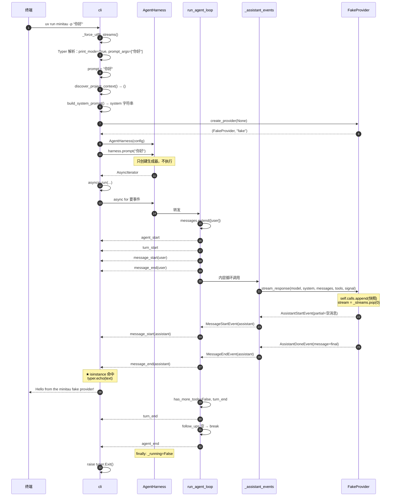

---

## 14. 关键设计模式总结

如果你想通过这个项目学架构，这几点最值得记：

### ① 双层事件词汇表

Provider 层管 token 增量（厂商相关），Agent 层管业务语义（厂商无关），`_assistant_events` 是唯一翻译点。

**好处**：换模型厂商只需重写 provider，上层零改动。这就是 `ModelProvider` 用 `Protocol` 而非 ABC 的原因 —— `FakeProvider` 无需显式继承就能满足协议。

### ② 异步生成器 = 惰性流水线

`prompt()` / `run_agent_loop()` / `stream_response()` 全返回 `AsyncIterator`：

- **调用不发车，`async for` 才发车**；
- **天然背压**：消费者慢，生产者就停；
- **可组合**：生成器可以层层嵌套转发（`harness._run` 就是纯转发）。

### ③ 一切皆事件，状态在 harness

`run_agent_loop` 是准纯函数（除了就地修改传入的 `messages`），所有跨轮状态（历史、队列、取消令牌、running 标志）都在 `AgentHarness`。

**好处**：loop 极易测试 —— 传入构造好的消息列表和 provider，断言事件序列即可。

### ④ 防御式边界：三层兜底

| 层级 | 位置 | 兜底逻辑 |
|---|---|---|
| 工具执行 | `loop.py:278-283` | `except Exception` → `(result, is_error=True)` |
| 事件翻译 | `loop.py:213-216` | provider 没发 start 就补一个 |
| 循环主体 | `loop.py:136-139` | assistant 为 None 就合成错误消息 |

**核心承诺：事件流永不因局部失败而中断。**

### ⑤ _provider_context 过滤器

`loop.py:228-242`：

```python
def _provider_context(messages: list[AgentMessage]) -> list[AgentMessage]:
    return [
        message for message in messages
        if not (
            isinstance(message, AssistantMessage)
            and message.stop_reason in {"error", "aborted"}
            and not message.content          # ← 三个条件同时满足才过滤
        )
    ]
```

过滤"三条件同时满足"的消息：assistant + error/aborted + 空 content。

**为什么要过滤？** 这些占位消息用于给 UI 通知（"出错了"），但对模型语义无贡献。如果不过滤，它们会被当成真实的助手回复污染上下文。

**注意条件是 `and` 而非 `or`** —— 一条 `stop_reason="error"` 但**有内容**的消息仍然会传给模型，因为模型确实说了话。

### ⑥ 用异常做控制流

`raise typer.Exit()` 在 Click 生态里是标准做法。比层层 `return` + 标志位清晰得多。

### ⑦ 防御性拷贝防迭代器失效

`harness.py:145` 的 `tuple(self._messages)` 和 `fake.py:30` 的 `list(messages)` 是同一个思路的不同应用：**一边遍历一边修改集合，先拷贝。**

---

## 15. 待改进点

阅读过程中发现一个潜在问题：

### 中断时机竞态

`harness._append_interrupted_tool_results`（`harness.py:137-164`）**只扫描 `_messages` 里已存在的 `AssistantMessage`**。

如果用户取消的时机恰好在 provider 流式产出中途 —— 此时 assistant 消息还在 `loop.py` 的局部变量 `assistant` 里、尚未 `messages.append(assistant)`（`:142`）—— 那么这次调用的 `tool_call_id` 就永远不会被补上结果。

**后果**：下次调用模型时，上下文里可能有 `tool_call` 却没有对应的 `toolResult`，某些厂商 API 会直接拒绝请求。

**当前不暴露的原因**：fake provider 是瞬间返回的，没有窗口期。接真实 provider（网络流式、耗时数秒）时值得留意。

**可能的修法**：让 `_run` 在 `finally` 里把"未完成的 tool_call"也纳入补齐范围，或者让 loop 在取消路径上先落盘 assistant 消息再退出。

---

## 附录：文件职责速查

| 文件 | 行数 | 职责 |
|---|---|---|
| `cli.py` | 238 | 命令行入口、参数解析、print 模式装配 |
| `context.py` | 80 | 项目根发现、AGENTS.md 收集 |
| `system_prompt.py` | 127 | 系统提示词拼接 |
| `harness.py` | 209 | 会话状态、队列、取消令牌 |
| `loop.py` | 282 | **Agent 双层循环、事件翻译、工具执行** |
| `events.py` | 88 | 上层业务事件定义（10 种） |
| `provider_events.py` | 107 | 底层流式事件定义（9 种） |
| `provider.py` | 33 | `ModelProvider` / `CancellationToken` 协议 |
| `message.py` | 112 | 消息模型、驼峰别名、内容块 |
| `tools.py` | 44 | 工具定义与执行签名 |
| `types.py` | 12 | `JSONValue` 类型别名 |
| `factory.py` | 30 | Provider 工厂 |
| `fake.py` | 39 | 假 Provider（回放预置事件） |

---

*文档基于 commit 状态实测生成，所有事件序列与输出均为真实运行结果。*
