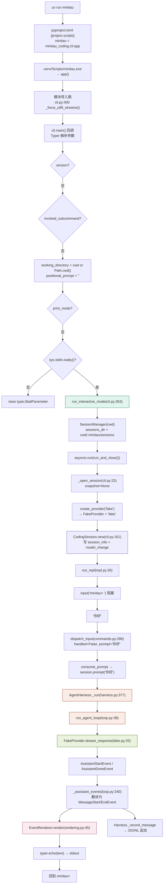
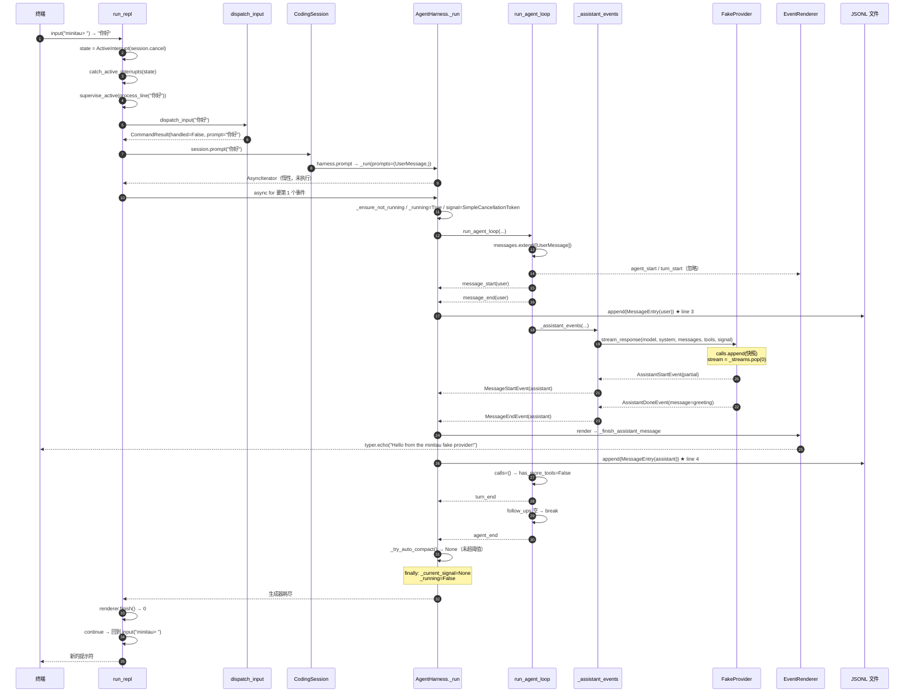

# 交互模式下输入「你好」的完整代码走读

> 场景：在终端执行 `uv run minitau`（不带 `-p`），进入 `minitau>` 提示符，然后敲入 `你好` 并回车。
> 本文把这一条路径从进程启动到屏幕出字、再到 JSONL 落盘，逐行拆开。
> 所有代码位置都标了 `文件:行号`，可直接对着源码读。

`docs/execution-flow.md` 讲的是 **print 模式**（`-p`）走的是 `run_print_mode` + `_print_assistant_text`。
本文讲的是**交互模式**，路径完全不同：它多出 REPL 循环、斜杠命令路由、Ctrl+C 监督器、以及 `EventRenderer` 的流式渲染。
两条路径共用 `CodingSession → AgentHarness → run_agent_loop → Provider` 这一段。

---

## 目录

- [0. 一分钟速览](#0-一分钟速览)
- [1. 与 print 模式的路径差异](#1-与-print-模式的路径差异)
- [2. 全链路调用图](#2-全链路调用图)
- [3. 阶段一：进程启动与 Typer 解析](#3-阶段一进程启动与-typer-解析)
- [4. 阶段二：装配会话（还没调用模型）](#4-阶段二装配会话还没调用模型)
- [5. 阶段三：进入 REPL，阻塞在提示符](#5-阶段三进入-repl阻塞在提示符)
- [6. 阶段四：输入「你好」被分类与监督](#6-阶段四输入你好被分类与监督)
- [7. 阶段五：事件流的产生（核心）](#7-阶段五事件流的产生核心)
- [8. 阶段六：逐事件渲染到终端](#8-阶段六逐事件渲染到终端)
- [9. 阶段七：收尾与落盘](#9-阶段七收尾与落盘)
- [10. 实测事件序列与 JSONL](#10-实测事件序列与-jsonl)
- [11. 那些容易踩的坑](#11-那些容易踩的坑)
- [12. 文件与行号速查](#12-文件与行号速查)

---

## 0. 一分钟速览

一句话：

> **Typer 解析出「没有 `-p`」→ 检查 stdin 是 TTY → `SessionManager` 定位会话目录 → 工厂造 `FakeProvider` → `CodingSession.new` 写两行元数据并装好 4 个工具 + 系统提示词 → `run_repl` 用 `input("minitau> ")` 阻塞 → 拿到 `你好` 后 `dispatch_input` 判定「不是斜杠命令」→ `session.prompt("你好")` 返回惰性生成器 → `async for` 拉动它 → `AgentHarness._run` 建立取消令牌和 running 标志 → `run_agent_loop` 双层循环 → `FakeProvider.stream_response` 回放两条预置事件 → 翻译成 `MessageStart/EndEvent` → `EventRenderer` 打印 → 每条 `MessageEndEvent` 由 Harness 追加成 JSONL 一行。**

如果只记一件事：**默认 Provider 是 `fake`，不是 `demo`。** 它只预置了**一组**回复，所以第二次提问会得到一条 `Provider produced no assistant message` 的错误消息（原因见第 11 节）。

---

## 1. 与 print 模式的路径差异

`cli.py:219` 的 `if print_mode:` 是唯一的岔路口。

| | print 模式（`-p "你好"`） | 交互模式（`minitau` 然后输入） |
|---|---|---|
| 入口函数 | `run_print_mode` (`cli.py:289`) | `run_interactive_mode` (`cli.py:353`) |
| stdin 要求 | 可以是管道 | **必须是 TTY**（`cli.py:241`） |
| 事件消费者 | `_run_print_session` (`cli.py:331`) | `run_repl` (`repl.py:26`) |
| 渲染器 | `EventRenderer(streaming=False)` | `EventRenderer(streaming=True)` |
| 是否有命令路由 | 无，整段文本都当 prompt | 有，`dispatch_input` 分流斜杠命令 |
| 是否有 Ctrl+C 监督 | 无 | 有，`supervise_active` (`interrupts.py:64`) |
| 会话标题 | `prompt[:40]` | `""`（`initial_prompt` 为 None） |
| 一轮结束后 | 进程退出 | 回到 `minitau>` 继续等输入 |

`streaming` 这个布尔值的差别很关键：交互模式 `write` 参数非 None，所以 `streaming=True`，允许 `EventRenderer` 逐字打印 `TextDeltaEvent`；print 模式 `streaming=False`，只认最终完整消息（`rendering.py:50`、`rendering.py:93`）。

---

## 2. 全链路调用图



三个包的分层没变：`minitau_coding`（应用层）→ `minitau_agent`（框架层）← `minitau_ai`（适配层）。
框架层 `minitau_agent` 只认 `ModelProvider` 协议，不认识任何厂商。

---

## 3. 阶段一：进程启动与 Typer 解析

### 3.1 从命令到函数

`pyproject.toml:40-41`：

```toml
[project.scripts]
minitau = "minitau_coding.cli:app"
```

`uv run minitau` 在 `.venv/Scripts/` 下找到 `minitau.exe`，其内容等价于：

```python
from minitau_coding.cli import app
app()
```

`cli.py:400` 的 `_force_utf8_streams()` 在**模块顶层**、函数之外，所以**导入时就执行**，而不是等到 `main()`。
它把 `sys.stdout` / `sys.stderr` 强制成 UTF-8（`cli.py:80-93`），这是 Windows 下中文不乱码的前提。
注意 `_is_utf8_encoding`（`cli.py:71-78`）会先把 `UTF-8` / `utf_8` / `utf8` 归一化再比较。

### 3.2 Typer 应用与回调

`cli.py:122-128`：

```python
app = typer.Typer(
    name="minitau",
    help="A minimal Python implementation of a Pi-style coding-agent harness.",
    add_completion=False,
    invoke_without_command=True,
    context_settings={"allow_interspersed_args": True},
)
```

`invoke_without_command=True` 是 `minitau` 不带子命令也能跑的原因。

`cli.py:130-131` 用 `@app.callback(invoke_without_command=True)` 装饰 `main()`。因为你这次**没传任何参数**，Typer 的绑定结果是：

```
prompt_args    → None        （positional）
print_mode     → False       （--print / -p）
provider       → None        （--provider）
model          → None        （--model / -m）
cwd            → None        （--cwd）
version        → False       （--version / -v）
resume         → None        （--resume）
continue_latest→ False       （--continue / -c）
context_window → None        （--context-window）
```

### 3.3 main() 内部的判断顺序

`cli.py:200-252` 依次执行：

```python
if version:                                    # :201  未触发
    typer.echo(...); raise typer.Exit()

if ctx.invoked_subcommand is not None:         # :205  未触发（没子命令）
    return

working_directory = cwd or Path.cwd()          # :210  → D:\Learn\deeplearn\Minitau
positional_prompt = " ".join(prompt_args or ()).strip()   # :211  → ""

if context_window is not None and context_window <= 0:    # :213  跳过
if resume is not None and continue_latest:                # :216  跳过

if print_mode:                                 # :219  False，跳过整段
    ...

if sys.stdin is None or not sys.stdin.isatty():  # :241
    raise typer.BadParameter("Interactive mode requires a TTY; use --print for piped input.")

run_interactive_mode(                          # :244
    initial_prompt=positional_prompt or None,  # → None
    provider_name=provider,                    # → None
    model_name=model,                          # → None
    cwd=working_directory,
    resume=resume,                             # → None
    continue_latest=continue_latest,           # → False
    context_window=context_window,             # → None
)
```

`cli.py:239-241` 的注释点出了一个真实约束：**不能先调用 `_merge_stdin_prompt()`**，否则它会把交互输入当管道内容一次性读完，`input()` 就拿不到东西了。所以交互模式只做 `isatty()` 检查，不读 stdin。

> 如果你在管道里跑 `echo 你好 | minitau`，会在这里被拦下并提示改用 `--print`。这是刻意的设计，不是 bug。

---

## 4. 阶段二：装配会话（还没调用模型）

### 4.1 run_interactive_mode 的外壳

`cli.py:353-397`：

```python
def run_interactive_mode(*, initial_prompt, provider_name, model_name,
                         cwd, resume, continue_latest, context_window) -> None:
    manager = SessionManager(cwd)                 # :364

    async def run_and_close() -> None:            # :366
        session, provider = await _open_session(  # :367
            manager=manager, provider_name=provider_name,
            model_name=model_name, context_window=context_window,
            resume=resume, continue_latest=continue_latest,
            title=(initial_prompt or "")[:40],    # :374  → ""
        )
        try:
            typer.echo(f"Session: {session.session_id}", err=True)   # :377  写 stderr
            await run_repl(                       # :379
                session, manager,
                read_line=lambda: input("minitau> "),
                emit=lambda text, is_error: typer.echo(text, err=is_error),
                write=lambda text, is_error: typer.echo(text, err=is_error, nl=False),
                initial_prompt=initial_prompt,     # → None
            )
        finally:
            await provider.aclose()               # :392  释放 Provider

    try:
        asyncio.run(run_and_close())              # :395
    except ValueError as exc:
        raise typer.BadParameter(str(exc)) from exc
```

三个 lambda 是**注入的 I/O 端口**：`read_line` 读键盘，`emit` 打一行（可带换行），`write` 打一段（不换行，用于流式打字机）。
把 I/O 做成参数注入，是为了让 `run_repl` 在测试里可以喂假输入、收假输出（见 `tests/test_repl.py`）。

### 4.2 SessionManager：只定位目录，不碰 Provider

`session_manager.py:43-53`：

```python
class SessionManager:
    def __init__(self, cwd: Path) -> None:
        self.cwd = cwd.resolve()
        self.sessions_dir = self.cwd / ".minitau" / "sessions"

    def create(self) -> str:
        while True:
            stamp = datetime.now().strftime("%Y%m%d-%H%M%S")
            session_id = f"{stamp}-{uuid4().hex[:6]}"
            if not (self.sessions_dir / f"{session_id}.jsonl").exists():
                return session_id
```

ID 形如 `20261003-152920-1a58ae`。**字典序 = 时间序**，这是后面 `latest()` 和列表排序能工作的基础。
`create()` 只生成 ID 字符串，**不创建文件** —— 真正写文件的是 `CodingSession.new`。

### 4.3 _open_session：先读快照，再建 Provider

`cli.py:23-68`。这次没有 `--resume` / `--continue`，所以：

```python
snapshot = None                                        # :34-38

stored_provider = None                                 # :40-44

chosen_provider = provider_name or stored_provider or "fake"   # :45  → "fake"
provider, default_model = create_provider(chosen_provider)     # :46
```

> **注意默认值是 `"fake"` 而不是 `"demo"`。** README 里演示多轮对话用的是 `--provider demo`。

`create_provider`（`factory.py:28-53`）：

```python
def create_provider(name: str | None) -> tuple[ModelProvider, str]:
    if name == "demo":
        return DemoProvider(), "demo"
    if name is None or name == "fake":
        greeting = AssistantMessage(
            content=[TextContent(text=FAKE_GREETING)], model=DEFAULT_FAKE_MODEL
        )
        return FakeProvider([
            [AssistantStartEvent(partial=AssistantMessage(model=DEFAULT_FAKE_MODEL)),
             AssistantDoneEvent(reason="stop", message=greeting)]
        ]), DEFAULT_FAKE_MODEL
    ...
```

`factory.py:15-16`：

```python
DEFAULT_FAKE_MODEL = "fake"
FAKE_GREETING = "Hello from the minitau fake provider!"
```

**这里有一个时间戳细节值得注意**：`greeting` 这个 `AssistantMessage` 是在 `create_provider` 调用时就构造好的，早于用户输入 `你好` 的时刻。所以最终 JSONL 里 assistant 的 `timestamp` 会比 user 的更早（实测差约 30ms）。这不是 bug，它说明 `timestamp` 的语义是「消息对象创建时刻」，不是「消息加入对话的时刻」。

`chosen_provider` 不是 `fake`/`demo` 且不在 `PROVIDER_PRESETS` 里时会抛 `ValueError`，被 `cli.py:396` 捕获转成 `typer.BadParameter`。

### 4.4 CodingSessionConfig

`cli.py:48-57`：

```python
config = CodingSessionConfig(
    cwd=manager.cwd,
    provider=provider,
    provider_name=chosen_provider,        # "fake"
    provider_explicit=provider_name is not None,   # False
    model=model_name or default_model,    # "fake"
    model_explicit=model_name is not None,         # False
    context_window_tokens=context_window, # None
    context_window_explicit=context_window is not None,   # False
)
```

三个 `*_explicit` 标志是给「恢复会话时谁的配置优先」用的（`session.py:45-68` 的 `_effective_config`）。这次没有快照，它们暂时不起作用。

### 4.5 CodingSession.new：写两行元数据，装配 Harness

`cli.py:58-64` 分叉：有快照走 `from_snapshot`，否则走 `CodingSession.new`。

`session.py:161-191`：

```python
@classmethod
async def new(cls, config, *, session_id, title) -> CodingSession:
    path = config.cwd / ".minitau" / "sessions" / f"{session_id}.jsonl"   # :170
    if path.exists():
        raise ValueError(f"Session {session_id} already exists")          # :171-172

    storage = JsonlSessionStorage(path)                                   # :174
    harness_config = _build_harness_config(config, storage)               # :175

    info = SessionInfoEntry(cwd=str(config.cwd), title=title)             # :177
    await storage.append(info)                                            # :178
    model_entry = ModelChangeEntry(                                       # :179
        parent_id=info.id,
        provider_name=config.provider_name,     # "fake"
        model=config.model,                     # "fake"
        context_window_tokens=config.context_window_tokens,   # None
    )
    await storage.append(model_entry)                                     # :185

    harness = AgentHarness(harness_config, last_entry_id=model_entry.id)  # :187-190
    return cls(config=config, session_id=session_id, harness=harness)
```

这一步产生 JSONL 的**前两行**：

```
line 1  SessionInfoEntry    cwd=..., title=""          parent_id=None
line 2  ModelChangeEntry    provider_name="fake", model="fake"   parent_id=line1.id
```

`last_entry_id=model_entry.id` 意味着**链尾指针现在指向第 2 行**。后面每条消息的 `parent_id` 都从这个指针接续，形成单链表。

### 4.6 _build_harness_config：三样原料

`session.py:123-144`：

```python
def _build_harness_config(config, storage) -> AgentHarnessConfig:
    tools = create_coding_tools(cwd=config.cwd)              # ① 四个工具
    context_files = discover_project_context(config.cwd)     # ② 项目上下文
    system = build_system_prompt(                            # ③ 系统提示词
        BuildSystemPromptOptions(
            cwd=config.cwd, tools=tuple(tools), context_files=context_files,
        )
    )
    return AgentHarnessConfig(
        provider=config.provider, model=config.model, system=system,
        tools=tools, storage=storage,
        context_window_tokens=config.context_window_tokens,   # None
    )
```

**① 四个工具** —— `tools.py:967-979`：

```python
def create_coding_tools(*, cwd=None) -> list[AgentTool]:
    root = Path.cwd() if cwd is None else Path(cwd)
    return [
        create_read_tool(cwd=root),
        create_write_tool(cwd=root),
        create_edit_tool(cwd=root),
        create_bash_tool(cwd=root),
    ]
```

每个工具都是**闭包工厂**：`cwd` 在工厂时刻被绑定进闭包，所以工具的路径边界跟着会话走，而不是全局单例。
`_path_arg`（`tools.py:64-73`）会 `resolve()` 后检查 `is_relative_to(cwd)`，越界直接抛 `ToolInputError`。

**② 项目上下文** —— `context.py:37-81` 的 `discover_project_context`：
先 `find_project_root`（向上找 `.git` / `pyproject.toml` / `uv.lock` / `setup.py` / `package.json`），
再从根目录沿路收集每一级的 `AGENTS.md`，最后补上 `<cwd>/.minitau/AGENTS.md` 和 `<cwd>/.agents/AGENTS.md`，
用 `resolve()` 去重、`is_file()` 过滤，全部 `read_text(encoding="utf-8")` 读进来。

**③ 系统提示词** —— `system_prompt.py:100-128`：

```python
prompt = (
    DEFAULT_IDENTITY
    + "\n\nAvailable tools:\n" + format_available_tools(options.tools)
    + "\n\nGuidelines:\n"     + format_guidelines(options.tools)
)
# 有 append_system_prompt 就追加
# 有 context_files 就用 <project_context> XML 包裹（路径经 xml escape）
prompt += f"\n\nCurrent date: {date.today().isoformat()}"
prompt += f"\nCurrent working directory: {options.cwd.resolve()}"
```

这次生成的 `system` 大致是：

```
You are minitau, an expert coding assistant operating inside the user's project.

Available tools:
- read: Read file contents
- write: Create or overwrite files
- edit: Make precise file edits with exact text replacement, including multiple disjoint edits in one call
- bash: Execute bash commands (ls, grep, find, etc.)

Guidelines:
- Use read to examine files instead of cat or sed.
- Use write only for new files or complete rewrites.
- Use edit for precise changes (edits[].oldText must match exactly)
- ...（edit 的 4 条，去重后合并）
- Inspect relevant files before making changes.
- Prefer small and focused changes.
- Do not claim that commands succeeded unless their results were observed.
- Keep explanations concise and reference file paths clearly.

Current date: 2026-10-03
Current working directory: D:\Learn\deeplearn\Minitau
```

`format_available_tools`（`system_prompt.py:32-37`）在无工具时返回 `"(none)"` 而不是空串，避免出现断头标题。
`collect_guidelines`（`system_prompt.py:39-62`）用 `seen` 集合对「工具自带指南 + 默认指南」去重。

> 这一整段 `system` 字符串会**原封不动**发给 `FakeProvider`，但 FakeProvider 根本不看它（见 7.4）。接真实 Provider 时它才会被拼进 HTTP payload 的 `messages[0]`（`openai_compatible.py:146-155`）。

### 4.7 打印会话 ID

`cli.py:377`：

```python
typer.echo(f"Session: {session.session_id}", err=True)
```

`err=True` → 写 **stderr**。实测输出：

```
Session: 20261003-152920-1a58ae
```

---

## 5. 阶段三：进入 REPL，阻塞在提示符

`repl.py:26-39`：

```python
async def run_repl(session, manager, *, read_line, emit, write=None,
                   initial_prompt=None) -> None:
    renderer = EventRenderer(
        emit_line=emit,
        emit_chunk=write if write is not None else emit,
        streaming=write is not None,          # ← True（cli 传了 write）
    )
    active_state: ActiveInterrupt | None = None   # :42  None = 空闲
```

`repl.py:71-85` 的 `if initial_prompt:` 分支被跳过（`initial_prompt` 是 None）。

于是进入主循环 `repl.py:89-130`：

```python
last_idle_interrupt: float | None = None

while True:
    try:
        with catch_idle_interrupts():          # :91  临时把 SIGINT 装成 KeyboardInterrupt
            line = read_line()                 # :92  → input("minitau> ") 阻塞
    except EOFError:                           # :93  Ctrl+Z / Ctrl+D
        return
    except KeyboardInterrupt:                  # :95  空闲时 Ctrl+C
        now = monotonic()
        if last_idle_interrupt is not None and now - last_idle_interrupt <= 2.0:
            return                             # 两秒内第二次 → 退出
        last_idle_interrupt = now
        emit("再按一次 Ctrl+C 退出；也可以输入 /exit。", True)
        continue
    ...
```

`catch_idle_interrupts`（`interrupts.py:54-61`）：

```python
@contextmanager
def catch_idle_interrupts() -> Iterator[None]:
    previous = signal.signal(signal.SIGINT, signal.default_int_handler)
    try:
        yield
    finally:
        signal.signal(signal.SIGINT, previous)
```

它把 SIGINT 恢复成默认处理器，这样 `input()` 被打断时抛的是 `KeyboardInterrupt`（而不是被自定义处理器吞掉）。
退出时 `finally` 把原来的处理器装回去 —— 不留下全局副作用。

**此刻进程真正在做的事：阻塞在 `input("minitau> ")` 上，等待键盘。** 事件循环里没有其他任务，Provider 已经建好但一次都没被调用。

---

## 6. 阶段四：输入「你好」被分类与监督

你敲下 `你好` + 回车后：

```python
last_idle_interrupt = None                     # repl.py:104
state = ActiveInterrupt(session.cancel)        # repl.py:105
try:
    with catch_active_interrupts(state):       # repl.py:108
        result = await supervise_active(       # repl.py:109
            process_line(line),
            state,
        )
except ActiveOperationCancelled:
    return
finally:
    renderer.finish()                          # repl.py:116
```

### 6.1 ActiveInterrupt：刹车与关机分开

`interrupts.py:16-30`：

```python
@dataclass(slots=True)
class ActiveInterrupt:
    cancel: Callable[[], None]
    requested: bool = False
    exit_after_cleanup: bool = False

    def request(self) -> None:
        if not self.requested:
            self.requested = True
            self.cancel()            # 第 1 次：只踩刹车
        else:
            self.exit_after_cleanup = True   # 第 2 次：标记「清理完就走人」
```

`catch_active_interrupts`（`interrupts.py:40-51`）把 SIGINT 换成 `state.request()`，运行期间生效，退出后还原。

### 6.2 supervise_active：把操作包成任务并轮询

`interrupts.py:64-128`：

```python
task = asyncio.create_task(operation)
loop = asyncio.get_running_loop()
deadline = None
try:
    while True:
        if task.done():
            return await task                  # 正常路径：任务完成就取结果
        if state.requested:
            state.cancel()                     # 覆盖「按下时任务还没起来」的窗口
        if state.exit_after_cleanup:
            if deadline is None:
                deadline = loop.time() + grace_seconds      # 5s 宽限期
            if loop.time() >= deadline:
                task.cancel()                  # 升级为 asyncio 任务取消
                done, _ = await asyncio.wait({task}, timeout=cleanup_seconds)
                ...
                raise ActiveOperationCancelled from exc
        await asyncio.wait({task}, timeout=poll_interval)    # 0.05s 醒来一次
```

三级升级：**协作取消（令牌）→ 宽限 5s → 任务取消 → 再等 5s 清理**。正常无中断时，这个循环每 50ms 检查一次 `task.done()`，任务一完成就 `await task` 返回。

### 6.3 process_line → dispatch_input

`repl.py:65-69`：

```python
async def process_line(line_1: str) -> CommandResult:
    result_1 = await dispatch_input(line_1, context)
    if not result_1.handled and result_1.prompt is not None:
        await consume_prompt(result_1.prompt)
    return result_1
```

`dispatch_input`（`commands.py:286-318`）：

```python
text = line.strip()                       # "你好"
if not text:
    return CommandResult(handled=True)

if text.startswith("//"):                 # 不匹配
    return CommandResult(handled=False, prompt=text[1:])

if not text.startswith("/"):              # ★ 命中：不是斜杠命令
    return CommandResult(handled=False, prompt=text)

parts = text.split(maxsplit=1)            # 命令分支走不到这里
...
```

`CommandResult(handled=False, prompt="你好")`。

`CommandContext`（`repl.py:59-63`）打包了三样东西给命令层用：

```python
context = CommandContext(
    session=session,        # 操作当前会话
    manager=manager,        # 创建/恢复会话
    on_event=on_event,      # 推送事件给渲染器
)
```

`handled=False` 且 `prompt` 非 None → 进入 `consume_prompt`。

---

## 7. 阶段五：事件流的产生（核心）

### 7.1 consume_prompt：惰性流的创建与消费

`repl.py:44-57`：

```python
async def on_event(event: AgentEvent) -> None:
    # 极小竞态：Ctrl+C 可能恰好发生在流开始消费之前，
    # 那时 Harness 还没建立本轮取消令牌，第一次 cancel() 可能无效。
    if active_state is not None and active_state.requested:
        session.cancel()
    renderer.render(event)

async def consume_prompt(text: str) -> None:
    stream = session.prompt(text)                        # ① 只创建，不执行
    async with closing_async_iterator(stream):           # ② 保证退出时关闭
        async for event in stream:                       # ③ 这里才是动力源
            await on_event(event)
```

**① `session.prompt` 什么都没干。** `session.py:346-347`：

```python
def prompt(self, text: str) -> AsyncIterator[AgentEvent]:
    return self._harness.prompt(text)
```

`harness.py:223-230`：

```python
def prompt_message(self, message: AgentMessage) -> AsyncIterator[AgentEvent]:
    # 这里只创建惰性事件流。调用方可能永远不迭代它，因此不能在这里占用运行状态
    # 或补写历史；真正开始消费时再由 _run 原子地完成这些操作。
    self._ensure_not_running()
    return self._run(prompts=(message,))

def prompt(self, content: str) -> AsyncIterator[AgentEvent]:
    return self.prompt_message(UserMessage(content=content))
```

`_run` 是 `async def` **异步生成器函数**，调用它只返回生成器对象，函数体一行都不跑。
`UserMessage(content="你好")` 在这一刻被创建（`message.py:40-47`），`timestamp` 用 `current_timestamp_ms()` 生成。

**② `closing_async_iterator`**（`async_iterators.py:15-28`）：

```python
@asynccontextmanager
async def closing_async_iterator(stream):
    try:
        yield stream
    finally:
        if isinstance(stream, SupportsAclose):
            await stream.aclose()
```

退出时（正常走完、异常、被取消）都会尝试 `aclose()`。异步生成器自带 `aclose`，所以这一步能保证 `_run` 的 `finally` 一定执行 —— 也就是 `_running` 标志一定会被复位。

**③ `async for` 是整条流水线的动力源。** 每 `__anext__()` 一次，就唤醒 `_run` 跑到下一个 `yield`。这是**拉取式**模型：没有任何地方主动推事件。

### 7.2 AgentHarness._run：建立运行状态

`harness.py:377-434`。第一次 `__anext__` 才真正开始执行：

```python
self._ensure_not_running()               # :384  第二次检查（防两条空闲流交叉）
self._append_interrupted_tool_results()  # :385  扫描没有结果的 tool_call，补错误结果
signal = SimpleCancellationToken()       # :386
self._running = True                     # :387
self._current_signal = signal            # :388
self._compaction_failed_this_run = False # :389
try:
    await self._persist_unrecorded_messages()      # :391  entry_ids 全非 None → 无事
    loop_events = run_agent_loop(                  # :392-404
        provider=self._config.provider,
        model=self._config.model,                  # "fake"
        system=self._config.system,                # 那一大段系统提示词
        messages=self._messages,                   # ★ 传的是活列表，不是副本
        prompts=prompts,                           # (UserMessage("你好"),)
        tools=self._config.tools,                  # 4 个编码工具
        max_turns=self._config.max_turns,          # None
        signal=signal,
        get_steering_messages=self._drain_steering_messages,
        get_follow_up_messages=self._drain_follow_up_messages,
        before_model_request=self._before_model_request,
    )

    async with closing_async_iterator(loop_events):        # :409
        async for event in loop_events:                    # :410
            if isinstance(event, MessageEndEvent):         # :411
                await self._record_message(event.message)  # :412  ★ 落盘钩子
            yield event                                    # :413
    # 循环自然结束才会走到这里
    final_message = self._messages[-1] if self._messages else None   # :416
    failed = (isinstance(final_message, AssistantMessage)
              and final_message.stop_reason in {"error", "aborted"}) # :417-420
    if not signal.is_cancelled() and not failed:                     # :421
        async for event in self._try_auto_compact():                 # :422
            yield event
finally:                                                             # :424
    try:
        if signal.is_cancelled():
            self._append_interrupted_tool_results()
            await self._persist_unrecorded_messages()
    finally:
        if self._current_signal is signal:      # :432  身份比较，只清本轮令牌
            self._current_signal = None
        self._running = False                   # :434  解除忙标志
```

**两个关键设计点：**

1. **`messages=self._messages` 传的是引用**，不是拷贝。`run_agent_loop` 会直接往这个列表里 `append`，所以 Harness 的历史在循环过程中就同步更新了。
2. **`_record_message` 挂在事件转发的中间**（`:411-412`）。只要 loop 发出 `MessageEndEvent`，Harness 就先落盘再往上传。这就是「消息一旦生成就立刻持久化」的实现方式。

`_record_message`（`harness.py:273-282`）：

```python
async def _record_message(self, message: AgentMessage) -> None:
    entry_id: str | None = None
    if self._storage is not None:
        entry = MessageEntry(message=message, parent_id=self._last_entry_id)
        await self._storage.append(entry)          # 写 JSONL 一行
        self._last_entry_id = entry.id             # 链尾前移
        entry_id = entry.id
    self._entry_ids.append(entry_id)
```

### 7.3 run_agent_loop：双层循环

`loop.py:38-51` 是签名，参数全部强制关键字传参。

**入口段** `loop.py:57-67`：

```python
new_messages = list(prompts)     # 本轮新增：[UserMessage("你好")]
if prompts:
    messages.extend(prompts)     # 全局历史：现在有 1 条

yield AgentStartEvent()          # :61
yield TurnStartEvent()           # :63
for prompt in prompts:
    yield MessageStartEvent(message=prompt)   # :66
    yield MessageEndEvent(message=prompt)     # :67
```

`messages` 与 `new_messages` 是同一个对象的两个视角：
- `messages`：**跨轮累积的完整历史**，每次调模型时传给 Provider；
- `new_messages`：**只装本轮新增**，最后塞进 `AgentEndEvent(messages=...)`。

**准备变量** `loop.py:81-86`：

```python
tool_by_name = {tool.name: tool for tool in tools}   # 名字 → 工具
turn = 1
first_turn = True
pending = tuple(get_steering_messages() if get_steering_messages else ())   # ()
```

**内层循环第一次迭代** `loop.py:99-211`：

| 行 | 代码 | 本次发生 |
|---|---|---|
| `:102-104` | `if not first_turn: yield TurnStartEvent()` | `first_turn=True` → **跳过**（入口段已经发过一次） |
| `:106-111` | 注入 `pending` | `pending=()` → 无 |
| `:114-122` | `max_turns` 检查 | `None` → 跳过 |
| `:124-131` | 取消检查 | 未取消 → 跳过 |
| `:132-144` | `before_model_request` | **执行**（见下） |
| `:145-152` | 再查取消 | 未取消 |
| `:155-173` | 调 `_assistant_events()` | **核心** |
| `:175-181` | `assistant is None` 兜底 | 不为 None |
| `:184-185` | `messages.append` / `new_messages.append` | 各 +1 |
| `:187-190` | `stop_reason in {error, aborted}`? | `"stop"` → 不返回 |
| `:193-206` | 遍历 `tool_calls` | `()` → 空转，`has_more_tools=False` |
| `:207-211` | 取消检查、`turn=2`、再拉 steering | 空 |
| `:99` | 内层条件 `False or ()` | **退出内层** |
| `:216-219` | `follow_ups` | 空 |
| `:220` | `break` | 退出外层 |
| `:222` | `yield AgentEndEvent(messages=new_messages)` | 结束 |

**`before_model_request`** 是 Harness 注入的 `_before_model_request`（`harness.py:337-350`）：

```python
async def _before_model_request(self) -> AsyncIterator[AgentEvent]:
    async for event in self._try_auto_compact():   # ① 先看要不要自动压缩
        yield event
    window = self._config.context_window_tokens or DEFAULT_CONTEXT_WINDOW_TOKENS
    usage = estimate_context_usage(
        system=self._config.system,
        messages=tuple(self._messages),
        tools=tuple(self._config.tools),
    )
    if usage.total_tokens >= window:               # ② 装不下就抛
        raise ContextWindowExceeded(...)
```

① `_try_auto_compact` → `_compaction_plan`（`harness.py:296-313`）：

```python
threshold = self.auto_compact_token_threshold
if threshold is None or threshold <= 0: return None
if len(self._messages) < 2: return None        # ★ 只有 1 条 → 直接返回 None
```

`auto_compact_token_threshold`（`harness.py:125-131`）：

```python
window = self._config.context_window_tokens or DEFAULT_CONTEXT_WINDOW_TOKENS   # 128_000
return auto_compaction_threshold_for_context_window(window)
```

`context_window.py:76-81`：

```python
reserve = min(DEFAULT_COMPACTION_RESERVE_TOKENS, max(1, context_window_tokens // 4))  # min(16384, 32000)
return max(1, context_window_tokens - reserve)      # 128000 - 16384 = 111616
```

阈值是 **111616**。当前 `len(self._messages) == 1`，直接被第二道守卫挡掉，**不压缩**。

② 粗略 token 估算（`context_window.py:58-74`，按 `CHARS_PER_TOKEN = 4` 算），当前总量远小于 128000，不抛异常。

`before_model_request` 一个事件都没产生。

### 7.4 _assistant_events：翻译层，唯一转换点

`loop.py:240-278`：

```python
async def _assistant_events(*, provider, model, system, messages, tools, signal):
    source = provider.stream_response(
        model=model, system=system, messages=messages, tools=tools, signal=signal,
    )
    started = False
    async with closing_async_iterator(source):
        async for event in source:
            if isinstance(event, AssistantStartEvent):
                started = True
                yield MessageStartEvent(message=event.partial)
            elif isinstance(event, AssistantDoneEvent):
                if not started:
                    yield MessageStartEvent(message=event.message)
                yield MessageEndEvent(message=event.message)
            elif isinstance(event, AssistantErrorEvent):
                if not started:
                    yield MessageStartEvent(message=event.error)
                yield MessageEndEvent(message=event.error)
            else:
                yield MessageUpdateEvent(
                    message=event.partial,
                    assistant_message_event=event,
                )
```

调用前，`messages` 先过一道过滤器 `_provider_context`（`loop.py:281-295`）：

```python
return [
    message for message in messages
    if not (
        isinstance(message, AssistantMessage)
        and message.stop_reason in {"error", "aborted"}
        and not message.content        # ← 三个条件同时满足才过滤
    )
]
```

当前 `messages` 只有一条 `UserMessage`，**原样通过**。

然后是 `FakeProvider.stream_response`（`fake.py:25-43`）：

```python
def stream_response(self, *, model, system, messages, tools, signal=None):
    self.calls.append((model, system, list(messages), list(tools)))   # 记录快照
    stream = self._streams.pop(0) if self._streams else []            # ★ 取一组预置事件

    async def iterator() -> AsyncIterator[AssistantMessageEvent]:
        for event in stream:
            if signal is not None and signal.is_cancelled():
                return
            yield event

    return iterator()
```

四个细节：

1. **`list(messages)` 防御性拷贝** —— 因为后面 loop 会往 `messages` 里 `append`，不拷贝的话事后断言的快照会失真；
2. **`self._streams.pop(0)`** —— 每次调用消耗一组。**预置只有一组**，所以第二次调用会拿到 `[]`；
3. **`iterator()` 是闭包** —— 捕获了 `stream` 和 `signal`，返回生成器对象，符合 `ModelProvider` 协议；
4. **取消检查在 `yield` 之前** —— 这是取消机制的挂载点。

`_streams` 里那组事件来自 `factory.py:36-39`：

```python
[
    AssistantStartEvent(partial=AssistantMessage(model="fake")),
    AssistantDoneEvent(reason="stop", message=greeting),
]
```

其中 `greeting` 就是 `AssistantMessage(content=[TextContent(text="Hello from the minitau fake provider!")], model="fake")`。

**翻译层依次产出两个上层事件：**

- 收到 `AssistantStartEvent` → `started=True` → `yield MessageStartEvent(message=partial)`
- 收到 `AssistantDoneEvent` → `started` 已为 True，不补 start → `yield MessageEndEvent(message=greeting)`

loop 收到 `MessageEndEvent` 且消息是 `AssistantMessage` 时，把它记进 `assistant` 局部变量（`loop.py:170-173`）：

```python
if isinstance(event, MessageEndEvent) and isinstance(event.message, AssistantMessage):
    assistant = event.message
```

### 7.5 一路向上转发

事件从 `FakeProvider` → `_assistant_events` → `run_agent_loop` → `AgentHarness._run` → `run_repl.consume_prompt`，中间每一层都是纯转发（`async for` + `yield`）。
唯一的副作用在 Harness 那一层：`MessageEndEvent` 触发 `_record_message`。

---

## 8. 阶段六：逐事件渲染到终端

`EventRenderer.render`（`rendering.py:45-84`）是一个大的 `isinstance` 分发。它只处理 6 种事件，其余**静默忽略**。

| 事件 | renderer 行为 | 本次是否命中 |
|---|---|---|
| `MessageUpdateEvent` | `streaming and isinstance(nested, TextDeltaEvent) and nested.delta` → `emit_chunk(delta)` | 否（FakeProvider 不发 delta） |
| `MessageEndEvent` + `AssistantMessage` | `_finish_assistant_message(message)` | **★ 命中** |
| `MessageEndEvent` + 非 assistant | 无 | 命中 2 次（user、tool） |
| `ToolExecutionStartEvent` | `emit_line("Tool: X started", True)` → stderr | 否 |
| `ToolExecutionEndEvent` | `emit_line("Tool: X finished/failed", True)` → stderr | 否 |
| `CompactionStartEvent` | `emit_line("Compacting context...", True)` | 否 |
| `CompactionEndEvent`（auto + aborted） | `emit_line("Compaction failed: ...", True)` | 否 |
| `AgentStartEvent` / `TurnStartEvent` / `TurnEndEvent` / `AgentEndEvent` | **无分支，直接 return** | 否 |

`_finish_assistant_message`（`rendering.py:86-123`）：

```python
final_text = message.text        # "Hello from the minitau fake provider!"

if not self._streaming or not self._printed_text:
    # --print 模式，或 provider 只发 done 不发 delta
    if final_text:
        self._emit_line(final_text, False)          # ★ 走这里
elif final_text.startswith(self._printed_text):
    remaining = final_text[len(self._printed_text):]
    if remaining:
        self._emit_chunk(remaining, False)
    self._close_line()
else:
    self._close_line()
    self._emit_line("Final message differs from streamed text.", True)
    if final_text:
        self._emit_line(final_text, False)

if message.stop_reason in {"error", "aborted"}:
    self._close_line()
    self._emit_line(message.error_message or message.stop_reason, True)
    self.exit_code = 130 if message.stop_reason == "aborted" else 1

self._printed_text = ""
```

本次 `streaming=True`，但 `_printed_text` 是空串（FakeProvider 一个 `TextDeltaEvent` 都没发），所以命中第一个分支 → `_emit_line(final_text, False)`。

`emit_line` 就是 `cli.py:383` 注入的：

```python
emit=lambda text, is_error: typer.echo(text, err=is_error)
```

`err=False` → 写 **stdout**。

**所以屏幕上的最终效果：**

```
Session: 20261003-152920-1a58ae
minitau> 你好
Hello from the minitau fake provider!
minitau> █
```

- 第 1 行来自 `cli.py:377`，**stderr**；
- 第 2 行是你敲的字（`input` 的回显）；
- 第 3 行是助手回答，**stdout**；
- 第 4 行是下一轮循环的 `input("minitau> ")` 提示符。

`message.text` 是属性（`message.py:82-88`）：

```python
@property
def text(self) -> str:
    return "".join(
        block.text for block in self.content
        if isinstance(block, TextContent)      # 工具调用块要被忽略
    )
```

因为 `content` 是 `list[TextContent | ToolCall]` 混合列表。

### 8.1 如果换成语义等价的 TextDelta 流会怎样

假如此时 Provider 真的逐字发 `TextDeltaEvent`，路径是 `MessageUpdateEvent` 分支（`rendering.py:47-56`）：

```python
nested = event.assistant_message_event
if self._streaming and isinstance(nested, TextDeltaEvent) and nested.delta:
    # delta 是「新增加的文字」；不能打印 nested.partial.text，
    # 因为 partial 是到当前为止的完整快照。
    self._emit_chunk(nested.delta, False)
    self._printed_text += nested.delta
    self._line_open = True
```

`emit_chunk` → `typer.echo(text, err=False, nl=False)`，不换行，形成打字机效果。
`_line_open` 标记「当前正文还没换行」，后面要打状态行时由 `_close_line()`（`rendering.py:125-130`）先补一个 `\n`，避免状态行粘在正文后面。

---

## 9. 阶段七：收尾与落盘

### 9.1 Harness 的收尾

`run_agent_loop` 自然结束后（`loop.py:222` yield 了 `AgentEndEvent`，生成器返回）：

```python
final_message = self._messages[-1]        # greeting（stop_reason="stop"）
failed = isinstance(final_message, AssistantMessage) and final_message.stop_reason in {"error","aborted"}
                                          # → False
if not signal.is_cancelled() and not failed:
    async for event in self._try_auto_compact():    # 再查一次自动压缩
        yield event
```

这次 `len(self._messages) == 2`，通过了 `len < 2` 的守卫，于是算一次 token：

```
threshold = 111616
usage.total_tokens ≈ system(几百) + 2 条消息 + 4 个工具定义   →  远小于 111616
usage.total_tokens <= threshold  →  return None
```

**不压缩**，一个事件也不产生。

`finally`（`harness.py:424-434`）：

```python
if signal.is_cancelled():          # False
    ...
if self._current_signal is signal:  # 身份比较
    self._current_signal = None
self._running = False              # ★ 解除忙标志，同一个 Harness 可以再次 prompt
```

### 9.2 回到 REPL

`consume_prompt` 的 `async with closing_async_iterator(stream)` 退出 → 对已耗尽的异步生成器调 `aclose()` 是空操作。
`process_line` 返回 `CommandResult(handled=False, prompt="你好")`。
`supervise_active` 的 `task.done()` 为真 → `return await task`。

回到 `repl.py:107-130`：

```python
finally:
    renderer.finish()                     # _close_line() + 返回 exit_code

if state.exit_after_cleanup:              # False
    return

if not result.handled and result.prompt is not None:
    continue                              # ★ 回到 while True 顶部，重新 input()

if result.error is not None:
    emit(result.error, True)
elif result.message is not None:
    emit(result.message, False)

if result.exit_requested:
    return
```

`continue` 之后回到 `repl.py:92` 的 `read_line()` → 又是 `input("minitau> ")`，**等待下一次键盘输入**。

### 9.3 落盘：JSONL 的实际内容

`JsonlSessionStorage.append`（`storage.py:30-35`）：

```python
async def append(self, entry: SessionEntry) -> None:
    self.path.parent.mkdir(parents=True, exist_ok=True)
    with self.path.open("a", encoding="utf-8") as file:
        file.write(entry_to_json_line(entry))
```

`entry_to_json_line`（`jsonl.py:17-19`）：

```python
return _SESSION_ENTRY_ADAPTER.dump_json(entry, exclude_none=True).decode() + "\n"
```

`_SESSION_ENTRY_ADAPTER = TypeAdapter(SessionEntry)` —— 因为 `SessionEntry` 是 `Annotated[Union[...], Field(discriminator="type")]`，不是 `BaseModel` 子类，所以必须用 `TypeAdapter`。

本次运行生成的 `cwd/.minitau/sessions/<session_id>.jsonl` 是**四行**：

```json
{"id":"089c54b417534d739c4d0d3b2a4fe9c1","timestamp":1791012560.6879134,"type":"session_info","cwd":"D:\\Learn\\deeplearn\\Minitau","title":"你好"}
{"id":"0d766a56d75c46efab26d23083ad175a","parent_id":"089c54b417534d739c4d0d3b2a4fe9c1","timestamp":1791012560.6920984,"type":"model_change","provider_name":"fake","model":"fake"}
{"id":"8de5937d13384cd08b89f6254ac6df02","parent_id":"0d766a56d75c46efab26d23083ad175a","timestamp":1791012560.71358,"type":"message","message":{"role":"user","content":"你好","timestamp":1791012560714}}
{"id":"468c55aecd2940819514f158219962d7","parent_id":"8de5937d13384cd08b89f6254ac6df02","timestamp":1791012560.7355316,"type":"message","message":{"role":"assistant","content":[{"type":"text","text":"Hello from the minitau fake provider!"}],"provider":"unknown","model":"fake","stopReason":"stop","timestamp":1791012560684}}
```

逐行说明：

| 行 | 类型 | 谁写的 | 何时写的 |
|---|---|---|---|
| 1 | `session_info` | `CodingSession.new` (`session.py:178`) | 装配会话时 |
| 2 | `model_change` | `CodingSession.new` (`session.py:185`) | 装配会话时 |
| 3 | `message`(user) | `Harness._record_message` | loop 发出 `MessageEndEvent(user)` 时 |
| 4 | `message`(assistant) | `Harness._record_message` | loop 发出 `MessageEndEvent(assistant)` 时 |

`parent_id` 串成一条链：`line1 → line2 → line3 → line4`。这就是「append-only + 单链表」的设计（`entries.py:1-4` 的模块注释）。

三个观察点：

1. **蛇形字段名 → 驼峰**：`parent_id` 在 JSON 里仍是 `parent_id`（`entries.py:35` 没配 alias），但 `MessageEntry` 内层的 `AgentMessage` 用的是 `WireModel`，`alias_generator=_to_camel`（`message.py:27`），所以 `stop_reason` 变成 `stopReason`、`tool_call_id` 变成 `toolCallId`。注意 `provider_name` 也保留了蛇形 —— 因为 `ModelChangeEntry` 继承的是 `BaseSessionEntry`，不是 `WireModel`。
2. **`exclude_none=True`**：`context_window_tokens=None` 和 `parent_id=None` 被省略了。所以第 1 行没有 `parent_id`，第 2 行没有 `context_window_tokens`。
3. **`provider: "unknown"`**：`factory.py:33-35` 构造 greeting 时只传了 `model`，没传 `provider`，所以用了 `AssistantMessage.provider` 的默认值 `"unknown"`（`message.py:52`）。接真实 Provider 时这个字段是 `"openai-compatible"`（见 `.minitau/sessions` 里那条 401 的历史会话）。

> 另外注意 `title`：本次是 `你好`，因为**这是 print 模式**（`cli.py:312` 传 `title=prompt[:40]`）。
> 真正的交互模式传的是 `title=(initial_prompt or "")[:40]`（`cli.py:374`），而你这次没给位置参数，所以 `initial_prompt` 是 `None` → **`title` 是空串 `""`**。

---

## 10. 实测事件序列与 JSONL

### 10.1 完整事件序列

`你好` 这一轮，从 `async for` 开始到结束，实际产出的事件顺序：

```
agent_start                     ← loop.py:61
turn_start                      ← loop.py:63
message_start   role=user       ← loop.py:66   （renderer 忽略；harness 不落盘）
message_end     role=user       ← loop.py:67   （renderer 忽略；★ harness 落盘 line 3）
message_start   role=assistant  ← loop.py:265  （来自 AssistantStartEvent）
message_end     role=assistant  ← loop.py:269  （来自 AssistantDoneEvent）
                                  ★ renderer 打印；★ harness 落盘 line 4
turn_end                        ← loop.py:206
agent_end       n_messages=2    ← loop.py:222
```

对照表：

| 事件 | 谁 yield | 代码位置 | renderer | harness |
|---|---|---|---|---|
| `agent_start` | 入口段 | `loop.py:61` | 忽略 | — |
| `turn_start` | 入口段 | `loop.py:63` | 忽略 | — |
| `message_start(user)` | 入口段 for | `loop.py:66` | 忽略 | — |
| `message_end(user)` | 入口段 for | `loop.py:67` | 忽略 | **落盘** |
| `message_start(assistant)` | 翻译层 | `loop.py:265` | 忽略 | — |
| `message_end(assistant)` | 翻译层 | `loop.py:269` | **打印** | **落盘** |
| `turn_end` | 内层循环末 | `loop.py:206` | 忽略 | — |
| `agent_end` | 函数末 | `loop.py:222` | 忽略 | — |

注意 `message_start(user)` / `message_end(user)` 也会触发 Harness 的落盘判断 —— 但 `MessageEndEvent(message=UserMessage)` 是**落盘**的（`harness.py:411` 只判断事件类型，不判断消息类型）。只有 renderer 会额外检查 `isinstance(event.message, AssistantMessage)`（`rendering.py:59`）。

### 10.2 时序图



---

## 11. 那些容易踩的坑

### 11.1 `fake` 只预置一组回复 —— 第二次提问会报错

这是最容易踩的一个。`factory.py:36-39` 只往 `FakeProvider` 里塞了**一组**事件：

```python
FakeProvider([
    [AssistantStartEvent(...), AssistantDoneEvent(...)]
])
```

`fake.py:35`：

```python
stream = self._streams.pop(0) if self._streams else []
```

第二次提问时 `_streams` 已空 → `stream = []` → `iterator()` 一个事件都不 yield。

于是 `_assistant_events` 里 `started` 永远是 False，`assistant` 保持 `None`，触发 `loop.py:175-181` 的兜底：

```python
if assistant is None:
    assistant = (
        _aborted_message(model) if signal is not None and signal.is_cancelled()
        else _error_message(model, "Provider produced no assistant message")
    )
    yield MessageStartEvent(message=assistant)
    yield MessageEndEvent(message=assistant)
```

`_error_message`（`loop.py:226-234`）构造 `AssistantMessage(stop_reason="error", error_message="Provider produced no assistant message")`。

然后 `loop.py:187-190` 检测到 `stop_reason in {"error","aborted"}` → `yield TurnEndEvent` + `yield AgentEndEvent` → `return`。

renderer 收到 `MessageEndEvent(error)` → `_finish_assistant_message` 的最后一个分支（`rendering.py:113-119`）→ `emit_line("Provider produced no assistant message", True)` 到 **stderr**，并且 `exit_code = 1`（交互模式下 exit_code 只被 `finish()` 返回，REPL 不用它）。

**结论：想连续多轮对话，用 `uv run minitau --provider demo`。** `DemoProvider`（`demo.py:22-54`）每次都会回显：

```python
last_user = next(
    (message.text for message in reversed(messages) if isinstance(message, UserMessage)), ""
)
answer = AssistantMessage(model=model, content=[TextContent(text=f"Demo response to: {last_user}")])
```

### 11.2 `_error_message` 会被落盘，但不会被发给模型

错误占位消息的 `content=[]`，会被 `_provider_context`（`loop.py:281-295`）过滤掉，不进下一次请求。
**但它是会被 `_record_message` 落盘的** —— 所以 JSONL 里会出现 `stopReason: "error"` 的 assistant 条目（`.minitau/sessions/20260929-205312-c1ba25.jsonl` 里就有一条 401 的记录）。

过滤条件是 **三个 `and`**，不是 `or`：一条 `stop_reason="error"` 但**有内容**的消息仍然会发给模型，因为模型确实说了话。

### 11.3 用户消息也会落盘，即使 Provider 不读它

`MessageEndEvent(user)` 同样触发 `_record_message`（`harness.py:411` 只判断事件类型）。
所以哪怕 FakeProvider 完全不看 `messages`，用户的 `你好` 依然进了 JSONL。这是「会话可恢复」的必要条件。

### 11.4 三个 `streaming` 相关的状态

`EventRenderer` 有三个实例变量（`rendering.py:37-43`）：`_printed_text`、`_line_open`、`exit_code`。

- `_printed_text`：**当前这一条**助手消息已经展示过的正文。每次 `_finish_assistant_message` 结束时清空（`rendering.py:123`），因为一次运行可能有多条助手消息（"先说要读文件" → 工具 → "根据文件给答案"）；
- `_line_open`：增量输出不换行，标记是否需要在消息结束时补换行；
- 判断「要不要走流式补尾」的条件是 `final_text.startswith(self._printed_text)`。如果不成立（流式文字和最终消息不一致），会明确打一行 `Final message differs from streamed text.` 到 stderr，而不是悄悄丢掉正确结果（`rendering.py:105-111`）。

### 11.5 `before_model_request` 在**每轮**都会跑

`loop.py:132-144` 在内层循环里，所以每一轮模型请求前都会调一次 `_try_auto_compact` + 检查窗口。
`_compaction_failed_this_run` 标志（`harness.py:317-318`）保证「本轮压缩失败过就不再重试」，避免在同一轮里反复失败反复请求。

### 11.6 Ctrl+C 的三级升级

| 状态 | 按 Ctrl+C 会发生什么 |
|---|---|
| 空闲（等 `input`） | 抛 `KeyboardInterrupt`；第一次只提示，**2 秒内**再按才退出（`repl.py:95-102`） |
| 运行中（第 1 次） | `state.request()` → `signal.cancel()`，只踩刹车，等协作收尾 |
| 运行中（第 2 次） | `exit_after_cleanup=True` → 5 秒宽限 → `task.cancel()` → 再等 5 秒清理 → `ActiveOperationCancelled` → REPL `return`（退出） |

`repl.py:44-51` 的 `on_event` 里那个「收到首个事件后再补一次 `session.cancel()`」是专门用来覆盖**「Ctrl+C 恰好发生在流开始消费之前」**的竞态窗口：那时 `_run` 还没执行到 `signal = SimpleCancellationToken()`，`harness.cancel()` 会因为 `_current_signal is None` 而静默失效（`harness.py:198-200`）。

### 11.7 Windows 下的中文与行尾

- **输出**：`cli.py:400` 的 `_force_utf8_streams()` 在导入期就把 stdout/stderr 改成 UTF-8；
- **读文件**：`read` 工具会 `text.replace("\r\n", "\n").replace("\r", "\n")`（`tools.py:189-190`）。不做这步，Windows 文件每行尾挂 `\r`，`edit` 的 `oldText` 匹配会**静默失败**；
- **写文件**：`write` / `edit` 都用 `read_bytes` / `write_bytes` 走二进制，避免 Python 文本模式在 Windows 上把 `\n` 二次翻译成 `\r\n`（`tools.py:382-399`、`tools.py:677-688`）。

### 11.8 `title` 在交互模式下是空串

`cli.py:374`：`title=(initial_prompt or "")[:40]`。交互模式下 `initial_prompt` 来自 `positional_prompt`（`cli.py:245`），而你没传位置参数 → `""` → `title=""`。

想给会话起名，进 REPL 后用 `/name <标题>`（`commands.py:149-160`），它会追加一条 `SessionInfoEntry`，靠「最后一条 `session_info` 生效」的规则覆盖标题（`session_manager.py:176-181`）。

---

## 12. 文件与行号速查

### 启动与装配

| 位置 | 内容 |
|---|---|
| `pyproject.toml:40-41` | `[project.scripts] minitau = minitau_coding.cli:app` |
| `cli.py:400` | `_force_utf8_streams()`（导入期执行） |
| `cli.py:71-93` | UTF-8 编码判断与 `reconfigure` |
| `cli.py:122-128` | `typer.Typer(...)` 应用 |
| `cli.py:130-131` | `@app.callback(invoke_without_command=True)` |
| `cli.py:201-208` | `--version` 与子命令让路 |
| `cli.py:210-217` | 工作目录、位置参数、参数校验 |
| `cli.py:219-237` | print 模式分叉 |
| `cli.py:239-252` | TTY 检查 + `run_interactive_mode` 调用 |
| `cli.py:23-68` | `_open_session`：快照 → Provider → Session |
| `cli.py:353-397` | `run_interactive_mode` |
| `session_manager.py:43-53` | `SessionManager.__init__` / `create` |
| `session.py:33-42` | `CodingSessionConfig` |
| `session.py:161-191` | `CodingSession.new` |
| `session.py:123-144` | `_build_harness_config` |
| `factory.py:15-24` | `DEFAULT_FAKE_MODEL` / `FAKE_GREETING` / `PROVIDER_PRESETS` |
| `factory.py:28-53` | `create_provider` |
| `tools.py:967-979` | `create_coding_tools` |
| `context.py:25-34` | `find_project_root` |
| `context.py:37-81` | `discover_project_context` |
| `system_prompt.py:100-128` | `build_system_prompt` |

### REPL 与命令

| 位置 | 内容 |
|---|---|
| `repl.py:26-39` | `run_repl` 签名 + `EventRenderer` |
| `repl.py:42` | `active_state = None`（空闲） |
| `repl.py:44-51` | `on_event`（含竞态补偿） |
| `repl.py:53-57` | `consume_prompt` |
| `repl.py:59-69` | `CommandContext` + `process_line` |
| `repl.py:89-130` | 主循环（读输入 / 监督 / 收尾） |
| `commands.py:286-318` | `dispatch_input` |
| `commands.py:261-283` | `COMMANDS` 注册表 |
| `interrupts.py:16-30` | `ActiveInterrupt.request` |
| `interrupts.py:40-51` | `catch_active_interrupts` |
| `interrupts.py:54-61` | `catch_idle_interrupts` |
| `interrupts.py:64-128` | `supervise_active` |

### Agent 核心

| 位置 | 内容 |
|---|---|
| `harness.py:223-230` | `prompt` / `prompt_message`（惰性） |
| `harness.py:273-282` | `_record_message`（落盘钩子） |
| `harness.py:296-313` | `_compaction_plan` |
| `harness.py:337-350` | `_before_model_request` |
| `harness.py:377-434` | `_run`（运行状态 + 转发 + 收尾） |
| `harness.py:125-131` | `auto_compact_token_threshold` |
| `loop.py:38-51` | `run_agent_loop` 签名 |
| `loop.py:57-67` | 入口段 |
| `loop.py:96-99` | 双层循环骨架 |
| `loop.py:132-144` | `before_model_request` 调用 |
| `loop.py:155-173` | Provider 调用 + 关闭子流 |
| `loop.py:175-181` | `assistant is None` 兜底 |
| `loop.py:193-211` | 工具执行 + `turn_end` |
| `loop.py:216-222` | follow_up + `agent_end` |
| `loop.py:240-278` | `_assistant_events`（翻译层） |
| `loop.py:281-295` | `_provider_context`（三条件过滤器） |
| `loop.py:226-238` | `_error_message` / `_aborted_message` |
| `context_window.py:13-16` | 估算常量与默认窗口 |
| `context_window.py:58-81` | `estimate_context_usage` / 阈值推导 |
| `compaction.py:98-201` | `select_compaction_rows` / `_first_recent_index` |

### Provider 与渲染

| 位置 | 内容 |
|---|---|
| `fake.py:25-43` | `FakeProvider.stream_response` |
| `demo.py:22-54` | `DemoProvider.stream_response` |
| `openai_compatible.py:138-158` | `_build_chat_payload` |
| `openai_compatible.py:188-221` | `stream_response` 三层流 |
| `openai_compatible.py:244-324` | `_stream`（重试信封 + SSE） |
| `_sse.py:140-253` | `ChatStreamParser.feed` / `finalize` |
| `stream.py:59-165` | `canonicalize_provider_stream` |
| `retry.py:20-60` | 瞬时状态分类 / 指数退避 |
| `rendering.py:45-84` | `EventRenderer.render` |
| `rendering.py:86-123` | `_finish_assistant_message` |
| `rendering.py:125-136` | `_close_line` / `finish` |

### 会话存储

| 位置 | 内容 |
|---|---|
| `entries.py:28-80` | 五种 Entry + `SessionEntry` 联合类型 |
| `jsonl.py:17-41` | `TypeAdapter` 编解码 |
| `storage.py:24-43` | `JsonlSessionStorage` |
| `memory.py:38-114` | `SessionState.from_entries` / `_apply_compaction` |
| `tree.py:21-39` | `path_to_entry`（父链回溯） |
| `session_manager.py:113-195` | `_read_snapshot`（完整性校验） |
| `async_iterators.py:15-28` | `closing_async_iterator` |
| `cancellation.py:6-7` | `CancellationToken` 协议 |
| `harness.py:77-85` | `SimpleCancellationToken` |

---

## 附录：如果换成真实 Provider

把默认的 `fake` 换成 `deepseek` / `kimi` / `openai` 时，**上面 3~9 阶段的框架部分一行都不用改**，只有第 7.4 节那一步不同：

1. `create_provider("deepseek")`（`factory.py:40-50`）→ `openai_compatible_config_from_env(api_key_var="DEEPSEEK_API_KEY", default_base_url="https://api.deepseek.com")`（`env.py:22-34`），缺 key 抛 `RuntimeError` → 被 `factory.py:46-48` 转成 `ValueError` → 被 `cli.py:396` 转成 `typer.BadParameter`；
2. `OpenAICompatibleProvider.stream_response`（`openai_compatible.py:188-221`）建三层流：`_stream`（HTTP + 重试）→ `_cancelled_stream`（可中断）→ `canonicalize_provider_stream`（raw → canonical）；
3. HTTP payload 由 `_build_chat_payload` 组装，`messages[0]` 是 `{"role":"system","content": system}`，后面接转换后的历史消息，`tools` 是 4 个编码工具的 JSON Schema；
4. SSE 逐行解析：`parse_sse_line` → `ChatStreamParser.feed` → `RawTextDelta` / `RawToolCall` → `canonicalize_provider_stream` 维护 `partial` 快照和块状态机 → `TextDeltaEvent` / `ToolCallStart/EndEvent` / `AssistantDoneEvent`；
5. 这时 `MessageUpdateEvent` 才会出现，`EventRenderer` 的流式分支（`rendering.py:47-56`）才会真正生效，屏幕上是逐字打印。

`canonicalize_provider_stream` 的 `partial` 深拷贝（`stream.py:31-34`）很关键：**消费者手里的快照不能被后续 delta 改写**。这也是为什么 `MessageUpdateEvent` 里的 `message` 是一份完整快照，而不是只带增量的对象。

---

*文档基于当前 `src/` 实现撰写。第 10 节的 JSONL 内容与终端输出为真实运行 `uv run minitau -p "你好"` 的结果（交互模式与 print 模式在 `CodingSession` 之前完全一致，只有标题字段与渲染器 `streaming` 标志不同）。*
